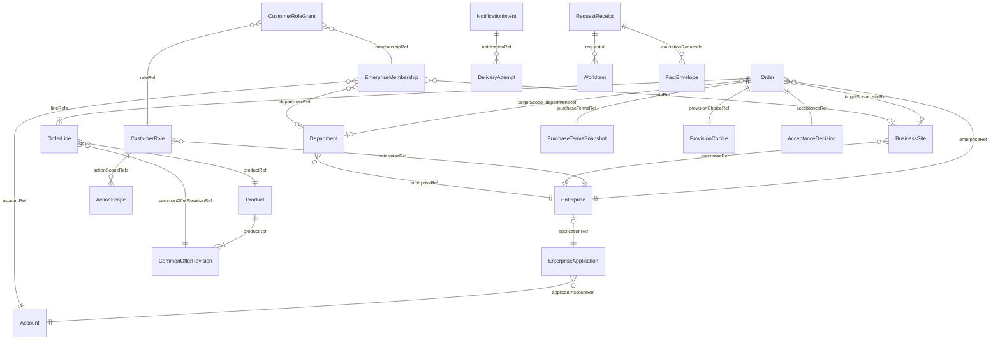

# U1 최소 통합 실행 기반 — 기능 명세

## 범위와 완료의 의미

첫 실행 단위(U1)는 신원/MFA·기업 신청/확인·최초 관리자, 필요한 고객/직원 권한, 최소 상품 등록/조회, HW/SW 별도 주문 접수·지속 기록·전체 확인 대기/진행 재조회를 실제 연결할 기능 설계다. 주 책임은 US1.1·US1.2·US3.3 및 9개 AC다. U2/U3/U7의 같은 원본을 최소로 구현하고 이후 각 단위가 확장한다. 전체 69개 스토리·227개 AC를 이 단위로 완료하지 않는다. [S1–S3·S6·S8]

미등록 계약/예외·대금·HW 공급/납기·SW 발급·후속 처리 포트는 실제 완료/가능으로 반환하지 않는다. 고객에게 접수/원래 요청 조건·품목별 미확인/남은 조치를 보여 주고 직원에게 권한 있는 판단 근거를 제공한다. 이 문서는 논리 모델과 행동의 설계이며 실행 결과·가용성/RPO·국내 저장·실거래 준비의 증거가 아니다.

entities.md의 YAML은 자료 형태, rules.md의 YAML은 규칙, 이 문서는 순서·워크플로우·상태 전이의 원본이다. 아래 ER/규칙 요약은 파생 뷰다. 실제 언어·프레임워크·DB·AWS 서비스는 여기서 선정하지 않는다. AWS/CDK의 기존 제약은 후속 설계에 유지한다.

## 논리 실행 역할과 단일 쓰기 권위

| 실행/표면 | U1 기능 | 원본 쓰기 권위 |
|---|---|---|
| 고객 PC UI | 등록/로그인·MFA, 자기 기업 신청/결과, 최초 관리자 조직/권한 설정, 상품 조회·타입별 주문 제출·원래 접수/대기 조회 | 없음. 허용된 명령만 API에 전달 |
| 내부 직원 PC UI | 직원 MFA/망 확인, 신청/근거 조회·기업 승인·별도 최초 관리자 지정, 상품 등록·전체 주문 대기/근거 조회 | 없음. 현재 업무 권한을 실행 소유자가 재검증 |
| API 실행 역할 | audience별 경계·입력/현재 권한·대상·원래 접수/결과·응답 투영 | IdentityRecovery, EnterpriseAccess, ProductCatalog, OrderAcceptance, NotificationDelivery의 명시적 작업만 |
| worker 실행 역할 | 커밋된 작업/사실의 대조·제한된 재시도·최소 통지/처리 표지 | 등록된 해당 업무 소유자의 같은 규칙/계약 |
| WorkInquiry/진단 | 현재 권한의 원본별 확인 상태·이력/대기 작업을 조합하고 증거 범위를 표시 | 거래 원본 쓰기 없음 |

4개 실제 배포 역할을 유지하되 논리 책임을 도메인별 네트워크 서비스로 나누지 않는다. U1은 후속 패키지를 import하지 않고 C13 등록 계약을 소유한다. 미등록 handler는 이름만 등록된 성공 함수가 아니라 실제 미등록이다. 최소 UI의 상호작용도 아래 흐름에 포함하며 별도 UI 단위 U8/U9가 이후 전체 화면을 확장한다.

## 논리 값과 원래 주문 문맥

Order.targetScope는 enterpriseRef·departmentRef·siteRef·contextPolicyRef·organisationRevision의 한 문맥이다. contextPolicyRef는 EnterpriseAccess.Enterprise의 orderingContextPolicy가 기록된 개정, organisationRevision은 해당 기업의 정책/조직 변경을 모두 반영한 일관된 조직 평가 개정이다. 원래 문맥은 주문자의 현재 소속·지금 표시 이름·현재 조직 정책으로 재작성하지 않는다. Dept/Site의 동일 이름은 동일 원본이 아니다.

신규 주문은 현재 정책·활성 조직·현재 order.submit 범위로 검증한다. 기존 주문은 당시 정책의 명시적 NOT_USED/NULL과 원래 조직 ID를 유지하고 현재 계정/소속/기업 이용·행위 범위로 접근을 검증한다. 역할 관리 화면은 폐지 조직을 과거 접근 대상으로 명시해 유지/부여/회수할 수 있다. 주문의 기업/조직을 새 조직으로 이관하는 별도 행동은 Q2의 선택에 포함되지 않았다. 일반 주문 조건 변경도 보호 문맥을 자동 바꾸지 않는다.

입력에 targetScope를 받는 C05/C16은 이를 제안 값으로 취급한다. 서버가 허용된 원본/현재 조직 정책을 조회해 같은 문맥을 구성하고 기업·조직·개정·문맥의 일치를 확인한다. targetScope가 있다고 identity/권한이 생기지 않는다. 수신된 사실/후속 참조는 Order 원본 문맥과 대조한다. 원본이 미확인이면 넓은 기업 범위나 요청자 소속으로 대체하지 않는다.

### 조직 기준/NULL 검증

| 당시/현재 정책 | 신규 주문 값 | 처리 |
|---|---|---|
| 두 기준 중 하나라도 UNSET | 값 유무와 무관 | 제출 거절·설정 필요. 조직 개수가0이라는 이유로 NOT_USED로 바꾸지 않음 |
| USED | 같은 기업의 활성 해당 원본 필수 | 현재 존재/유효성과 제출 범위·개정 대조 |
| NOT_USED | 해당 필드의 명시적 NULL | 저장 시 당시 policy Ref/개정을 연결 |
| USED인데 NULL/누락, NOT_USED인데 원본 지정 | 불일치 | 누락·정책 충돌을 자동 보충하지 않고 거절 |
| 기존 주문 원본의 NOT_USED/NULL 또는 비활성 조직 | 원래 값 보존 | 당시 정책/원본을 역참조하며 현재 해당 행위 권한으로 접근 |

### 행위별 범위 판정

각 활성 역할의 같은 action에 속한 완성된 scope를 독립적으로 평가한 뒤 ALLOW 결과만 합집합으로 결합한다. ENTERPRISE_ALL도 해당 기업 안에서만 유효하다. 관리 권한이나 order.read의 넓은 범위를 order.submit·payment.read 등으로 가져오지 않는다.

| Scope kind | 한 scope 레코드의 명시적 선택 | targetScope 포함 조건 |
|---|---|---|
| DEPARTMENT_SITE | departmentRefs/siteRefs 각각0..1. 빈 배열은 그 축의 정확한 '해당 없음'이며 wildcard가 아님 | 각 축이 선택한 안정 ID와 일치하거나, 빈 축은 원래 target의 NULL이 당시 명시적 NOT_USED임을 확인해 일치. 두 축 모두 만족 |
| SITE_ALL_DEPARTMENTS | siteRefs에1개 이상 실제 같은 기업 ID, departmentRefs=[] | 선택한 사업장 중 하나와 일치; 해당 scope가 명시적으로 모든 부서를 포함 |
| DEPARTMENT_ALL_SITES | departmentRefs에1개 이상 실제 같은 기업 ID, siteRefs=[] | 선택한 부서 중 하나와 일치; 해당 scope가 명시적으로 모든 사업장을 포함 |
| ENTERPRISE_ALL | departmentRefs=[]·siteRefs=[] | 기업 ID 일치; 이 행위에 한해 모든 원래 조직 문맥 포함 |

정확한 서울·IT와 부산·총무 두 조합은 별도 DEPARTMENT_SITE 레코드로 저장한다. 서로 다른 scope에서 서울·부산과 IT·총무를 수집해 새 조합을 만들지 않는다. 폐지 조직 선택은 해당 ID를 명시하고 읽기·요청 행위를 각각 부여해야 한다. 신규 order.submit은 scope 포함과 별개로 현재 활성/정책 입력 조건을 통과해야 한다.

## 경계 계약과 필요한 추가 정의

### 기존 명세의 적용

| 경계 | U1에 적용하는 기존 계약 | 불변 조건 |
|---|---|---|
| 신원 | C01/C16/C17 등록·startLogin·completeChallenge·enrolMfa·readIdentity | public/목적 제한과 업무 세션을 구별; 실제 인증 결과만 MFA 근거 |
| 기업/권한 | C02 applyEnterprise·approveEnterprise·readEnterprise·upsertOrganisation·upsertMembership·define/grantCustomerRole·evaluateAccess, 직원 역할 관리 | enterprise parent/대상/개정과 행위별 권한 확인 |
| 상품 | C03 register/reviseProduct·listVisibleProducts | 직원 전용 원본 쓰기; 기업 예외 미확인은 공통값으로 가장하지 않음 |
| 주문/진행 | C05 submitOrder·readAcceptedOrder, C10 readOrder/readOrders/readReceipt 등 | 원래 ID·조건·문맥과 현재 권한; 전체 확인 대기 |
| 통지/전달 | C11, C18, C20-E17, C25 | 지속 사실·최소 안내·실제 전달 결과와 업무 결과 구별 |
| 등록/호환/대조 | C13–C15, C19 | 실행할 실제 handler와 스키마/릴리스 검증 근거; 진단은 읽기 |

인증 입력은 기존 RegistrationInput/ChallengeInput의 목적 규약을 따른다. CommandMeta가 없는 public 인증 경로에 없는 meta/업무 principal을 발명하지 않는다. 업무 명령의 Idempotency-Key와 meta.clientRequestId는 같아야 한다. 원래 접수 재조회는 C16/C17 GET /requests/{id}, ReceiptReadRequest.requestId와 REQUEST target 모두 같은 식별자를 가리킨다.

### CE01–CE04: 확인한 기능을 실행하기 위한 추가 경계

아래는 **이번 기능 설계의 추가 정의**다. 현재 contract-summary.md에 이미 있는 operation/HTTP 경로라고 주장하지 않는다. 기존 필드의 의미·필수 값·Result 계약을 몰래 변경하지 않고 새 operation/경로·별도 payload 정의로 추가한다. Code Generation의 source 계획에서 공통 계약과 provider/consumer/등록 명세를 함께 구현하고 형식·권한·호환 시험을 통과하기 전 실제 binding으로 내보내지 않는다. 기존 v1 소비자에 맞지 않는 변화가 필요하면 C13의 버전 병행/전환 조건을 먼저 적용한다.

| ID | 소유자 / 행위 | 대상·입력·결과 | 전송 접점 및 기존 관계 |
|---|---|---|---|
| CE01 | EnterpriseAccess.setOrderingContextPolicy / 고객 기업관리자+organisation.manage | ENTERPRISE target. CommandMeta(expectedRevision=현재 Enterprise 개정), departmentUsage/siteUsage 각각 USED 또는 NOT_USED, reason 필수. 출력 Receipt와 Enterprise 개정/AccessHistory 결과 참조 | CUSTOMER POST /enterprises/{id}/ordering-context-policy-changes. 입력의 기업 parent와 target 일치. 기존 C02/C16 관계에 새 명령 추가 |
| CE02 | EnterpriseAccess.designateInitialAdministrator / 직원의 별도 지정 권한 | ENTERPRISE target. CommandMeta, accountRef, 확인 근거 basisRefs, 초기 관리용 역할 label·actionScopes 명시. 허용 관리 행위는 organisation.manage/user.manage/role.manage와 해당 기업 범위; 거래 행위는 자동 추가하지 않음. 출력 Receipt와 Membership/Role/Grant/AccessHistory 원본 참조 | STAFF POST /enterprises/{id}/initial-administrator-designations. 승인 기업·확인된 활성 후보/관계·현재 개정 필요. 기존 C02/C17 관계에 추가; 복원용 restoreAdministrator를 조용히 재정의하지 않음 |
| CE03 | OrderAcceptance.readReviewAssessment를 WorkInquiry/API가 투영 / 고객 order.read 또는 직원 order.review.read | RECORD target=원래 Order. 입력 RecordQuery; 출력 ReviewAssessmentViewResult(아래 표). 내부 근거/다른 업무 section은 해당 권한으로 제한 | CUSTOMER/STAFF GET /orders/{id}/review-assessment. 기존 WorkInquiry→OrderAcceptance 관계의 새 읽기. 권한/parent/원래 targetScope·최신 결정 개정 대조 |
| CE04 | EnterpriseAccess.readApplication/listApplications / 신청자 또는 직원 application.read | RECORD/명시적 목록 대상. RecordQuery 또는 허용된 status/cursor/pageSize 필터. 결과 ApplicationViewResult/ApplicationPage. 다른 계정/기업 내용을 비노출 | CUSTOMER/STAFF GET /enterprise-applications/{id}; STAFF GET /enterprise-applications. 신청자의 자기 상태/결과와 직원 확인 목록을 기존 C02/C16/C17 관계에서 조회 |

CE01의 설정은 조직 사용 여부와 같은 기업의 당시 정책을 기록하는 한정된 행위다. 범용 업무 규칙 편집기나 계약 조건을 수정하는 기능이 아니다. CE02는 현재 staff enterprise.approve만 가진 사람에게 지정 권한을 자동 확대하지 않는다. 최초 관리자/역할의 실제 확인 정책과 초기 직원 권한 준비는 FD-OQ2를 통과해야 한다.

### 추가 읽기 값의 논리 형식

| 값 | 필수 내용 | 선택/미확인·검증 |
|---|---|---|
| ReviewAssessmentView | orderRef, 원래 TargetScope, productType, 전체 acceptance, 원래 requestId, 각 line의 lineRef/productRef/commonOfferRevisionRef/quantity/requestedPaymentMode/requestedActivationDate, source별 KnowledgeState와 reasonKind/reasonCode/observedAt·revision, 허용된 nextActions | 요청/제시 값은 원래 사실. 확인되지 않은 기업 가격/계약/공급/납기는 실제 값 없이 미확인과 근거/필요 조치 표시. basisRefs와 내부 설명은 권한 있는 직원에만 투영. 다른 업무의 금액/키는 포함하지 않음 |
| ReviewAssessmentViewResult | KNOWN/UNKNOWN/CONFLICT/UNAVAILABLE와 원본/관측시각/허용된 근거 | KNOWN은 실제 저장된 주문 요청·검토 기록을 안다는 뜻이며 acceptance 또는 각 조건을 ACCEPTED/KNOWN으로 승격하지 않음 |
| ApplicationView | applicationRef, applicantAccountRef, legalName, designatedContact, state, 신청/결정 시각, 허용된 확인 항목의 KnowledgeState, 승인/최초 관리자 결과 참조 | 증거 상세는 직원의 해당 권한과 최소 정보 원칙에 따름. 신청자에게 자신이 제출한 값/필요 조치만 반환 |
| ApplicationViewResult/ApplicationPage | 같은 read knowledge 형식 또는 허용 items/nextCursor | 자기/업무 범위 밖 정보·건수·식별자 비노출. 실제 한도/필터 값은 FD-OQ4에서 확인 |

기존 OrderView의 purchasePrice·paymentTermsRef·agreedPeriod·completionBasisRef 등 확인된 필수 조건을 채울 수 있을 때만 기존 KNOWN 구조를 반환한다. 미확인 가격/정책을 가짜 Ref·0원·NULL=적용 없음으로 채우지 않는다. U1의 미확인 주문은 CE03에서 원래 요청/원본 문맥과 확인 대기를 조회한다. 이 추가 읽기가 U1의 필수 최소 경로이며 코드 전에 실제 스키마/등록/권한 시험 대상으로 포함된다.

## 직원 행위와 준비

U1의 논리 직원 행위를 아래처럼 분리한다. 기존 StaffRole.actions는 서버 허용 레지스트리의 정확한 operation 매핑으로 확인해야 하며 SYSTEM 전용 권한을 추가하지 않는다. 아래 문자열은 기능 설계의 레지스트리 정의로, 실제 최초 역할·인력 확보를 뜻하지 않는다.

| 행위 | 허용 작업 | 자동 포함하지 않는 권한 |
|---|---|---|
| application.read | 허용된 기업 신청 목록/근거 조회 | 기업 승인/최초 관리자 지정 |
| enterprise.approve | 근거에 따른 기업 이용 승인/거절 | 최초 관리자 지정·전체 거래 |
| enterprise.initial-administrator.designate | 별도 근거에 따른 최초 관리자 지정·명시적 초기 관리 역할 기록 | 상품 등록/주문·대금/SW 처리 |
| product.register / product.revise | 판매 상품 신규/개정 | 고객 역할 관리·계약 승인 |
| product.read | 허용된 상품 조회 | 상품 등록·기업 비공개 예외 전체 |
| order.read / order.review.read | 각각 허용된 주문 기록/전체 판단 사유 | 수락 판단·대금/발급 결과 전체 |
| staff.role.manage | 직원 역할·부여/회수 관리 | 업무 원본 전체 실행 |

초기 실제 직원 계정/MFA/망·권한 관리자의 신뢰된 준비 절차는 FD-OQ1/FD-OQ2의 코드 선행 조건이다. 비공개 준비 절차는 일반 고객 API나 인증 우회용 공개 endpoint가 아니다. 합성 검증에서는 별도 시험 계정과 명시적 초기 grant를 기록하고 실제 기업/직원 확인이 완료됐다고 표현하지 않는다.

## Workflows — Source of Truth

### WF01 계정·로그인·MFA와 기업 신청

1. 고객/직원 표면은 각각 해당 audience의 기존 등록/로그인 경계를 사용한다. 직원 인증 진입도 승인된 직원망을 필요로 한다.
2. IdentityRecovery가 등록/로그인/검증 목적·주체·challenge/state·만료와 실제 인증 권위를 확인한다. 필요한 경우만 목적 제한 세션으로 MFA 등록에 진입한다.
3. 검증된 등록 수단으로 MFA 성공을 확인한 뒤 업무 세션을 발급한다. 제한 세션은 기업 업무나 직원 승인을 수행하지 않는다. 세션/MFA 성공은 기업 승인/역할이 아니다.
4. 활성 고객 계정은 C02.applyEnterprise에 legalName·designatedContact·registrationEvidenceRefs와 CommandMeta를 보낸다. 신청 시 기업 거래 소속이 아직 없다는 이유로 신청 자체에 승인 기업을 요구하지 않는다.
5. EnterpriseAccess는 실제 제출 필드를 저장하고 필요한 확인 정책/근거의 미확인을 PENDING/UNVERIFIED로 기록한다. 신청/원래 접수/이력·필요 작업은 논리 원자 커밋으로 연결한다.
6. 커밋 확인 후 접수 ID/상태를 반환한다. 신청자는 현재 본인 계정의 CE04와 원래 접수 조회로 상태/남은 조치를 확인한다. 임의의 다른 신청 ID는 비노출로 거절한다.
7. 미승인 기업의 주문 제출은 실패한다. 신청 승인·최초 관리자 지정·현재 실제 역할/MFA를 순서와 권한에 맞춰 확인해야 거래할 수 있다.

### WF02 기업 확인과 별도 최초 관리자 지정

1. 직원은 MFA·망·현재 application.read 권한으로 신청과 허용된 근거를 조회한다.
2. 기업 승인 요청은 enterprise.approve를 별도 검증한다. 대상 신청/current revision과 FD-OQ2의 필수 기업 확인 근거를 대조한다.
3. 증거 부족/충돌/조회 실패면 APPROVED로 바꾸지 않고 해당 미확인과 필요한 조치를 남긴다. DECLINE은 실제 거절 근거/이력을 필요로 한다.
4. APPROVE가 유효하면 기업 원본과 승인 결과·접수/이력/통지 원인을 원자 기록한다. 이 승인만으로 최초 관리자를 지정하거나 일반 거래 권한을 주지 않는다.
5. 최초 관리자 지정은 CE02로 별도 수행한다. enterprise.initial-administrator.designate·승인 기업·활성 후보 계정/관계·명시적 초기 관리 역할/범위를 다시 검증한다.
6. Membership·관리자 지정·고객 관리용 Role/ActionScope/Grant 및 이력은 한 논리 커밋에 기록한다. 최초로 관측한 기대 개정과 다른 지정 경합은409로 재확인한다.
7. 지정 성공 후 관리자는 허용된 자기 기업 조직/역할 관리를 시작한다. 주문/대금/SW 권한은 별도 명시적 역할 부여가 필요하다.
8. 기업 승인 뒤 지정이 실패하면 기업 승인 결과와 실패/관리자 부재를 각각 보여 준다. 전체 가입/최초 관리자 준비 완료로 표시하지 않는다. 나중 관리자0명도 다른 담당자의 유효 권한을 자동 중지하지 않는다.

### WF03 조직 기준과 최소 고객 역할 설정

1. 현재 기업관리자 상태와 organisation.manage를 가진 사용자가 CE01에 각 기준의 USED/NOT_USED·reason·현재 Enterprise 개정을 명시한다.
2. EnterpriseAccess는 기업 경계/현재 허용 범위를 검증하고 정책·개정·행위자/이력을 원자 기록한다. UNSET을 조직 수에 따라 자동 바꾸지 않는다.
3. 사용 기준의 실제 Department/BusinessSite는 기존 upsertOrganisation CREATE/UPDATE 계약으로 등록/변경한다. UPDATE는 실제 해당 기업 원본과 expectedRevision이 필요하다.
4. role.manage/user.manage 등 해당 행위가 있는 사용자는 회사 내 명시적 ActionScope·역할·활성 소속을 부여한다. scope table의 조합/빈 값 의미와 같은 기업 parent를 검증한다.
5. 소속 이동·역할 회수/조직 비활성화는 현재 원본/이력을 변경한다. 기존 Order.targetScope나 원래 grant의 범위를 새 조직으로 자동 바꾸지 않는다.
6. 과거 접근이 필요하면 관리자가 정확한 옛 조직/해당 없음 범위를 해당 행위에 명시적으로 유지/부여한다. 관리자 본인의 관리 권한만으로 과거 거래 내용을 조회하지 않는다.

### WF04 직원 상품 등록과 고객 상품 조회

1. 직원의 상품 등록 권한·MFA/망·입력/원본 버전을 검증한다.
2. HW에는 SW term kind가 없고 SW에는 PERPETUAL/TERM을 명시한다. 라벨·설명·공통 정확한 가격/조건 참조를 실제 등록한다.
3. Product와 CommonOfferRevision 및 이력/접수 결과는 원자 기록한다. 가격 변경은 새 개정으로 남긴다.
4. 고객의 현재 product.read·기업 범위로 허용 상품을 투영한다. 공개 공통 가격과 확인한 기업 적용 가격을 구별한다. 기업 예외 판단이 없으면 예외 없음으로 확정하지 않는다.
5. 고객은 같은 타입 내 다품목/양수 수량과 제출할 원래 판매 개정·요청 지급모드/활성일·FULL 의사를 선택한다. U1 기본 경로에서 미등록 부분 동의/기간/대금 실제 결과를 가장하지 않는다.

### WF05 주문 접수·동일 키 재조회·확인 대기

1. CUSTOMER audience·활성 계정/MFA·승인/이용 가능 기업·소속과 원래 요청 헤더/CommandMeta 형식을 확인한다. 입력에 서버 신원/권한 문맥을 받지 않는다.
2. 현재 주체로 원래 요청 키·대상·정규 입력을 대조한다. 이미 동일 접수가 있으면 저장된 원래 targetScope에 대한 현재 해당 접근 권한으로 이전 결과를 반환한다. 키가 같고 내용이 다르면409다. 기존 접수의 원래 가격/조직 개정이 이후 바뀌었다는 이유로 새 요청으로 실행하지 않는다.
3. 새 요청에는 현재 조직 정책/활성 원본·같은 기업·order.submit 범위와 제안 targetScope 일치를 검증한다. 미승인·잘못된 권한/타입/필수 입력/수량은 거절하며 직원 검토로 우회하지 않는다.
4. 현재 상품/원래 제시 개정과 요청 입력을 대조하고 제출 당시 조건을 고정한다. 확인한 공통 가격/조건과 미확인 기업 적용·계약/기간/지급 조건은 필드별 knowledge/근거로 나눈다.
5. 공급/납기·계약 등 필수 판단을 실제 등록 소유자에게 확인한다. U1에서 미등록인 원본은 그 항목의 UNVERIFIED/MODULE_NOT_REGISTERED 사유로 보존한다. 기술 조회 실패는 TECHNICAL_FAILURE로 구별한다.
6. 모든 라인의 상태/사유를 AcceptanceDecision에 기록한다. 하나라도 미확인/특례/충돌/실패면 전체 REVIEW_REQUIRED다. 일부 확인으로 부분 ACCEPTED를 생성하지 않는다.
7. 마지막 유효성/권한·조직/대상 버전을 커밋 시점에 일관되게 대조한다. Order·Line·원래 TargetScope/Terms/ProvisionChoice·AcceptanceDecision·RequestReceipt·이력·필요 통지 사실/작업을 원자적으로 지속 기록한다.
8. 커밋 확인 후 실제 requestId/REVIEW_REQUIRED 등 접수 상태와 대상/결과 참조를 반환한다. 저장 실패/불명에는 성공 접수라고 응답하지 않는다.
9. 원래 ID 재조회와 CE03에서 품목별 대기/원래 요청/원본 문맥·허용된 남은 조치를 표시한다. 기존 OrderView 필수 확인 값이 없는 경우 UNKNOWN을 유지한다. U1에서 판매 수락/지급/배송/발급 실제 완료를 생성하지 않는다.

### WF06 worker·최소 통지·재시작 대조

1. worker는 지속 커밋된 Work/Fact만 읽고 실제 binding·계약 버전·대상/원인 요청을 확인한다. 인메모리 큐만으로 성공 접수를 보존하지 않는다.
2. SYSTEM은 해당 업무 실행 허가, 사용자 기원의 미실행 변경은 원래 행위와 현재 계정/기업/역할·최신 조건을 실행 소유자가 다시 검증한다. 작업이 있다는 이유로 허용하지 않는다.
3. 소비자·deliveryId의 처리 표지가 있으면 이전 효과를 대조한다. 없으면 소유자의 실제 효과/통지 원본·다음 작업/사실과 표지를 같은 논리 커밋으로 기록한다.
4. 통지는 현재 허용된 수신자·최소 내용/로그인 링크만 사용한다. 승인/신원 통지는 주문 조직과 다른 원래 신청/주체 관계를 확인한다.
5. 외부 발송 수락/실제 전달/열람을 각각 구별한다. 미등록 메일 주체/불명 결과는 UNKNOWN/UNAVAILABLE로 표시한다. 실제 IN_APP 결과와 이메일 미확인을 합쳐 성공으로 표시하지 않는다.
6. 안전성이 확인된 일시 기술 실패만 한도/기한 안에서 원래 operation/work/request ID로 재시도한다. 원래 외부 결과가 불명이면 대조/직원 조치로 전환한다.
7. 프로세스 재시작 후 원래 접수/원본/사실/미전달 작업/처리 표지를 대조하고 동일 ID로 재조회한다. 증거는 관측 범위/시각/제한을 표시하며 보존/복구 목표의 달성을 문서만으로 주장하지 않는다.

### WF07 현재 권한의 조회·화면 갱신

1. 목록/개별/접수/검토/이력/통지 조회마다 현재 principal/audience·기업/행위·원래 대상 문맥을 확인한다.
2. 각 section의 조회 권한을 따로 평가한다. 허용되지 않은 금융/SW 등 section은0원/빈 결과로 대신하지 않고 아예 제외한다. 내부 확인 근거는 고객 조회에 자동 노출하지 않는다.
3. 확인 값·UNKNOWN/CONFLICT/UNAVAILABLE·각 소유자/관측 시점·기술 실패를 구별한다. 미확인 사유/품목·남은 조치를 숨기지 않는다.
4. 화면은 원래 request/order ID로 서버 재조회 안내 안에서 제한 갱신한다. 실패/지연에는 '접수 확인 필요'와 같은 ID 재확인 경로를 제공한다. 새 ID로 자동 재제출하지 않는다.
5. 이후 소속/권한이 회수되면 현재 응답 투영을 거절한다. 기존 성공 접수/원본 보존과 현재 화면 접근 차단을 구별한다.

## State Machines — Source of Truth

아래는 U1이 관측/적용하는 논리 전이다. wire의 state enum은 기존 C00을 따르며 내부 state가 자동 거래 완료를 뜻하지 않는다. 전이 표에 없는 전이는 임의 허용하지 않고 원본 소유자 확인/해당 확장 단위로 연결한다.

| 원본 | From → To | 필수 조건·효과 |
|---|---|---|
| IdentityChallenge | OPEN→SATISFIED | 목적·주체·audience·기한과 실제 검증 일치; 소비 개정 기록 |
| IdentityChallenge | OPEN→EXPIRED/INVALIDATED | 실제 기한 도달/승인된 무효화; 업무 세션 발급 없음 |
| IdentityChallenge | SATISFIED 반복 | 같은 시도 결과 재확인; 추가 인증/권한 효과 없음 |
| MfaEnrollment | PENDING→VERIFIED | 유효 등록 수단 검증 결과·계정 관계 확인 |
| MfaEnrollment | VERIFIED→INVALIDATED | 승인된 재등록/복구 결과에 따른 원래 수단 무효화; 전체 복구 흐름은U2 |
| IdentitySession | PURPOSE_LIMITED→MFA_VERIFIED | 실제 MFA 검증·등록·audience/주체/현재 활성 상태 대조 후 새 업무 세션 |
| IdentitySession | 제한/업무→INVALIDATED | 만료·회수·검증된 보안 처리; 과거 MFA를 새 권한으로 재사용하지 않음 |
| EnterpriseApplication | PENDING/UNVERIFIED→APPROVED | BR2.1의 실제 근거/별도 직원 승인·현재 개정 |
| EnterpriseApplication | PENDING/UNVERIFIED→DECLINED | 별도 권한/거절 근거·현재 개정; 신청/이력 보존 |
| EnterpriseApplication | PENDING↔UNVERIFIED | 확인 자료/조회 상태 변화와 이력; 승인 효과 없음 |
| EnterpriseMembership | 관리자 미지정→지정 | CE02의 별도 직원 권한·관계/현재 개정·명시적 초기 관리 범위 원자 기록 |
| EnterpriseMembership | 활성/관리자 상태 변경 | 해당 관리 권한/개정·이력/경고; Order.targetScope 변화 없음 |
| OrderingContextPolicy | UNSET→USED/NOT_USED, 이후명시변경 | 기업관리자+organisation.manage·현재 개정·reason/이력; 두 기준 각각 적용 |
| Department/BusinessSite | active true↔false | 명시적 관리 권한/원본 개정·이력; ID/과거 개정 보존, 새로운 ID 재사용 금지 |
| Customer/StaffRoleGrant | 부여→회수 또는명시적재부여 | 현재 관리 권한·기업/역할/주체 관계; 해당 grant/원본 개정과 이력 보존 |
| Order/AcceptanceDecision | 유효접수→REVIEW_REQUIRED | 필수 조건 미확인/특례/충돌/조회실패의 품목별 근거와 전체 판단 |
| Order/AcceptanceDecision | REVIEW_REQUIRED→REVIEW_REQUIRED | 실제 확인 기록/원본 변화 재대조; 일부 확인으로 전체 또는부분수락 금지 |
| Order/AcceptanceDecision | REVIEW_REQUIRED→ACCEPTED/DECLINED | U3의 실제 전체 수락/거절 규칙·근거가 등록/검증될 때 확장. U1미등록값으로실행금지 |
| RequestReceipt | 생성→ACCEPTED/RESULT_RECORDED/REVIEW_REQUIRED | 원본/접수/필요 작업·이력의 지속 커밋 확인. 실제 기록 결과의 정확한 상태만 반환 |
| RequestReceipt | ACCEPTED→PROCESSING→RESULT_RECORDED/REVIEW_REQUIRED/TECHNICAL_FAILED | 원래 작업의 실제 실행/기록 결과. 전체거래상태는별도원본 |
| RequestReceipt | REVIEW_REQUIRED/TECHNICAL_FAILED→PROCESSING | 허용된 원래 작업의 재확인/명시적안전재처리. 신규 주문/거래효과로재발급하지않음 |
| WorkItem | PENDING→PROCESSING→RESULT_RECORDED | 실행 허가/등록handler·현재대상/버전; 효과/표지/다음사실 원자커밋 |
| WorkItem | PROCESSING→PENDING | 반복 안전성이 검증된 일시 기술실패·횟수/기한안. 실패 시도가 실제효과 없음을 대조 |
| WorkItem | PENDING/PROCESSING→REVIEW_REQUIRED/TECHNICAL_FAILED | 권한/버전/미등록/기한·결과불명의 원인과 필요한 조치 보존 |
| 통지 전달 | 시도→확인수락/전달/UNKNOWN/CONFLICT/UNAVAILABLE | 실제 제공자 근거에 맞는 사실만 기록; 발송수락/전달/열람/업무완료를 구별 |

논리 원자 경계에서 권한 회수/조직 변경이 경합하면 현재 버전을 재평가한다. 조회는 응답 투영의 일관된 권한 판단 시점, 변경은 실제 커밋의 판단 시점을 기준으로 한다. 이미 권한 있는 시점에 커밋된 성공 접수를 나중 회수 때문에 삭제하지 않는다. response/commit 뒤 변경의 시점 관계와 물리 일관성 방법은 후속 NFR/Infra에서 구현·동시 시험으로 증명한다.

## 최소 UI 상호작용

| 표면/상태 | 입력·표시·다음 행동 | 데이터/권한 경계 |
|---|---|---|
| 등록/로그인/MFA | 목적별 필드/오류, MFA 등록/검증 완료 전 업무 메뉴 진입 차단 | challenge/세션의 실제 목적/주체·audience; 비밀을 로그/화면 이력에 저장하지 않음 |
| 고객 기업 신청 | legalName·연락처·실제 정책의 증거 참조, 접수 ID·PENDING/필요 확인 | CE04 자기 신청만; 미승인 주문 거절 |
| 직원 신청 목록/확인 | 기업/근거·미확인/기술 실패, 승인/거절·별도 최초 관리자 지정 | 각 직원 행위별현재권한; 지정 실패는 별도남은조치 |
| 고객 초기 조직/역할 | 기준 사용여부·그 이유, 실제 조직·행위별 scope·과거 조직 명시 선택 | 관리와 거래 권한 분리, 미설정/미확인을 '없음'으로보충하지않음 |
| 직원 상품 | 타입·SW기간유형·설명/공통가격/실제조건참조·등록결과 | 직원등록권한·타입/개정검증 |
| 고객 주문 작성 | 상품·수량→요청 이용/지급·제공 조건/대상 조직→전체 검토/제출 | 작성 중 세션 입력 유지, PC1280+; HW/SW별도·FULL기본·부분동의능력표시 |
| 접수 확인/원래 ID 재조회 | 실제 저장 결과 또는 접수 확인 필요, 원래 ID 유지 | timeout을 새 요청의 이유로 삼지않음 |
| 고객/직원 주문 확인 대기 | CE03의 요청/품목별 reasonKind·미확인·허용된 남은 조치 | 현재 원래 주문 조직 권한; 직원 내부 근거/금융·발급 section은별도권한 |
| 최소 통지 | 화면 최소 안내/로그인 링크·권한있는결과, 메일 전달 미확인/실패는정확히구별 | 발송/열람을동의/업무완료로해석하지않음 |

UI 구성은 page/session state, 입력 draft, request ID/result reference, 서버의 허용 행동·조회 결과로 나눈다. 서버 권한/가격/기간을 UI가 결정하지 않는다. 오류 초점·라벨·키보드 이동·색상 외 상태 문구, 확대/내용 재배치의 적용 가능한 WCAG2.2AA 목표를 유지한다. 1280 CSS px 기준을 직원 인증의 보안 수단으로 사용하지 않는다. 고객 모바일은 미정, 직원 모바일은 제외다. 실제 브라우저 버전/화면 성능은 관련 후속 검증에서 확인한다.

## 실패·경합·재확인

| 상황 | 결과와 보존 | 재확인 |
|---|---|---|
| 필수 입력/타입/수량·기업 부모 불일치 |400/422·거절, 민감 대상 존재 비노출 | 사용자가 허용된 입력 수정; 직원 검토로 우회하지 않음 |
| MFA/세션·기업/행위 권한 실패 |401/403 또는 비노출404 | 현재 인증/권한 경로; 자동 재제출 금지 |
| 동일 키의 다른 내용/오래된 대상·조직 개정 |409 | 원래 ID/현재 상태 대조; 실제 새 의도일 때만 새키 |
| 저장 실패/커밋 여부 불명·응답 유실 | 성공접수로단정하지않음; 같은ID로대조 | 저장돼있으면원래결과, 없거나원본대조불능이면확인필요 |
| 계약/공급/납기 원본 미등록/미확인 | 전체 REVIEW_REQUIRED·조건별 UNVERIFIED | 소유자·필요근거·미구현능력 명시 |
| 원본 조회 기술실패/충돌 | TECHNICAL_FAILURE/CONFLICT와 최신 원본 관계 보존 | 원래원본대조/직원판단; 최신도착값을승자로삼지않음 |
| 권한 회수/조직 비활성화와 접수 경합 | 커밋 전에 최신 판단·거절/409; 원래 성공 기록 보존 | 현재권한/신규활성조직확인 |
| worker 효과 뒤 ack 유실/중복전달 | 같은소비자/ID 표지·원래효과 원자대조 | 새상품제공/통지효과를중복반영하지않음 |
| 외부메일 수락 뒤 전달불명 | UNKNOWN과시도/correlation·근거보존 | 실제결과조회/안전성확인;무조건재발송하지않음 |

HTTP 실패는 기존 RFC9457 Problem Details와 일치하는 실제 status/OMS code/추적 ID/허용 입력 오류를 반환한다. 내부 원본/기업 존재·비밀·키를 오류에 노출하지 않는다. 429/페이지/요청 한도·deadline/retryAfter의 실제 값은 FD-OQ1/4/6에서 확인한다.

## Entity Relationship Diagram — Derived

entities.md YAML의 핵심24개 관계를 파생한 ER다. 전체 원본 연결은 entities.md의50개 관계와 각 attribute.references에서 확인한다. 계정/세션·MFA·통지·기술 대조의 나머지 관계는 파생 표에 있고 도식에 생략돼 있다. source-of-truth를 도식으로 대체하지 않는다.

텍스트 대체: 계정→기업 신청, 승인 기업→부서/사업장·소속/역할, 역할→행위 범위→소속 부여를 연결한다. Order는 기업뿐 아니라 **자기 원래 targetScope의 부서/사업장**을 참조하며 요청자 현재 소속과 구별한다. 주문은 품목·원래 구매 조건·제공 의사·전체 판단에 연결되고, 품목은 상품/판매 개정을 참조한다. 원래 접수에 지속 작업/사실이 연결되며 통지 원본에 채널별 전달 시도가 연결된다. 도식 관계는 논리 관계이며 공유 테이블 쓰기/네트워크 경계를 뜻하지 않는다.

## Business Rules Summary — Derived

rules.md의 YAML에서 파생한 요약이다.

| Rule | Category | Statement |
|---|---|---|
| BR1.1 | validation | 기업 이용 신청의 확인 필드와 신청자 문맥을 지속 기록한다. |
| BR1.2 | authorization | 미승인/이용 중지 기업의 주문을 접수하지 않는다. |
| BR1.3 | authorization | 다른 기업의 신청·접수·주문 식별자로 내용이나 존재를 노출하지 않는다. |
| BR2.1 | validation | 기업 승인은 정해진 검증 정책의 근거·현재 대상 개정과 직원 확인 권한을 필요로 한다. |
| BR2.2 | authorization | 최초 관리자는 지정 권한이 있는 직원이 확인된 계정·기업 관계를 대조해 지정한다. |
| BR2.3 | authorization | 관리자 지정·기업 승인과 개별 주문/대금/SW 권한을 자동 결합하지 않는다. |
| BR2.4 | authorization | 모든 업무 접점에 MFA·활성 주체·audience와 직원망을 검증한다. |
| BR3.1 | policy | 조직 기준 사용 여부는 고객사 관리자가 명시하며 기본은 UNSET이다. |
| BR3.2 | validation | 신규 주문 문맥은 같은 기업의 현재 유효 정책·조직과 제출 범위를 만족해야 한다. |
| BR3.3 | constraint | 접수한 주문 조직은 요청자의 이후 소속/조직 정책 변경으로 바꾸지 않는다. |
| BR3.4 | authorization | 행위별 완성된 범위만 합집합으로 평가한다. |
| BR3.5 | policy | 폐지 조직 식별자와 기존 접근 범위를 보존하되 신규 주문 대상은 활성 조직만 허용한다. |
| BR3.6 | constraint | 권한/조직/대상 버전을 응답 투영과 변경 커밋의 효력 시점까지 확인한다. |
| BR3.7 | policy | 관리자 0명 상태를 경고·기록하며 다른 사용자의 업무를 자동 중지하지 않는다. |
| BR4.1 | authorization | 판매 상품은 해당 등록 권한을 가진 내부 직원만 등록한다. |
| BR4.2 | policy | 기업 적용 가격·공개 예외가 미확인이면 공통 값을 확정 예외 결과로 가장하지 않는다. |
| BR4.3 | constraint | 제출 시 제시된 가격·판매/계약 개정·요청 조건을 원래 스냅샷으로 보존한다. |
| BR5.1 | validation | HW/SW는 별도 주문이고 같은 타입의 다품목·양수 수량만 접수한다. |
| BR5.2 | policy | FULL이 기본이며 PARTIAL은 실제 확인된 동의와 해당 조건을 필요로 한다. |
| BR6.1 | policy | 미확인·특례·충돌·기술 실패를 품목/조건별 사유로 구별해 전체 검토 대기로 기록한다. |
| BR6.2 | constraint | 일부 품목의 확인으로 주문 일부를 자동 판매 확정하지 않는다. |
| BR6.3 | authorization | 직원의 확인 대기 사유 조회도 현재 해당 판단 정보 권한을 요구한다. |
| BR6.4 | policy | U1은 실제 등록되지 않은 업무 기능의 가능/완료를 주장하지 않는다. |
| BR7.1 | constraint | 성공 접수는 요청·필요 원본/이력·작업/사실의 지속 커밋 확인 뒤 반환한다. |
| BR7.2 | constraint | 같은 원래 요청의 반복은 현재 권한으로 이전 결과를 반환하며 효과를 추가하지 않는다. |
| BR7.3 | constraint | 기존 원본의 변경은 expectedRevision과 현재 개정을 대조한다. |
| BR7.4 | constraint | 작업/사실의 반복 전달은 소비자별 처리 표지와 실제 효과를 원자적으로 기록해 중복 효과를 막는다. |
| BR7.5 | policy | 자동 재시도는 안전한 일시 기술 실패에만 제한하며 불명 외부 결과는 대조한다. |
| BR7.6 | constraint | 주요 변경/승인/정정의 원래 행위자·시각·사유·전후/근거·접수/결과를 보존한다. |
| BR8.1 | authorization | 통지 수신/열람과 결과 조합 조회는 현재 대상/행위 권한에 맞춰 최소 투영한다. |
| BR8.2 | constraint | 통지의 발송 요청·실제 전달·열람·업무 결과는 서로 다른 사실이다. |
| BR8.3 | policy | 최소 UI는 PC·한국어·허용된 행동·입력/결과 구별과 접근성 조건을 유지한다. |
| BR8.4 | policy | 진단/접수·결과 대조는 읽기 증거이며 거래 원본 쓰기 권위를 갖지 않는다. |
| BR3.8 | validation | 고객 역할은 허용된 고객 행위와 같은 기업 원본의 명시적 범위만 저장·부여한다. |

## U1 수락 기준 추적과 예정 검증

| AC | 기능/규칙 | 정상·실패 검증의 관찰 결과 |
|---|---|---|
| AC1.1.1 | WF01; BR1.1·BR7.1 | 확인 항목이 정해진 합성 profile로 신청→지속 접수/확인 대기→원래ID조회. 저장실패에는성공응답없음 |
| AC1.1.2 | WF01/WF05; BR1.2 | 미승인기업의주문거절; 신청접수와거래승인분리 |
| AC1.1.3 | WF01/WF07; BR1.3 | 다른기업/다른신청자 신청/접수ID 조회거절·내용/존재/건수비노출 |
| AC1.2.1 | WF02; BR2.1·BR2.2·BR7.1·BR7.6 | 권한/근거있는기업승인과별도최초지정→기업/관리자연결·이력/접수보존 |
| AC1.2.2 | WF02; BR2.1 | 근거부족/불명/다른대상근거 승인시도→APPROVED가아닌확인필요 |
| AC1.2.3 | WF02; BR2.2·BR2.3 | 승인권한만있는직원의관리자지정거절;관리/거래권한자동확대없음 |
| AC3.3.1 | WF05/WF07; BR6.1·BR6.4 | 품목별UNVERIFIED/특례/충돌/조회기술실패 사유가서로구별;미등록공급자그대로표시 |
| AC3.3.2 | WF05; BR6.2 | 일부품목확인된제한시험에서도전체확인대기·남은미확인품목보존·부분수락없음 |
| AC3.3.3 | WF07; BR6.3·BR1.3 | 현재판단정보권한없는직원·다른기업접근의근거/이력/목록비노출 |

AC3.3.1/2의 특례·충돌·부분 확인 자료는 격리된 계약 시험의 명시적 입력/fixture로 검증한다. 실제 실행의 미등록 공급자는 그대로 미등록이며 시험 fixture를 실거래 binding/확인근거로 발행하지 않는다. 첫 시연은 합성기업2개·HW/SW별도주문·원래ID재조회·프로세스재시작보존·타기업거절로 구성한다. 실제 실행 명령은 코드가 준비된 뒤 별도로 제시/승인하며 문서 검사 명령을 OMS 검증 명령으로 쓰지 않는다.

보조 검증: 모든 MFA/직원망·직원 상품권한, Q1의USED/NOT_USED/UNSET/부모기업/활성/개정, Q2의소속이동/폐지조직·행위별scope/권한회수경합, 같은키같은/다른내용·저장후응답유실/재시작, 반복worker소비/역순원본·메일미확인/현재수신권한, 고객/직원최소PC/접근성경로를 검증한다. 단순 설계추적OK는 이 시험/코드커버리지·운영목표 달성 판정이 아니다.

### 공통·협력 기준의 명시적 추적

주 책임9개 외에도 신원/기업 접근·주문/이력·운영의 공통 대조 기준52개를 traceability.json에 모두 열거한다. 실제 Primary Unit은 unit-of-work-story-map.md를 따른다. 여기의 OK는 해당 기능 규칙 연결이며 다른 단위의 전체 제품 구현/운영 시험 완료가 아니다. Deferred는 그 소유 단위/단계·선행 조건과 미완성 범위를 명시한다. U1 최소 MFA/권한·성공 접수/보존·기술 실행 준비를 뒤 단위까지 미룬다는 뜻이 아니다.

| AC | 설계 추적 상태 | 규칙 또는 전체 완료 책임/남은 범위 |
|---|---|---|
| AC1.3.1 | Deferred | U2 기능 설계/구현의 전체 초대·소속 관리와 U8/U9 화면 통합. U1의 현재 권한/기업 경계는 유지 |
| AC1.3.2 | OK | BR1.3, BR3.4, BR3.8 |
| AC1.3.3 | OK | BR3.6, BR7.6 |
| AC1.3.4 | Deferred | U2 기능 설계/구현의 전체 초대·소속 관리와 U8/U9 화면 통합. U1의 현재 권한/기업 경계는 유지 |
| AC1.4.1 | OK | BR3.4, BR3.6, BR3.8 |
| AC1.4.2 | OK | BR2.3, BR8.1 |
| AC1.4.3 | OK | BR3.8 |
| AC1.5.1 | OK | BR3.4 |
| AC1.5.2 | OK | BR3.4, BR3.8 |
| AC1.5.3 | OK | BR1.3, BR3.4 |
| AC1.5.4 | OK | BR3.3, BR3.4, BR3.5, BR3.6 |
| AC1.6.1 | Deferred | U2 전체 직원 역할 관리; 계약 자기 승인 통제는 U3 CommercialAgreement의 확인된 동일인/별도 승인 구현. U1 초기 명시적 grant/MFA·현재 권한은 먼저 필요 |
| AC1.6.2 | Deferred | U2 전체 직원 역할 관리; 계약 자기 승인 통제는 U3 CommercialAgreement의 확인된 동일인/별도 승인 구현. U1 초기 명시적 grant/MFA·현재 권한은 먼저 필요 |
| AC1.6.3 | OK | BR3.6, BR7.6 |
| AC1.7.1 | OK | BR2.4, BR3.4 |
| AC1.7.2 | OK | BR2.4 |
| AC1.7.3 | OK | BR2.4 |
| AC1.8.1 | Deferred | U2 사전 복구·MFA 재등록/이전 수단 무효화·이력과 U7 통지 연결. U1 인증 준비의 실제 복구/비상 정책 확인은 FD-OQ1 선행 조건 |
| AC1.8.2 | Deferred | U2 사전 복구·MFA 재등록/이전 수단 무효화·이력과 U7 통지 연결. U1 인증 준비의 실제 복구/비상 정책 확인은 FD-OQ1 선행 조건 |
| AC1.8.3 | Deferred | U2 사전 복구·MFA 재등록/이전 수단 무효화·이력과 U7 통지 연결. U1 인증 준비의 실제 복구/비상 정책 확인은 FD-OQ1 선행 조건 |
| AC1.9.1 | Deferred | U2 담당자/비상 복구의 확인 근거·세션/수단 처리와 U7 통지. 실제 근거 없는 MFA 해제/우회는 U1에서도 금지 |
| AC1.9.2 | Deferred | U2 담당자/비상 복구의 확인 근거·세션/수단 처리와 U7 통지. 실제 근거 없는 MFA 해제/우회는 U1에서도 금지 |
| AC1.9.3 | Deferred | U2 담당자/비상 복구의 확인 근거·세션/수단 처리와 U7 통지. 실제 근거 없는 MFA 해제/우회는 U1에서도 금지 |
| AC1.10.1 | OK | BR3.7, BR7.6 |
| AC1.10.2 | Deferred | U2 관리자 부재의 실제 복원/재지정과 전체 U8/U9 경로; U1 최초 지정과 관리자0명 경고/권한 비확대는 별도 유지 |
| AC1.10.3 | Deferred | U2 관리자 부재의 실제 복원/재지정과 전체 U8/U9 경로; U1 최초 지정과 관리자0명 경고/권한 비확대는 별도 유지 |
| AC3.1.1 | OK | BR5.1, BR4.3 |
| AC3.1.2 | OK | BR1.2, BR3.2, BR5.1, BR8.3 |
| AC3.1.3 | OK | BR7.1, BR7.2 |
| AC3.1.4 | Deferred | U3 전체 판매 조건/제공 선택·U8 고객 PC 화면 통합. 고객 모바일은 최신 Refined Mockups Q5에서 미정, PC1280+ 결정이 기존 모바일 문구에 우선 |
| AC9.1.1 | Deferred | U10/운영의 자동 복구 시도 시작 메신저+이메일·실패/수동 긴급 알림·독립 전달·수신/재알림의 실제 경로 |
| AC9.1.2 | Deferred | U10/운영의 자동 복구 시도 시작 메신저+이메일·실패/수동 긴급 알림·독립 전달·수신/재알림의 실제 경로 |
| AC9.1.3 | Deferred | U10/운영의 자동 복구 시도 시작 메신저+이메일·실패/수동 긴급 알림·독립 전달·수신/재알림의 실제 경로 |
| AC9.2.1 | Deferred | U10/NFR/Infra·실제 장애/배포/논리손상/오삭제 복구 시험과 30분RTO·성공접수RPO0·8영역 정확성 대조; U1 지속 접수/재시작 기본은 먼저 필요 |
| AC9.2.2 | OK | BR7.1, BR7.2, BR8.4 |
| AC9.2.3 | Deferred | U10/NFR/Infra·실제 장애/배포/논리손상/오삭제 복구 시험과 30분RTO·성공접수RPO0·8영역 정확성 대조; U1 지속 접수/재시작 기본은 먼저 필요 |
| AC9.3.1 | Deferred | U10·Build and Test/CI/Deployment의 전체 점검·production 승인·시간/사람 작업 증거. U1 첫 병합/검증 환경의 필수 검사/승인 준비는 면제하지 않음 |
| AC9.3.2 | Deferred | U10·Build and Test/CI/Deployment의 전체 점검·production 승인·시간/사람 작업 증거. U1 첫 병합/검증 환경의 필수 검사/승인 준비는 면제하지 않음 |
| AC9.3.3 | Deferred | U10·Build and Test/CI/Deployment의 전체 점검·production 승인·시간/사람 작업 증거. U1 첫 병합/검증 환경의 필수 검사/승인 준비는 면제하지 않음 |
| AC9.3.4 | Deferred | U10·Build and Test/CI/Deployment의 전체 점검·production 승인·시간/사람 작업 증거. U1 첫 병합/검증 환경의 필수 검사/승인 준비는 면제하지 않음 |
| AC9.4.1 | OK | BR7.6 |
| AC9.4.2 | OK | BR7.6 |
| AC9.4.3 | OK | BR1.3, BR8.1 |
| AC9.5.1 | Deferred | U10 및 Infra/제공자별 국내 저장·로그/백업·처리 위치 증거; U1 FD-OQ5/6의 도입/실데이터 전 조건은 유지 |
| AC9.5.2 | Deferred | U10 및 Infra/제공자별 국내 저장·로그/백업·처리 위치 증거; U1 FD-OQ5/6의 도입/실데이터 전 조건은 유지 |
| AC9.5.3 | Deferred | U10 및 Infra/제공자별 국내 저장·로그/백업·처리 위치 증거; U1 FD-OQ5/6의 도입/실데이터 전 조건은 유지 |
| AC9.6.1 | Deferred | U10/Observability/운영의 업무별 실제 연속30일 측정·정상 권한 거절 분류. 단기 합성 검증으로 대체하지 않음 |
| AC9.6.2 | Deferred | U10/Observability/운영의 업무별 실제 연속30일 측정·정상 권한 거절 분류. 단기 합성 검증으로 대체하지 않음 |
| AC9.6.3 | Deferred | U10/Observability/운영의 업무별 실제 연속30일 측정·정상 권한 거절 분류. 단기 합성 검증으로 대체하지 않음 |
| AC9.7.1 | Deferred | U10/운영의 실제 사람 작업/자동 대기/사고/사업 업무·미해결 누적과 같은 범위 재검증. 1인 이유로 기능/검사/커버리지를 축소하지 않음 |
| AC9.7.2 | Deferred | U10/운영의 실제 사람 작업/자동 대기/사고/사업 업무·미해결 누적과 같은 범위 재검증. 1인 이유로 기능/검사/커버리지를 축소하지 않음 |
| AC9.7.3 | Deferred | U10/운영의 실제 사람 작업/자동 대기/사고/사업 업무·미해결 누적과 같은 범위 재검증. 1인 이유로 기능/검사/커버리지를 축소하지 않음 |

AC1.3.4와 AC3.1.4의 오래된 PC·모바일 문구는 상위 기록으로 남아 있지만, 최신 Refined Mockups Q5와 현재 요구의 고객 PC1280+·모바일 지원 미정 결정을 따른다. 직원 모바일 제외도 유지한다. 이 줄은 모바일 구현 완료를 주장하지 않는다.

## Assumptions & Open Questions

| ID | 실제로 미확인인 항목 | 책임/해소 시점·차단 효과 |
|---|---|---|
| FD-OQ1 | 실제 신원 권위·로그인 식별자 정규화/중복, MFA 수단·등록/기한·제한세션·session lifetime/변경효력·복구/직원망 근거 | U1 NFR/Infra 및 IdentityRecovery/EnterpriseAccess. 인증 코드/실제계정 전에 확인. 이메일만으로MFA해제·인증우회금지 |
| FD-OQ2 | 기업/최초관리자의 실제 확인 항목/증거/동일인·관계·초기직원권한 준비, 실제 업무 담당자 | 기업/접근 코드 전에 실제 또는 명시적 합성 profile을 확인. 합성profile은실제기업확인/실거래허가가아님. 특정서류/확인방식을발명하지않음 |
| FD-OQ3 | 실제 공통/기업예외·지급/기간/완료 기준의 필수 값·가격정밀도/산식·일수/달력·반올림·실제제공근거 | U1은원래제시/요청과미확인상태보존·CE03필수. U3/U4/U5/U6가관련계산/수락/실행코드전확인; 미확인필드에가짜값/Ref로KNOWN생성금지 |
| FD-OQ4 | 실제 요청/상품·주문라인·페이지/필터 한도, 화면 갱신간격/횟수·support browser 실제버전 | U1 NFR/코드와전체UI/성능검증전확인. 시험50품목/합성고객수를제품상한으로적용하지않음 |
| FD-OQ5 | 실제 저장·원자경계/장애보존·오삭제/논리손상복구·한국저장/로그/백업·보관/삭제·민감Evidence접근 | U1 NFR/Infra/코드·실데이터전확인; 이후U10/운영에서전체증거검증. 문서로99.9%·30분RTO·acknowledged RPO0달성선언금지 |
| FD-OQ6 | 실제 메일/최소통지 실행 수단·권위/국내위치·수신/재시도/기한·실패대조; 개발자시도/실패메신저/메일 독립경로 | U1 NFR/Infra·전달코드/실제전송전확인. 전체고객통지U7,자동복구시작알림/실패긴급알림과독립전달U10/운영에연결 |

고객 수요·실제 업무 자료·제공자/접근권·상용지표와 1인 운영 효과는 여전히 가설/검증 대상이다. 기술개발자1명을실제계약등록자/다른승인자등모든사업역할인원으로간주하지않는다. 기존Domain R-01의보호대상문맥과R-02중구매스냅샷판매개정참조를여기에연결했으며다른소유자의참조는해당확장전확인한다. 과거검토의상태를소급수정하지않는다.

## Sources

- S1: [unit-of-work.md](../../../inception/units-generation/unit-of-work.md) — U1 범위·컴포넌트와 배포 역할.
- S2: [unit-of-work-story-map.md](../../../inception/units-generation/unit-of-work-story-map.md) — 주 책임/협력·원본 소유·이전 보완 의견.
- S3: [requirements.md](../../../inception/requirements-analysis/requirements.md) — FR1–FR6·FR14–FR16와 NFR1·NFR4–NFR5·NFR12, OQ1–OQ10.
- S4: [components.md](../../../inception/domain-design/components.md) — 신원/기업/상품/주문/조회/통지의 단일 소유자.
- S5: [contract-summary.md](../../../inception/contract-design/contract-summary.md) — C00–C03·C05·C10–C11·C13–C21·C25, G01–G23. 아래 CE01–CE04는 이 문서에 아직 없는 추가 경계 정의다.
- S6: [stories.md](../../../inception/user-stories/stories.md) — US1.1·US1.2·US3.3의 실제 9개 AC.
- S7: [functional-design-questions.md](functional-design-questions.md) — Q1·Q2 사용자 A 답변과 정확한 Looks correct 및 기록된 작성 권한.
- S8: [bolt-plan.md](../../../inception/delivery-planning/bolt-plan.md) — B01 시연·완료·보존·회사 경계 확인.
