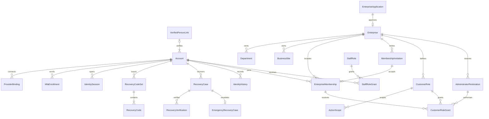

# U2 신원·복구·기업 접근 기능 명세

## 범위·근거·완료 의미

IdentityRecovery/EnterpriseAccess의 초대·소속·고객/직원 역할·행위별 범위·MFA/복구·확인된 동일인·관리자 부재/재지정을 설계한다. U1 최소 연결을 확장하며 실제 고객/직원 전체 화면은 U8/U9, 거래 판단/결과는 각 원본 소유자, 통지 전달은 U7, 실제 운영 검증은 U10과 연결한다. U2는 독립 실행 서비스가 아닌 같은 논리 소유자의 모듈이다.

근거: [unit-of-work.md](../../../inception/units-generation/unit-of-work.md), [unit-of-work-story-map.md](../../../inception/units-generation/unit-of-work-story-map.md), [requirements.md](../../../inception/requirements-analysis/requirements.md), [components.md](../../../inception/domain-design/components.md), [contract-summary.md](../../../inception/contract-design/contract-summary.md), [확인 답변](functional-design-questions.md), [사용자 스토리](../../../inception/user-stories/stories.md). U1 통합 접점은 [U1 기능 명세](../../u1-integrated-foundation/functional-design/functional-spec.md)와 [U1 보안 설계](../../u1-integrated-foundation/nfr-design/security-design.md)의 안정 계정/현재 권한·보호 변경·원래 조직/세대·CE01/CE02 조건을 보존한다. 완료된 U1 기록을 다시 쓰지 않는다.

이 문서는 **워크플로와 상태 전이의 원본**이다. [entities.md](entities.md)의 YAML은 데이터/관계, [rules.md](rules.md)의 YAML은 판정 규칙 원본이다. 이 문서의 ER/규칙 요약은 파생 뷰다. traceability의 OK는 설계 규칙 연결이며 구현/수락 시험·실운영 통과가 아니다. 전체69스토리/227AC에 U2가 협력하므로 모두 열거하되, 주 책임26AC와 다른 원본 소유자의201AC를 구별한다.

## 논리 권위와 행위

고객 행위는 정확히 아래15개이며 행위마다 범위를 독립 평가한다.

| 행위 | 의미 |
|---|---|
| product.read | 허용된 상품 조회 |
| order.read | 허용된 주문 조회 |
| order.submit | 주문 제출 |
| payment.read | 허용된 대금 정보 조회 |
| entitlement.read | SW 발급/권한 결과 조회 |
| renewal.request | 갱신 요청 |
| autoRenewal.request | 자동 갱신 신청 |
| autoRenewal.cancel | 자동 갱신 신청/합의 해제 요청 |
| order.change.request | 주문 변경 요청 |
| order.cancel.request | 주문 취소 요청 |
| order.return.request | 주문 반품 요청 |
| organisation.manage | 자기 기업 조직 관리 |
| user.manage | 자기 기업 담당자·소속·활성/관리자 지정 표지 관리 |
| role.manage | 자기 기업 역할 정의·개정·부여·회수 |
| contract.change.request | 기업 계약 조건 변경 요청 |

신청/해제 요청은 거래 소유자의 합의·실제 적용 결과를 대신하지 않는다. 관리 행위는 거래 조회/제출을 자동 포함하지 않는다. 관리자는 현재 관리 범위와 허용 목록 안에서 자신이 직접 수행할 권한이 없는 역할도 타인/자신에게 **명시적으로** 부여할 수 있다. 타 기업/직원/SYSTEM 권한이나 자신의 관리 범위 밖 권한은 만들지 못한다.

직원은 기존 staff.role.manage, enterprise.approve, enterprise.initial-administrator.designate 등 U1 행위를 유지한다. U2에 identity.recovery.verify(확인 복구), identity.person.verify(인정된 동일인 연결 확인), enterprise.administrator.restore(관리자 재지정)를 별도로 등록한다. 이는 실제 최초 담당자에게 이미 부여됐다는 뜻이 아니다. 직원 역할은 서버 허용 목록의 현재 직원 행위만 사용하고 고객15행위 목록을 직원 권한으로 자동 전환하지 않는다. 비상 운영 권위는 일반 역할 문자열로 생성하지 않는다.

## Workflows — Source of Truth

### WF01 기존 기업 승인·최초 관리자와 신원 연결

1. 기존 신청/직원 승인과 CE02의 별도 최초 관리자 지정을 유지한다. 로그인/초대 수락은 이 절차의 대체가 아니다.
2. 신원은 안정 Account와 검증된 provider issuer/subject/audience/세대로 연결한다. 기업 관계·위임·업무 권한은 별도 원본이다.
3. 최초/후속 관리자 표지와 organisation.manage/user.manage/role.manage의 명시적 grant를 구별한다. 거래 권한은 자동 생성하지 않는다.
4. 동일인 연결의 인정된 정책·출처·확인자/시점·유효성은 확인 상태와 함께 제공한다. 계정/이메일만으로 다른 사람이라고 반환하지 않는다.
5. 실제 증거/작업 권위가 미확인이면 해당 확인/적용을 보류한다. 합성 증거는 시험 profile에서만 사용한다.

적용: BR1.1, BR1.3, BR2.1, BR4.2, BR7.3.

### WF02 담당자 초대와 본인 수락

1. 고객 관리자의 현재 자기 기업 user.manage와 대상 소속 범위를 확인한다. 역할이 포함되면 role.manage 및 역할 전체의 부여 범위도 확인한다.
2. 승인 기업과 현재 조직 정책/예정 부서·사업장, 역할/개정, 대상 연락 경로, 초대한 소속, 대상 소속 개정 또는 생성 의도를 원래 초대에 고정한다.
3. PENDING 초대와 접수/이력·최소 통지 의무를 보호된 논리 변경으로 기록한다. 통지 요청/전달과 수락은 별개다. 토큰 원문을 일반 원본/로그/통지 이력에 복제하지 않는다.
4. 본인은 지정 연락 경로의 검증을 거쳐 자신의 계정 인증·MFA를 완료한다. 아직 기업 소속이 없을 수 있으므로 **초대 수락 전용 신원 문맥**으로만 진행한다. 일반 기업 권한을 먼저 요구하거나 먼저 부여하지 않는다.
5. 기업 가입 전에는 다른 기업/담당자/거래 목록을 제공하지 않는다. 해당 초대의 현재 대상 연락 경로와 본인 계정의 검증된 경로가 일치해야 한다. 이메일 주소 입력만 일치한 상태는 검증 완료가 아니다.
6. 수락 시 PENDING/기한/토큰 세대·본인/목적·기업 상태·조직 정책/해당 조직·예정 역할 개정·초대한 관리자의 현재 관련 관리 권한을 재검증한다. 관련 내용이 바뀌면 RECONFIRMATION_REQUIRED 또는 재초대로 연결한다. 별도 관리자 재승인은 요구하지 않는다.
7. 같은 기업/계정의 소속 원본이 없으면 생성한다. 기존 INACTIVE 소속 재활성화는 원래 대상 개정에 고정된 명시적 관리 의도를 확인한다. 기존 ACTIVE 소속의 조직/역할을 초대로 덮어쓰지 않으며 충돌하면 별도 관리/재확인을 요구한다.
8. commit 직전 현재 권한/원본 개정을 다시 확인하고 초대 ACCEPTED·소속 활성화·명시적 역할 grant·이력·통지 의무·접수 보호를 한 논리 변경으로 확정한다. 초대만으로 관리자 표지나 거래 권한을 추가하지 않는다.
9. 수락/회수·동시 수락은 원래 초대 개정과 유일 효과로 판정한다. 같은 요청 재시도는 원래 결과를 대조하며 회수된 권한을 재생성하지 않는다. 결과 읽기도 현재 본인/허용 정보 조건을 확인한다.

적용: BR2.2–BR2.6, BR3.3, BR7.1, BR7.2, BR7.4.

### WF03 소속·조직·활성 상태와 회수

1. 현재 관리 행위와 **기존 및 변경 후** 대상 소속/범위를 모두 확인한다. 타 기업 소속은 수정하지 않는다.
2. USED 축에는 같은 기업의 현재 사용 가능한 조직을 지정하고 NOT_USED 축은 명시적 미사용으로 표현한다. UNSET으로 신규 주문을 허용하지 않는다.
3. 예상 개정에 맞는 소속/조직/활성 변경, Enterprise 조직 개정과 대상 권한 개정/이력을 함께 보호 기록한다.
4. 이동/폐지 뒤 기존 주문은 원래 기업·부서·사업장/미사용 정책·개정을 유지한다. 새 조직 권한만으로 옛 조직 주문에 접근하지 않는다. 권한 있는 관리자가 과거 식별자의 필요한 scope를 명시적으로 유지/부여/회수한다.
5. 회수 효력 뒤 새 접근/실행/commit·민감 결과 투영은 현재 권한을 재평가한다. 이미 확정된 원래 결과/이력은 지우지 않고 아직 실행되지 않은 원래 작업은 소유자의 보류/거절 규칙으로 연결한다.
6. 관리자 표지/실효 관리 권한의 변화는 WF09로 대조한다. 다른 유효 grant 또는 계정의 다른 기업 소속을 자동 회수하지 않는다.

적용: BR1.2, BR2.1–BR2.3, BR3.6, BR6.1, BR7.1.

### WF04 고객/직원 역할 정의·개정·부여

1. 역할 관리자의 현재 신원/MFA·관련 관리 행위와 대상 범위를 확인한다. 직원은 승인된 사설 접점도 확인한다.
2. 고객 역할은15행위/4범위의 완성된 술어를 각각 검증한다. 직원 역할은 등록된 직원 행위 목록을 검증한다. 미등록/SYSTEM 행위는 거절한다.
3. 새 역할은 별도 원본을 만든다. 기존 역할 변경은 roleRef·예상 역할 개정과 새 전체 구성을 가진 별도 개정 동작이다. 기존 defineCustomerRole/defineStaffRole의 닫힌 생성 입력에 target 필드를 몰래 추가하지 않는다.
4. 역할 관리자의 직접 거래 권한이 없어도 현재 관리 범위 안의 허용 역할을 부여할 수 있다. 자기 부여도 같은 현재 범위·내용 검증과 명시적 grant/이력을 거친다.
5. 부여 대상 소속/계정·역할·scope의 기업/audience가 맞는지 전체 검증한다. 변경의 일부만 유효하면 전체 명령을 거절한다.
6. 역할 개정은 현재 유효 grant가 사용하는 역할 개정을 변경하며 영향을 받는 소속/직원의 권한 개정과 이력을 같은 논리 변경으로 갱신한다. 과거 결정은 당시 역할 개정을 보존한다. 기존 초대의 예정 역할 개정 불일치는 WF02에서 재확인한다.
7. 회수/비활성화는 이전 grant/역할 개정·이력을 보존하며 실제 접근은 WF05에서 현재 판정한다. 자기 역할 변경으로 현재 관리 범위 밖 권한을 확장하지 않는다.
8. 계약 등록/승인은 확인된 실제 사람이 달라야 한다. 동일인 관계 미확인도 허용으로 바꾸지 않는다. SW 기간의 같은 사람 두 권한·별도 승인 규칙은 SW 소유자에게 남긴다.

적용: BR1.3, BR2.3, BR3.1–BR3.3, BR3.6, BR4.1, BR4.2.

### WF05 행위별 범위 평가와 결과 투영

1. 신뢰된 신원/목적·현재 계정/연결·실제 MFA·유효 세션/보안 세대 및 해당 audience/직원 접점을 확인한다.
2. 실제 원본의 기업·부서·사업장/명시적 미사용 상태를 조회한다. 클라이언트 targetScope 주장으로 원본의 대상을 바꾸지 않는다.
3. 고객의 해당 기업 활성 소속과 현재 유효 grant/역할 개정을 조회하고 **요청 행위가 같은** 완성된 scope만 선택한다.
4. 아래 술어 중 하나라도 참이면 해당 행위의 범위 조건을 충족한다. 다른 행위의 범위, 다른 scope 행의 부서와 사업장을 조합하지 않는다. 기업 이용/업무 소유자 조건은 별도로 충족해야 한다.
5. 실제 실행/commit과 결과 투영 때 현재 개정을 다시 확인한다. 회수/변경 경합은 WF03/04의 현재 원본으로 판정한다.
6. 목록·건수·요약·이력·오류·통지·캐시도 필요한 정보 행위를 검증한다. 사용자/역할 관리만으로 주문·금액·발급 결과를 조회하지 않는다.

| kind | 한 완성된 scope의 술어 | 명시적 미사용 축 |
|---|---|---|
| DEPARTMENT_SITE | 같은 기업 AND 부서 selector 일치 AND 사업장 selector 일치 | 해당 축 NOT_USED를 실제 원래 문맥의 미사용 상태와 비교 |
| SITE_ALL_DEPARTMENTS | 같은 기업 AND 사업장 EXACT 일치; 부서 ALL | 전체는 명시 ALL이며 누락 배열이 아님 |
| DEPARTMENT_ALL_SITES | 같은 기업 AND 부서 EXACT 일치; 사업장 ALL | 전체는 명시 ALL이며 누락 배열이 아님 |
| ENTERPRISE_ALL | 같은 기업 AND 두 축 명시 ALL | 타 기업은 포함하지 않음 |

EXACT은 같은 기업의 한 조직 참조, NOT_USED는 조직을 실제 미사용한 문맥, ALL은 해당 kind에서만 허용한 명시적 전체다. SITE_ALL_DEPARTMENTS의 사업장이나 DEPARTMENT_ALL_SITES의 부서가 미사용이면 해당 kind를 사용하지 않고 DEPARTMENT_SITE의 NOT_USED 또는 ENTERPRISE_ALL로 명시한다. 과거 문맥의 비활성 조직 EXACT은 현재 명시 grant로 접근할 수 있으나 신규 주문은 현재 활성 조직만 사용한다.

기업 전체 order.read + 서울/IT order.submit은 전체 조회/서울IT 제출만 허용한다. 서울IT order.submit + 부산IT order.submit은 두 쌍만 허용하고 서울총무/부산총무는 거절한다. 한 기업 ENTERPRISE_ALL은 다른 기업에 대해 항상 거짓이다.

적용: BR1.1–BR1.4, BR2.1, BR3.4–BR3.6, BR7.4.

### WF06 사전 복구 코드로 MFA 재등록

1. 원래 계정과 활성 인증 연결/세대에 RecoveryCase를 생성/대조한다. 요청 존재 응답은 계정 존재를 무권한 사용자에게 노출하지 않는다.
2. 실제 password와 현재 발급 집합의 미사용 복구 코드를 검증한다. 같은 코드는 원자적으로 한 원래 복구 허가에 한 번만 소비한다. 정기 만료는 없지만 사용/재발급/회수·계정/연결 세대 무효화를 대조한다.
3. 유효하지 않으면 MFA 해제나 일반 업무 접근 없이 담당자 복구 경로를 안내한다. 이메일 접근만으로 이 검증을 대체하지 않는다.
4. 유효하면 계정/원래 연결·기한에 묶인 ENROLMENT_ONLY 상태를 만든다. 기존 세션은 보안 세대/회수 상태로 업무 접근을 막고 아직 새 수단은 업무 MFA 근거로 사용하지 않는다.
5. C21로 원래 승인된 수단 변경을 실행·대조한다. 원래 provider 작업의 종료/격리가 확인되지 않아 늦은 제거가 새 수단에 영향을 줄 수 있으면 HOLD로 둔다. 새 독립 subject를 사용하는 격리는 실제 지원과 동일인/계정·안전한 연결 전환 근거가 있을 때만 허용한다.
6. 새 수단의 실제 검증, 이전 수단/코드/세션 무효화, 새 필수 코드 집합·보관 확인을 대조한다. 원문 코드/수단 비밀을 일반 원본·이력·통지에 저장하지 않는다.
7. 복구 COMPLETED·현재 보안 세대·전후 근거·원래 접수/결과와 E01 당사자 통지 의무를 보호 기록한다. 발송/전달 상태는 통지 소유자 결과로 별도 표시한다.
8. 새 업무 세션을 위한 현재 신원/MFA·기업/소속·행위별 권한을 다시 확인한다. 복구가 새 역할/기업 이용 승인을 만들지 않는다.

적용: BR1.1, BR1.2, BR5.1, BR5.2, BR5.4, BR5.5, BR7.1, BR7.2, BR7.5.

### WF07 담당자 확인 복구

1. 사전 수단/password 검증이 불가한 사용자의 원래 RecoveryCase·계정/연결/목적을 고정한다.
2. 현재 직원 신원/MFA·사설 접점과 identity.recovery.verify를 EnterpriseAccess에서 확인한다. 고객 관리자 요청이나 전달받은 권한 문자열은 직원 복구 권위가 아니다.
3. 인정된 확인 정책의 필수 항목·출처·대상 신원·원래 인증 연결·확인 주체 권위·현재성/시점·복구 요청 관계를 대조한다. 증거 Ref만 존재하거나 이메일 주소가 맞는 것만으로 CONFIRMED를 만들지 않는다.
4. 확인 결정/정책 개정·근거·사유·확인자를 기록한다. 부족/충돌·권한 없음은 보류/거절하며 상세 증거는 해당 권한으로 제한한다. 실제 증거 profile이 없으면 실제 복구 실행을 허용하지 않는다.
5. 확인된 경우 ENROLMENT_ONLY로 진행하고 WF06의 원래 외부 작업 대조·새 MFA/옛 무효화·새 코드 확인·보호 이력/E01 통지·현재 권한 재평가를 동일하게 수행한다.
6. 담당자 자신도 접근 불가하면 WF08로 연결한다. 이 명세는 계약 외 업무에 새로운 상시 두 사람 승인을 요구하지 않는다. 실제 확인 주체/독립 근거의 인정 조건은 등록된 복구 정책으로 검증한다.

적용: BR1.4, BR5.2–BR5.5, BR7.1, BR7.2.

### WF08 비공개 비상 운영 복구

1. 모든 담당자가 업무 신원 조건을 충족할 수 없고 사전 수단도 사용할 수 없다는 원래 대상/상황을 비공개 운영 절차의 EmergencyRecoveryCase로 기록한다.
2. OMS 정상 업무 세션과 별도로 보호된 운영 권위를 확인한다. 기존 초기 준비와 연결되는 검증된 작업자/접근 자격·실제 대상 신원/원래 계정·인증 연결·확인 정책·사유/근거가 없으면 HOLD/실행 불가다.
3. 비상 문맥은 원래 지정 담당자의 재등록 작업에만 한정하며 기한/원래 작업/이력을 보존한다. 일반 CUSTOMER/STAFF endpoint의 EMERGENCY 선택이나 자체 생성 role/header로 만들지 않는다.
4. 원래 수단 무효화의 실제 결과/옛 작업 격리와 새 제한 MFA 등록을 대조한다. 초기 콘솔 신원 생성만으로 기존 계정 연결·업무 권한·MFA 완료를 인정하지 않는다.
5. 새 MFA·코드 보관 확인·옛 세션/수단 무효화·보호 이력/E01 통지를 확인한 뒤 기존의 정당한 현재 권한을 재평가한다. 새 업무 권한/상시 공유 관리자·영구 MFA 해제를 만들지 않는다.
6. 담당자가 정상 업무 조건을 다시 충족한 후 WF07의 일반 복구를 재개한다. 비상 작업 결과 불명/미등록 제공자 지원은 원래 작업으로 대조하며 정상 복구로 표시하지 않는다.

이 절차는 설계 방향이며 실제 작업자/IAM 등 운영 자격·인증 제공자 기능·실계정 변경을 실행하거나 확보했다고 주장하지 않는다.

적용: BR1.4, BR5.4–BR5.6, BR7.1, BR7.2, BR7.5.

### WF09 관리자 부재와 재지정

1. 활성 소속의 관리자 표지 회수/비활성화와 역할/계정 변경을 현재 관리 권한·원래 대상 개정으로 검증한다.
2. 같은 기업의 변경 후 지정된 활성 관리자 수를 원자적으로 계산한다. 0이면 관리자 부재 경고/이력을 남기면서 변경을 허용한다. 관리자 표지가 있어도 관리 grant가 없으면 실효 관리 권한 부재도 별도로 경고한다.
3. 기업 이용 상태·다른 담당자의 업무 grant를 자동 변경하지 않는다. 동시 마지막 두 관리자 회수도 실제 최종 수와 경고를 보존한다.
4. 권한 있는 직원은 enterprise.administrator.restore로 해당 기업과 새 지정자의 인정된 위임/신원·근거·정책/현재 개정을 확인한다. 근거 미확인은 HOLD다.
5. 명시한 해당 기업 관리 grant와 관리자 표지·소속/권한 개정·AdministratorRestoration/AccessHistory·접수 보호를 함께 기록한다. 거래 권한이나 기업 승인/첫 지정 결과를 자동 생성하지 않는다.
6. 새 관리 가능 여부는 실제 유효 grant로 확인한다. 요청 접수·근거 확인·실제 지정/관리 가능 상태를 구별해서 표시한다.

적용: BR2.2, BR2.3, BR6.1, BR6.2, BR7.1, BR7.2, BR7.4.

## 상태 전이 — Source of Truth

| 원본 | 전이 | 필수 조건 / 허용 결과 |
|---|---|---|
| MembershipInvitation | PENDING → ACCEPTED | WF02 본인·MFA·현재 권한/원본 검증과 소속/grant의 원자 보호 변경 |
| MembershipInvitation | PENDING → REVOKED / EXPIRED | 허용 회수 또는 실제 기한 만료; 수락과 원본 개정으로 경합 |
| MembershipInvitation | PENDING → RECONFIRMATION_REQUIRED | 예정 역할/조직/소속 개정 또는 관련 조건 변경; 권한 미확인 |
| MembershipInvitation | RECONFIRMATION_REQUIRED → REVOKED | 허용된 관리자 종료 후 새 원본 초대를 생성; 기존 초대를 몰래 갱신하지 않음 |
| MembershipInvitation | ACCEPTED / REVOKED / EXPIRED → 동일 상태 | 원래 허용 결과 조회만; 재사용해 권한 생성 금지 |
| EnterpriseMembership | 미생성 → ACTIVE | 초대 수락 또는 기존 확인된 관리자 지정의 원자 결과 |
| EnterpriseMembership | ACTIVE ↔ INACTIVE | 현재 user.manage와 대상 개정·이력/권한 개정; 재활성화가 옛 회수 grant를 되살리지 않음 |
| CustomerRole / StaffRole | 현재 개정 → 새 개정 / INACTIVE | 허용 관리자가 전체 구성/새 범위를 검증; grant 영향/권한 개정 함께 갱신 |
| CustomerRoleGrant / StaffRoleGrant | 미부여 → ACTIVE → REVOKED | 현재 명시적 부여/회수와 원본 이력; 재부여는 별도 새 명령/근거 |
| RecoveryCase | REQUESTED → VERIFICATION_PENDING | 대상 원본/연결·기한 고정; 일반 업무 접근 없음 |
| RecoveryCase | VERIFICATION_PENDING → ENROLMENT_ONLY | 유효 password+미사용 코드 또는 인정된 담당자/비상 확인 근거 |
| RecoveryCase | ENROLMENT_ONLY ↔ EXTERNAL_PENDING | 같은 원래 작업·기한으로 실행/관측; 새 효과를 자동 반복하지 않음 |
| RecoveryCase | 미종결 상태 → HOLD / REJECTED / CANCELLED | 미확인/충돌·권한/근거 없음·기한/회수·허용 취소에 따른 기록; 원래 근거 보존 |
| RecoveryCase | HOLD → ENROLMENT_ONLY / EXTERNAL_PENDING | 같은 원래 대상/작업·유효 기한과 새 확인 근거; 새 허가/코드 효과 중복 금지 |
| RecoveryCase | ENROLMENT_ONLY / EXTERNAL_PENDING → COMPLETED | 새 실제 MFA·옛 무효화·코드 보관 확인·현재 연결과 보호 이력/E01 의무 전부 확인 |
| RecoveryCase | COMPLETED / REJECTED / CANCELLED → 동일 상태 | 원래 결과 대조; 새로운 복구는 별도 새 원본과 현재 세대 |
| MfaEnrollment | PENDING → VERIFIED → INVALIDATION_PENDING → INVALIDATED | 실제 각 제공자 근거; 불명은 UNKNOWN이며 VERIFIED로 승격 금지 |
| RecoveryCode | UNUSED → CONSUMED / REVOKED | 한 원래 복구에 원자 소비 또는 집합/계정/연결 무효화; 역전 금지 |
| RecoveryCodeSet | UNACKNOWLEDGED → ACTIVE → REVOKED | 최초 보관 확인/재발급·회수; 이전 집합 역전 금지 |
| EmergencyRecoveryCase | OPEN → VERIFIED → EXTERNAL_PENDING → ENROLMENT_ONLY → COMPLETED | WF08의 별도 운영 권위·실제 변경/새 MFA 및 일반 접근 재평가 |
| EmergencyRecoveryCase | 미종결 → HOLD / CANCELLED | 권위/근거/지원 미확인 또는 허용 종료; 원래 이력 유지 |
| AdministratorRestoration | REQUESTED → VERIFIED → APPLIED | 인정된 기업 위임/신원과 현재 직원 권한·개정·관리 grant 보호 변경 |
| AdministratorRestoration | REQUESTED / VERIFIED → HOLD / REJECTED | 부족/충돌·무권한·원본 변경; 관리자 표지/권한 미적용 |
| IdentitySession | ACTIVE / RESTRICTED → REVOKED / EXPIRED | 현재 보안 세대·유휴/절대 수명·logout/복구/회수; 미완료 목적은 BUSINESS로 자체 승격하지 않음 |

HOLD 재개는 원래 기한/대상을 늘리는 동작이 아니다. 기한이 지난 원래 작업은 안전한 원래 결과 대조/종료로 보존하고 새 실행을 허용하지 않는다. 새 복구/초대는 현재 조건·새 허가의 별도 원본이며 과거 불명 외부 효과를 해결/격리하기 전 새 수단에 영향을 줄 실행을 시작하지 않는다. 세션·코드 수량/길이·초대 수명/시도 제한 등 유한 설정은 기존 확정 정책을 유지하고 미확정 기술 값은 NFR에서 명시한다.

## 계약·추가 접점과 호환 조건

C01의 신원/복구와 C02의 기업 접근, C21의 원래 신원 작업 실행/관측, C20-E01의 복구 통지 사실을 사용한다. C16/C17의 고객/직원 접점과 U7 읽기/통지는 각각 해당 목적·정보 권한을 유지한다. 아래는 **이 설계의 추가 접점**이며 현재 원래 계약에 이미 등록됐다는 뜻이 아니다. 전송/실행 코드 전 closed payload·target/purpose·provider/consumer/operation/version·호환 시험을 함께 등록한다. logical profile 이름은 `u2-access-additions:1`이며 기존 common:1 및 U1 추가 profile을 조용히 다시 정의하지 않는다.

| 추가 ID / 동작 | 소유자·목적 / 논리 입력·출력 | 기존 계약과 차이 |
|---|---|---|
| CE-U2-01 acceptMembershipInvitation / readOwnInvitation | EnterpriseAccess. IdentityRecovery가 발급한 INVITATION_ACCEPTANCE 문맥(검증된 계정/audience·MFA/연락 경로·binding/security 세대·단일 invitation target·기한). 수락 입력은 meta(expectedRevision=초대 개정), invitationRef, write-only response, contactVerificationRef. 결과는 Receipt+허용된 원래 초대/소속/역할 결과 참조; 읽기는 원래 상태/만료·본인에게 필요한 예정 소속/역할·남은 조치만 | C02 inviteMembership 생성과 별도 수락. 기존 ServiceContext의 기업 소속 선행 조건이나 LimitedIdentityContext의 닫힌 purpose enum으로 우회하지 않음. C01의 신원 확인/목적 발급과 C02/C16 추가 binding 필요 |
| CE-U2-02 revokeMembershipInvitation / readMemberships / readCustomerRoles | EnterpriseAccess. 현재 해당 관리 행위/범위와 기업 target; 회수는 invitation recordRef·meta(expectedRevision=초대 개정). 목록은 허용 기업/조직 필터·유한 page/cursor와 필드 제한. 결과는 Receipt 또는 목적별 bounded page/KnowledgeState | 기존 readEnterprise 결과에 미등록 목록/민감 증거를 넣지 않고 별도 닫힌 결과 정의. invite 출력의 resultRef에 MembershipInvitation의 원본 참조를 명시 등록 |
| CE-U2-03 reviseCustomerRole / deactivateCustomerRole / reviseStaffRole / deactivateStaffRole | EnterpriseAccess. 고객은 해당 enterprise와 role record target 및 role.manage, 직원은 staff.role.manage/직원 접점. 입력 meta(expectedRevision=역할 개정), roleRef, 새 전체 label/구성 또는 비활성 의도·reason; 결과 Receipt+새 역할/권한 개정/이력 참조 | 기존 RoleInput/StaffRoleInput은 roleRef 없는 생성 입력이다. 기존 생성/target을 몰래 갱신 명령으로 재해석하지 않음. 같은 허용 행위 목록 유지 |
| CE-U2-04 scopedActionV2 / ordering target 문맥의 명시적 축 | EnterpriseAccess. enterpriseRef/action/kind, departmentSelector/siteSelector 각각 EXACT(ref), NOT_USED, ALL의 닫힌 합집합. EXACT은 ref 필수, 다른 selector는 ref 금지. 위 WF05 kind별 조합만 허용. 결과는 현재 원래 scope 판정 | 기존 ActionScope의 배열을 암묵 wildcard/곱집합으로 해석하지 않음. v1 배열은 등록된 의미/명시 정책·개정으로 손실 없는 경우만 변환하고 불명/다중 조합은 거절. U1 target 문맥과 USED/NOT_USED/UNSET 의미 보존 |
| CE-U2-05 recoveryCompletion / recoveryStatus / verifiedPersonEvidence | IdentityRecovery. 원래 RecoveryCase/Account target·제한 목적 및 등록된 실제 evidence. 완료는 새 수단/코드 보관 확인·옛 무효화 원본/개정·E01 의무; 읽기는 목적별 최소 상태/근거의 KnowledgeState. 동일인 조회 결과는 별도 personLinkRef/확인 상태·정책/현재 개정 | 기존 enrolMfa/verifyRecovery/staffVerifyRecovery와 receipt/IdentityView만으로 새 완료/수단/동일인 상세를 자동 약속하지 않음. 필요한 닫힌 추가 결과를 별도 등록; raw secret은 write-only 검증 입력에만 |
| CE-U2-06 emergencyRecoveryProcedure / applyVerifiedEmergencyResult | IdentityRecovery. 일반 사람 업무 경로와 분리된 비공개 운영 문맥, 원래 emergency/recovery/account/binding/작업·기한/별도 권위·근거/현재성. 실제 완료를 C21 원래 작업 관측과 대조한 제한 결과만 보호 기록 | 일반 고객/직원 권한 문자열·공개 HTTP 경로로 비상 권위를 만들지 않음. 실제 제공자/작업 자격/등록 절차 없으면 실행 불가; 기존 초기 신원 생성/최소 권한 준비와 연결되지만 계정/권한 자동 생성 아님 |
| CE-U2-07 restoreAdministrator의 명시적 근거/관리 grant profile | EnterpriseAccess. 원래 enterprise·designee account·명시 관리 role/grant 목록·검증된 위임/동일인 evidence·정책·예상 원본 개정·reason. 결과 Receipt+AdministratorRestoration/소속/관리 grant/이력 | 원래 restoreAdministrator의 RoleGrantInput은 basis/정책·새 복원 레코드가 없다. 별도 profile/명령으로 확장하고 원래 입력에 미등록 필드를 추가하지 않음. CE02 최초 지정과 구별 |

새 접점의 입력은 표의 목적별 필수 필드와 닫힌 허용 값만 받는다. 선택/미확인 필드는 explicit null/KnowledgeState로 정의하고 모호한 `data:any`를 사용하지 않는다. 구체 wire 필드/JSON-Schema/operation binding·내구/호환·지원은 NFR/구현의 선행 조건이다. 아직 물리 스키마/실제 endpoint나 제공자 capability가 등록·검증됐다고 주장하지 않는다. 기존 소비자가 새 profile을 모르거나 필수 값이 없으면 명시적 미지원/미확인으로 거절하며 구형 메시지를 최신 사실로 재해석하지 않는다. 읽기/통지 결과는 현재 정보 권한을 적용한다.

## 데이터 흐름·실패·동시성

| 상황 | 원본 판정/허용 결과 | 남는 근거 / 후속 조치 |
|---|---|---|
| 초대 전달 실패 또는 불명 | PENDING과 별도 통지 상태; 활성화 없음 | 원래 초대/통지 의무·시도/기한; U7의 안전한 전달 대조 |
| 초대 수락 직전 관리자 권한 회수 | 활성화 거절/재확인 | 원래 초대/현재 관련 권한 근거; 허용 관리자의 새 초대 |
| 수락과 회수·동시 수락 | 원본 개정에 먼저 확정된 한 결과 | 단일 소속/grant 효과·원래 요청 결과; 회수 권한 재생성 없음 |
| 역할 개정으로 부여 범위 증가 | 현재 관리 범위와 새 구성 전체를 검증 | 새 역할/권한 개정·영향 대상; 기존 초대는 예정 개정 불일치 재확인 |
| 진행 요청 중 소속/권한 회수 | 이후 실행/commit 거절/원래 작업 보류 | 이미 확정된 접수/결과는 보존; 거래 소유자의 현재 실행 허가 |
| 부서 폐지·담당자 이동 | 원래 주문 문맥과 현재 명시 scope로 과거 조회 | 원래 식별자/정책·이력; 신규 주문만 현재 활성 조직 |
| 복구 코드 동시 사용 | 같은 코드의 단일 원래 복구 허가 | 소비/발급 집합·세대·요청; 다른 복구 효과 거절 |
| 옛 수단 제거 요청의 결과 불명/늦은 완료 | HOLD; 새 수단 위험이 있으면 완료 불가 | C21 원래 작업/효과/기한·binding 세대; 종료/검증된 격리 |
| 보호 기록 실패 | 성공 접수/복구 완료 응답 금지 | 원래 요청의 지속 상태를 대조; 권한/세션 반쪽 활성화 방지 |
| 복구 통지 전달 불명 | 복구 사실과 통지 미확인을 분리 | E01 원본 사실/의무·U7 실제 전달 상태; 원문 비밀 없음 |
| 두 마지막 관리자 동시 회수 | 현재 최종 지정 수0 경고/이력; 변경 허용 | 다른 사용자 권한·기업 이용 상태 유지; 확인된 직원 재지정 |
| 비상 권위·신원/실제 지원 미확인 | HOLD/실행 불가 | 부족 근거/원래 대상·요청·필요 조치; MFA 영구 해제 없음 |
| 다른 계정의 동일인 계약 승인 | 동일인 근거로 거절 | 사람 연결/원래 등록자·승인자; 계약 소유자의 별도 승인 규칙 |

읽기 결과와 새로운 write/effect는 서로 다른 권위다. C01/C02는 해당 원본만 변경한다. C21 관측이 권한을 만들지 않고 E01/U7 통지 발송이 복구/업무 완료를 결정하지 않는다. U1에 남은 큐/기한 처리의 미해결 Major는 이 기능 설계로 수정/해소했다고 주장하지 않는다.

## Entity Relationships — 파생 뷰

텍스트 대체: 안정 Account는 외부 연결·MFA·세션·코드 집합·복구/이력을 가진다. 확인된 사람 하나에 여러 계정이 연결되며 아직 확인되지 않은 계정은 연결이 없을 수 있다. 기업은 부서/사업장·소속·초대·역할·복원 원본을 가진다. 수락된 초대는 한 소속을 참조하고, 그 소속은 여러 고객 역할 grant를 받는다. 고객 역할은 완성된 행위 scope를 참조한다. 직원 계정/역할은 별도 직원 grant로 연결한다. 복구에는 확인 결정과 선택적 비상 운영 원본이 연결된다. 상세 cardinality/방향은 entities.md YAML이 원본이다.

## 규칙 요약 — 파생 뷰

| 규칙 그룹 | 책임 |
|---|---|
| BR1.1–BR1.4 | 현재 신원/목적/MFA·세션·사람 연결·직원 접점 |
| BR2.1–BR2.6 | 원래 조직·소속/관리 범위·초대/본인 수락 원자성 |
| BR3.1–BR3.6 | 15행위·역할 개정/별도 부여·4범위 합집합·회수/정보 경계 |
| BR4.1–BR4.2 | 직원 역할과 실제 동일인 계약 자기 승인 금지 |
| BR5.1–BR5.6 | 사전/담당자/비상 복구·원래 외부 작업·실제 완료 |
| BR6.1–BR6.2 | 관리자0 허용/경고와 확인된 재지정 |
| BR7.1–BR7.5 | 접수/보호·이력/정보·닫힌 계약/PC 접점·외부 권위 |

## 수락 기준 추적과 예정 검증

[traceability.json](traceability.json)은 실제 스토리 할당에서 도출한227AC를 모두 열거한다. 주 책임26AC는 아래 업무 규칙에 연결한다. 협력201AC는 각 거래/UI/운영 소유자의 전체 결과를 대신 만들지 않으며 현재 인증/권한·동일인/정보 경계를 제공하는 U2 협력 조건과 후속 완성 책임을 명시한다. OK/Deferred 모두 시험 결과가 아니다.

| 스토리 / 기준 | 설계·필수 검증 관점 |
|---|---|
| US1.3 / AC1.3.1–4 | WF02/03의 초대 생성·본인 수락·소속/활성·현재 개정/회수; 타 기업 거절; PC1280 접점은 U8/U9와 통합 |
| US1.4 / AC1.4.1–3 | WF04의15행위 개별 구성/부여/회수·관리와 거래 분리·직원/타 기업 권한 거절 |
| US1.5 / AC1.5.1–4 | WF05의 행위별 합집합·쌍 곱집합 금지·사업장/부서 전체·타 기업 거절·NOT_USED와 원래 조직 |
| US1.6 / AC1.6.1–3 | WF04의 직원 역할/복수 grant·현재 회수·같은 사람 다른 계정 계약 승인 거절 |
| US1.7 / AC1.7.1–3 | WF05의 모든 사람 MFA·현재 권한·직원 접점 독립 확인; 사내망/MFA만으로 다른 조건 대체 금지 |
| US1.8 / AC1.8.1–3 | WF06의 유효 password+미사용 코드·단회/세대·제한 재등록·옛 무효화/새 코드·보호 이력/E01; 이메일만 복구 금지 |
| US1.9 / AC1.9.1–3 | WF07/08의 실제 확인 정책/권위·근거 부족 거절·비공개 비상 복원·새 MFA/원래 권한; 실제 profile 미확인은 실행 불가 |
| US1.10 / AC1.10.1–3 | WF09의 마지막/동시 관리자 회수 허용·경고/다른 grant 유지·근거 있는 재지정·무권위 거절 |

구현 후 정상/경계/동시성·보호 실패/재시도·늦은 provider 결과/계정 전환/정보 비노출·접점/표시 조건을 실제 실행해 확인한다. 이 단계에서 실행 제품 보안/성능/복구/회사망·실계정의 통과를 주장하지 않는다.

## 미확인 조건·후속 선행조건

| ID | 확인할 사항 | 적용 전 경계 / 책임 |
|---|---|---|
| U2-OQ01 | 실제 기업/동일인·소속/위임·복구 본인 확인의 인정된 출처·필수 항목/정책 개정·확인자 권위·보관/국내 경로 | 실제 계정/기업 지정·수동/비상 복구 전 등록·실증. 미확인은 HOLD/UNCONFIRMED. 합성 profile은 별도 시험 경계 |
| U2-OQ02 | 초대 토큰/연락 경로·수명/시도·재발송/회수/연락처 변경·목적 제한/보관·실수신 | 관련 NFR/전송 코드 전 유한 설정·공격/동시성 시험. 이 문서의 제안값을 기존 승인값으로 만들지 않음 |
| U2-OQ03 | 실제 인증 제공자의 수단 제거/새 등록·옛 작업 종료/격리·binding 전환·비상 자격·출시 후 제공자 전환 | 해당 adapter/비공개 절차 활성화 전 실제 지원·기능/권위 검증. 같은 원래 작업의 불명/기한을 유지 |
| U2-OQ04 | CE-U2-01–07의 닫힌 profile·명령/결과/목적·target/nullable 축·등록/버전/구형 소비자 호환·호스트/UI 접점 | NFR/Code Generation의 명시적 등록·검증 선행 조건. 원래 common:1/닫힌 계약과 U1 완료 산출물을 수정하지 않음 |
| U2-OQ05 | 실제 역할/소속 변경 영향의 현재 개정·원자 보호·세션/진행 작업·회수 복구 후 부활 방지 | 모델/adapter 구현 전에 U1의 현재 보안 세대/원본 보호와 차분 대조. 본 문서가 코드 필드를 이미 구현했다고 가정하지 않음 |
| U2-OQ06 | 전체 고객/직원 PC UI·통지 실제 전달·거래 소유자의 실행·운영 준비 증거 | U8/U9·U7·해당 거래 Unit·U10와 통합 검증. U2 설계/합성 시험만으로 전체 AC 완료를 선언하지 않음 |

개발/운영 인력1은 기능 제외 이유가 아니다. 기능·기술 운영을1인으로 감당할 수 있는 구조를 검증한다는 기존 목표를 유지하며 실제 승인자/신원 확인자·회사망/운영 자격이 이미 확보됐다고 가정하지 않는다.

