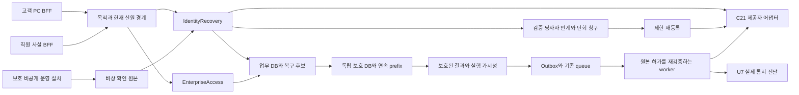

# U2 논리 컴포넌트·호스트 품질 설계

**Unit:** u2-identity-enterprise-access  
**Kind:** library/embedded. 실제 서비스/인프라 수를 늘리지 않고 기존 API·standalone worker·고객/직원 BFF·PostgreSQL/독립 보호 DB·Outbox/SQS·관측 경계에 결합한다. 별도 performance/scalability/reliability/observability 산출물 대신 이 문서가 호스트 조건을 담당한다.

## LC01. Component Inventory and Trust Boundaries

| 논리 컴포넌트 / 원본 소유 | 위치·역할 | 입력·실패 범위 / 격리 |
|---|---|---|
| PurposeIdentityGateway / IdentityRecovery | 기존 Nest API의 명시 boundary, BFF가 서버로 전달 | PRE/INITIAL/INVITE/RECOVERY/BUSINESS를 exact operation으로 구별; STAFF private ingress 검증. public 고객 실패가 직원 credential을 선택하지 않음 |
| IdentityRecoveryCore / U2 | API·worker 공유 TypeScript 모듈 | account/binding/session/MFA/code/case·근거/인계·실제 완료; provider token·확인 근거 상세는 최소 투영 |
| EnterpriseAccessCore / U2 | 같은 호스트 공유 모듈 | 조직/소속/role/grant·현재행위OR·초대/관리자 원본; 부서/사업장/role 문자열로 다른 owner 데이터 자동 접근 불가 |
| PartyClaimCoordinator / IdentityRecovery | U2 purpose submodule | 확인 당사자 context+one-time grant/claim/EnrollmentAuthority, SD05; 담당자 결정과 청구/소비·업무 session 분리 |
| CanonicalScopeEvaluator / EnterpriseAccess | 순수 술어와 현재 원본 repository | SD03/08 exact action/기업/원래 조직·policy revision; old/new 차분 가능. 캐시는 요청 안에서만, 현재 fence 불일치 때 재사용 불가 |
| ProviderCapabilityAdapter / U2·C21 | 기존 API/worker outbound port | Cognito first, Keycloak 향후; native operation·original result와 evidence. 불명/미지원은 HOLD; 새 자체 로그인 플랫폼을 추가하지 않음 |
| ProtectedMutationCoordinator / 기존 U1 기반+U2 payload | primary transaction와 별도 보호 DB journal | SD09의 current fence·candidate/연속 prefix/visibility; journal gap은 보호 변경·ACK 공통 실패 범위 |
| PurposeSecretVault / U2·기존 보호 저장/키 경계 | 별도 암호 자료·key 권위/접근 역할 | raw 전달/진행 자료 한시 read; 일반 Outbox/원장 append·진단 권한으로 복호화 불가 |
| OutboxRelay/Consumer / 기존 호스트·각 owner | 필요한 consumer queue/DLQ·Nest worker | per-message parse/현재permit/lease·effect/ACK; queue는 현재 권위/원본/기한을 소유하지 않음 |
| Notice/OperationalTelemetryPort / U7·U10 | 기존 E01·독립 Slack/email·CloudWatch/OTel | 최소 사실/통지 의무·관측, 신원 이력/실제 전달·복구 완료와 분리 |
| Recovery/MigrationVerifier / U2+기존 복구 도구 | 로컬 검증·등록 비공개 운영 절차 | 새 epoch/ACK·current state·lossless scope/version. 운영자 자격은 business role header로 생성 불가 |

SD01–12는 [security-design.md](security-design.md)의 목적/권위·보호/보류 상세 패턴이다. 위 표는 실제 새 Nest provider/class/DB가 이미 등록됐다는 주장이 아니다. Infrastructure/Code Generation에서 기존 host/provider/schema/registry와 명시 결합한다.

## Logical Architecture

텍스트 대체: 고객/직원 BFF는 목적별 gateway를 통해 IdentityRecovery와 EnterpriseAccess를 호출한다. 직원은 사설 경계, 비상은 보호 비공개 운영 원본이다. 담당자 실제 확인→확인 당사자 인계/단회 청구→제한 재등록을 분리하며 제공자는 C21에 둔다. U2 변경은 primary 후보→독립 보호 DB/prefix→보호 결과/Outbox 순서로 공개된다. worker는 원래 허가를 재검증하고 U7가 통지의 실제 전달을 담당한다. 신원·권한 원본을 telemetry/queue/제공자 group이 대체하지 않는다.

## LC02. Resource Budgets and Query Design

다음은 기존 호스트에 적용할 첫 구현 설정이며 실제 사업의 총 담당자/role 수 한도나 capacity 실적이 아니다. 환경/보호 상한과 충돌하면 실제 성능/보안 근거로 조정하고 변경을 기록한다. 권한·보호를 끄는 완화는 불가다.

| 자원 / 유한 기본값 | 적용·고갈 처리 |
|---|---|
| U2 JSON 요청64KiB·depth16·한 문자열 최대4096문자 | 전용 secret/password는 provider 허용보다 더 넓게 통과시키지 않음; canonical field별 더 작은 기존 제한 우선. 거절은 원문 로그 없이413/정규 문제 |
| 한 명령 roleRefs100·각 role predicate200·evidenceRefs20 | 등록된 추가 profile에서 maxItems/길이검사, 중복 제거 후에도 원래 개수 검사. 총 role/담당자 수 제한 아님; 대량 변경은 현재 권위 있는 독립 bounded 명령으로 수행 |
| 목록 기본25/최대100, opaque 서명 cursor TTL5분 | cursor는 enterprise/action/filter/sort/current authorization fence에 결합; 변경 시 새 목록 요청. cursor로 다른 기업/과거 allow 재사용 불가 |
| 목록 scan chunk200·총 scan2000/요청·필터/정렬 allowlist | 현재 기업/행위 predicate를 SQL 조건/인덱스로 push down. 상한에서 전체 건수를 지어내지 않고 continuation/자원 문제 표시; count도 같은 권한 필터 |
| one API replica U2 active request32·대기32/최대250ms | 상한 초과는429/503와 최소 Retry-After; 최초 시도 실패로 계측. STAFF/인증과 bulk 목록을 별도 논리 bulkhead에 두고 기존 host total limit 아래 조정 |
| provider 접점별 전체 inflight8·각 subject mutation1·probe 전체1 | primary의 등록된 coordination/lease 원본을 사용, 불가하면 새effect 제한. process-local8이 전체replica8을 뜻하지 않음 |
| worker U2 실행4/replica·receive batch≤10 | per-message 검증/격리; global subject slot/permit·기한은 별도. 큐메시지가 늘어도 무제한 goroutine/DB 연결 생성 불가 |
| primary PG pool10/API·5/worker, 보호 PG5/API·3/worker | 기존 host pool을 공유, 새 연결 pool을 더하지 않음. 실제 DB/기존replica 총합 budget 확인; acquire≤500ms, lock≤500ms·statement≤2초·transaction≤3초와 HTTP 남은 기한 중 최소 |
| crypto 검증 동시4/replica·대기16/250ms | 난수/verifier/해시 지원 비용 측정, 비밀번호 hash를 provider로 위임한 경로와 중복 로컬 검증 구별. 고갈은 안전 거절 |
| public/제한 인증 network120회/분·identifier10회/5분·global50req/s | 최소 raw 네트워크/identifier 대신 purpose-keyed bucket Ref; known/unknown 동일 초기 결과. 전역 bucket 원자 관리/endpoint별 그룹·유한 TTL. account 전체 영구 lock으로 전용 불가 |
| invitation token 검증 초대당10회/5분, handoff 유효 형식5실패/grant | 경로 network/global 제한과 별도 원본 시도 집계; 인계5실패 SD05 보호. invalid context는 타인 grant를 임의 소진시키지 않음 |
| 운영 bucket/provider breaker lease TTL≤5분·정리 batch100/분 | 실제 정상 writer/현재 epoch로 조정, 복구 뒤 expired bucket을 인증 허가로 해석하지 않음. 임의 client 새 key로 전역 제한 우회 불가 |

공통 bucket/lease는 별도 Redis/새 서비스 없이 기존 primary의 제한 operational 원본을 사용한다. issuer/unknown identifier의 endpoint 반응·타이밍/상한·NAT 공유 영향은 부정/부하 시험 대상이다. rate limiter 실패는 신규 인증/보호 변경을 차단하며 안전한 기존 업무 조회의 현재 auth를 끄지 않는다. 시간은 서버UTC instant, expiry의 now>=deadline·시계 역행/과도 skew를 감지해 신규 민감 단계 차단; 사용자가 보낸 시간을 authority로 쓰지 않는다.

조회 인덱스 방향은 Account+activeBinding/audience, Session handle verifier/expiry, Membership enterprise+account/state, Invitation enterprise+state+issuedAt 및 tokenGeneration, Grant account+case+state, Role enterprise+state/revision와 action predicate 참조다. unique active binding·원래 invitation accept effect·원래 grant claim·membership enterprise/account·idempotency/consumer effect는 같은 transaction에서 유일성을 보장한다. 큰 role/과거 조직 목록은 keyset pagination하며 authorization SQL 선택 후 필요한 원본만 요청한다.

한 요청의 grant/role/policy 조회는 같은 현재 read snapshot/fence에서 공유한다. 다른 요청 사이 보호 권한/계정/세션 cache는 사용하지 않는다. role 변경의 effectiveAuthorizationRevision은 SD03의 기업/소속/role 참조 tuple로 비교하고 commit/result 직전 current fence를 재검증한다. 데이터 변경이나 provider/보호 대기 동안 긴 DB lock을 잡지 않는다. 전역 commit prefix의 직렬화/공백은 공통 병목으로 별도 측정한다.

## LC03. Performance, Queue and Deadline Patterns

정상 E2E 목표는 읽기p95≤1초/변경p95≤2초/유효 기술오류≤0.1%다. HTTP hard read5초/write10초는 목표 완화값이 아니라 전체 대기 상한이다. BFF→API/current auth/source→primary→journal/prefix→응답을 모두 포함해 측정한다. phase마다 deadline을 다시10초로 만들지 않는다. 인증 provider의 동기 challenge 완료 경로도 실제 provider latency를 포함하고 접수만 반환한 경로와 분리한다.

긴 실제 수단 변경/통지는 원래 protected Receipt/Work 이후 별도 실행·결과다. 보호 접수와 현재 제한 문맥 준비가 없는데 빠른202를 반환하지 않는다. HTTP 시간초과 후 같은 원래 candidate/Receipt/inputDigest로 재대조한다. raw password/provider session 참조가 만료됐으면 expired 새 effect를 실행하지 않고 HOLD/새 현재 준비로 연결한다.

정상 내부 실행 가능한 작업 first-startp95≤10초, 개별attempt≤30초·최초+추가3/첫시도부터5분과 원래 permit deadline 중 최소다. 아직 사람 확인/당사자 입력·provider 대조/허가 부족으로 실행 불가인 시간을 정상 내부 dispatch latency에서 빼되 blocked-age·남은 조치로 별도 보존한다. blocked 작업을 READY로 표시해 빠른 시작 실적으로 만들지 않는다. provider unknown이면 원래 result 대조, expired published는 보호 REVIEW_REQUIRED/HOLD로 종료·보존, SD10의 per-message boundary로 정상 siblings 진행을 유지한다.

서비스 readiness는 current auth/schema/primary 불가와 보호변경(journal/prefix) 불가를 분리한다. provider breaker는 새 인증/관련effect 불가이지 OMS 모든 process 죽음이 아니다. liveness restart가 실제 auth/provider 복구를 증명하지 않는다. journal만 불가해도 현재 안전한 보호 조회/권위가 검증된 범위만 유지하고 변경/claim/ACK는 차단한다.

## LC04. Capacity and Scaling

기존 합성100기업/1000고객/10직원·10000상품/100000주문/평균5·시험최대50품목,100active session·20req/s30분(80/20)·100req/s5분→20req/s5분내회복/10분유지 기준을 유지한다. U2 계정/role/grant/조직 분포는 고정seed로 다양한 scope·retired 조직·초대/복구·거절을 포함한다. 각 U2와 협력 business 경로 비율/성공·최초거절/기술오류를 별도 기록하고 rate/보호 상한 때문에 거절된 peak도 숨기지 않는다.

첫 profile은 정상20req/s의80% 현재 허용 읽기(자기 신원/초대·소속/역할·허용 주문 협력),20% 변경(초대/수락/역할/grant·유효 인증/복구 단계)의 실제 구성과 fixture 개수를 고정한다. 실제 수단 입력/담당자 검토는 사전 결정된 synthetic legitimate client로 모델링하고 작업/통지의 완료는 별도 추적한다. invalid auth 공격 profile은 정상 성능 표본과 별도로 실행하되 정상 요청을 영향받지 않았다고 가정하지 않는다.

기존 stateless API/worker replica를 필요 시 확장할 수 있게 session/claim/permit/attempt/lease를 지속 원본으로 조정한다. 각 replica count와 DB/provider/crypto total budget을 먼저 검증하고 무조건 scale-out/새 sharding/cache를 추가하지 않는다. queue backlog→bounded worker·provider 상한, latency/pool/prefix 지연→원인 조회/프로파일→등록된 호스트 확장 또는 query 개선이다. actual AWSautoscaling/cost값은 Infra에서 기존 배치와 확인한다. business count를 임의 서비스 제한으로 바꾸지 않는다.

## LC05. Availability, Recovery and Protected State

핵심 업무별 rolling30일/계획점검 포함99.9%, 첫 앱·worker/저장 전환/배포·논리 오삭제·단일AZ 일시 장애는 발생부터 현재 보안/성공 접수 검증까지 RTO30분을 유지한다. 센터 소실 물리재난 제외·리전/필수 외부 장기중단30분재개 미검증은 실제 downtime 집계를 면제하지 않는다. provider장애로 허용 login불가도 가용성 실패다.

U2 protected payload inventory는 Account/Binding/SessionFence·MFA/BackupCodeSet+verifier/status·RecoveryCase/Verification/Emergency·PartyClaimContext/Grant/ClaimReceipt/EnrollmentAuthority·Enterprise/Organization/Membership/Invitation/Role/Grant/AdministratorRestoration·history·관련Receipt/Work/permit/effect/notice obligation·schema/epoch/tombstone이다. raw 입력/한시 암호 비밀은 SD11 별도 수명이며 보호된 terminal/파기 marker와 재구성 참조를 유지한다. original HTTP handler를 replay해 grant/MFA/provider 효과를 다시 만들지 않는다.

복원 시 최신 유효 보호 prefix/ACK manifest와 계정/binding/security·소비/회수/만료·외부 UNKNOWN·current authorization tuple을 비교한다. code/grant/session/role 권위의 부활0과 ACK누락/중복0, 원래 업무 owner의8정확성 검증을 함께 확인한다. 새 epoch에서 재인증하고 schemadecoder/파기 suppression을 적용한 뒤 한 writer로 재개한다. 사고 t0→감지·Slack/email자동시도알림→fence/restore→대조/실제 핵심업무까지30분을 측정한다. 문서/합성만으로 AWSfailover/실30분/RPO0를 주장하지 않는다.

## LC06. Observability and Alerting

CloudWatch 중심·OpenTelemetry의 등록된 요청/worker trace100%대상·최소metadata는 기존 결정을 유지한다. emitter drop·clock/trace누락·provider/DB/secret lookup한도·국내저장/비용을 계측하고 trace를 업무 이력/보호 원장으로 대신하지 않는다. labels는 operation/purpose/audience/result/holdReason/version 같은 유한 catalog만. account/email/company/rawtoken·evidence·case/grant ID는 고카디널리티 metric label에 넣지 않는다. 필요한 correlation은 접근 제한 로그/trace에 목적별 keyed 참조로 연결한다.

필수 지표: 일반/제한 인증·허용 business p95/error·현재권한 deny, private ingress rejection, claim expiry/bad/context mismatch/consumed repeat, invite pending/expiry/reconfirm, HOLD reason/age/current resume outcome, provider attempt/unknown/breaker/currentoriginaleffect, primary/journal/prefix gap/ACK latency, queue accepted/blocked/expired/quarantine·firststart, tombstone/복원ACK/currentstate차이·telemetrydrop다. “거절”은 legitimate boundary deny와 허용업무 실패를 구별한다.

- 보호 prefix gap/내용 충돌·보안 상태 부활/ACK비교불일치·권한위반·secret누출은 즉시 incident와 기존 긴급Slack/email경로로 연결한다.
- 자동 복구 시도 시작은 원래incident의 첫시도알림, 실패/수동필요·30분위험은 긴급알림이다. technicalretry마다 새incident/무한알림을 만들지 않는다.
- 핵심업무별5분유효기술실패>1% 또는 p95목표초과가 연속2창이면 경고,10분연속/전체막힘이면 긴급으로 올린다. 저트래픽창은 요청수/synthetic 정상경로 근거를 함께 표시하고0건을100%성공으로 기록하지 않는다.
- 관측알림 요청/actualsend/recipient delivery/명시ACK/복구완료는 별도event다. OMSauth불가에 독립인 기존운영알림과 수동필요를 대조한다. 실제수신자·발송이없으면 local sink만 검사한다.

dashboard는 business별30일actualdowntime·current auth/purpose/hold·provider/protectedprefix·queue/복원검증4뷰로 연결한다. 근거상세/암호원문은 dashboard로 보내지 않는다.

## LC07. One-person Operation, Deployment and PC Interface

실제 정상 기술반복≤30분/일·배포 사람작업≤15분/회·대표1인복구≤30분을 목표로 bounded진단·원래target기반복구/checklist·원본대조/보고서자동화를 설계한다. 판매/신원확인/기업위임 업무와 기술운영 시간을 구별한다. developer1을 계약의다른실제승인자/모든본인확인자 확보로 간주하지 않는다. 실제 역할/근거부족은 businessHOLD다.

초기직원 Cognitoconsole생성과 최소 OMSstaff.role.manage의 비공개보호bootstrap을 보존한다. consoleCONFIRMED/group으로 businessgrant를 자동생성하지 않는다. 비상실자격→원래계정/MFA복구→정상권한재평가→일반직원복구재개 경로를 SD07로 연결한다.

배포는 기존schema/decoder/profile/role fence·outbox/암호자료와 expand→호환검증→featureactivate 순서다. 구version pendingwork/receipt/소비·decoder가남으면 제거하지 않는다. rollback은 새current권한/ACK원본을 덮지않고 호환code/route를 선택한다. 필요한점검은 한국평일20–22시·회당중단≤10분/30일누적≤20분·최소24시간전 화면/기업지정email안내다. 예상초과는 중단/안전되돌림·지연안내로 전환, RTO30분으로점검한도연장불가. 무중단배포/10분복구는 향후목표를 유지하며첫버전실적으로표시하지않는다.

U8/U9에 한국어/KRW/한국시각·PC1280+·고객mobile추후/직원mobile제외·WCAG2.2AA·기존출시최신/직전stablebrowser검증조건을 제공한다. 인계코드 복사/붙여넣기·키보드/label/focus·남은기한/오입력·현재보류사유의허용정보·재인증/새준비/전달요청vs완료를 표현한다. narrowviewport는 보안근거가아니다. 영어(미국) 방향만으로 해외저장/USD/미국출시를 승인하지않는다.

## LC08. Explicit Contract Profile and Migration Plan

새 **urn:oms:contract:u2-access-additions:1**은 설계 식별자이며 아직 실행registry에 존재한다고 주장하지 않는다. original common:1/C01/C02/C21/E01·U1 CE01–04는 보존한다. 모든 새call은 closed context/operation/data/target과 expectedRevision·원래idempotency/Receipt/Problem 의미를 등록한 뒤 활성화한다. 서버authority context는 public data와 구별하며 proof refs를 클라이언트가 생성해 주입할 수 없다.

| profile family / 기능 연결 | 닫힌 target·data·context 의미 |
|---|---|
| Invitation accept/read (CE-U2-01) | exact InvitationRef/challenge; verifiedowncontact/current identity·binding/security/expiry; accept에는 expectedInvitationRevision+originalkey, read는 최소ownprojection |
| Membership list/revoke/update (CE-U2-02) | enterprise/membershipRefs·예상개정·원래/새조직selector·상태/명시reactivate/adminflag; current관리authority·querycursor/allowlist |
| Role revise/deactivate/grant (CE-U2-03) | roleRef/revision+bounded전체predicate/action목록·granttarget·예상accessrevision; define의기존create입력에roleRef를추가하지않음 |
| ScopeV2 (CE-U2-04) | SD03의enterprise/action/kind/두closedselector/sourcepolicyrevision, 기존version별정확한mapping |
| Recovery result/evidence (CE-U2-05) | case/target·observedresult/evidenceRefs/revision·확인policy/currentauthority; actualcomplete/noticeDelivery를구별; unknown/nullable 값은 common 형식을 준수 |
| Emergency private result (CE-U2-06) | exactEmergencyCase/원래account/binding/operation·actualqualifiedOperator/currentpolicy/context·expectedRevision; 정상CUSTOMER/STAFFcall로선택불가 |
| Administrator restore (CE-U2-07) | enterprise/targetmembership·verifieddelegation/person/policy·explicitmanagementgrants·expectedrestoration/enterprise/accessrevision |
| Handoff extension (CE-U2-ND-01) | createPartyContext/issueHandoff/claimHandoff/readOwnClaimResult의별도operation; code는writeOnly·PartyContextsecret+exactgrant/case/enrollment/challenge·expectedRevision·currentbasis/세대/expiry; output은유일ClaimReceipt/limitedhandle |
| Enrollment binding extension (CE-U2-ND-02) | INITIAL_MFA/MFA_REENROLMENT/INVITATION_ACCEPTANCE별closedcontext및permittedoperationcatalog; target/challenge/case/claim/verificationRevision·account/binding/security/epoch/expiry; providerfirstfactor교체는SD06의당사자case내전용operation |
| HOLD control extension (CE-U2-ND-03) | Recovery/Emergency/AdministratorRestoration의resume/close를distinctoperation·exactsourceRef/revision·currentauthority/새basis/reason·originaleffect/supersedes관계로등록 |

공통 Ref/Receipt/Problem/Knowledge·sourceObservedAt/actualResult 의미는 원래contract에서 재사용한다. 바뀐 output view/phase enum은 새profile에만 정의하고 구consumer에unknownenum을밀어넣지않는다. producer지원 version+consumer지원 version이 일치하지않으면 activation거절·남은 work보존이다. C21nativecapability mapping은 exactproviderprofile에등록하며 identity지원없음은UNCONFIRMED/HOLD다.

순서는 모델·새schema/validator/operation등록→old/new decoderfixture와 실제host/provider흐름→losslessscope/backfill/원래target권위→현재fence/보호payload·파기/복원→구consumer병행→local통합→필수검사→관련featurelocalactivation이다. fullwireimplementation은 CodeGeneration에서등록/컴파일하고 schema2020-12/strict/ref/format·negativefixtures로 검증한다. 타입 선언만으로 등록완료라고 하지않는다.

## LC09. Verification and Detailed NFR Mapping

NFRx.y별target은 아래식별자의 실제패턴과SD보안상세를가리킨다. statusOK는 설계 연결이다. 실제goals/localtests/cloud/전체PC/업무accuracy달성판정이아니다.

| NFR | 요구 | 실제 설계·필수 검증 묶음 |
|---|---|---|
| NFR1.1 | 고객/직원 모두 실제 password+TOTP MFA와 필수 사전 복구 코드·보관 확인을 업무 접근 전에 충족한다. | [SD01](security-design.md#SD01) / [SD06](security-design.md#SD06) / SV01,SV05 |
| NFR1.2 | 현재 안정 계정/외부 연결·audience·목적·행위/범위는 서버 원본으로 구성한다. | [SD01](security-design.md#SD01) / [SD03](security-design.md#SD03) / SV01,SV02 |
| NFR1.3 | 같은 행위의 완성된 네 범위만 합집합하고 원래 조직 문맥을 보존한다. | [SD03](security-design.md#SD03) / [SD08](security-design.md#SD08) / SV02,SV08 |
| NFR1.4 | 직원은 모든 인증/등록/복구/조회/실행 경로에서 사설 승인 접점과 현재 MFA/직원 행위 권한을 함께 충족한다. | [SD02](security-design.md#SD02) / [SD07](security-design.md#SD07) / SV01,SV06 |
| NFR1.5 | 고객 유휴30분·직원 유휴15분, 로그인 후 절대8시간과 기존 로그인/MFA challenge5분을 유지한다. | [SD02](security-design.md#SD02) / [SD05](security-design.md#SD05) / SV01,SV04 |
| NFR1.6 | 공개 및 제한 인증 POST에도 origin/CSRF·subject/challenge/state·현재 목적을 검증한다. | [SD02](security-design.md#SD02) / [SD05](security-design.md#SD05) / SV01,SV04 |
| NFR1.7 | 계약 자기 승인 금지는 실제 확인된 동일인 원본으로 판정한다. | [SD07](security-design.md#SD07) / SV02 |
| NFR1.8 | 읽기·목록/건수·오류·이력·통지는 현재 정보 권한으로 최소 투영한다. | [SD03](security-design.md#SD03) / [SD04](security-design.md#SD04) / [SD10](security-design.md#SD10) / SV02 |
| NFR1.9 | worker/외부 관측은 등록된 목적·원래 작업/대상·버전·현재 허가를 명시 검증한다. | [SD06](security-design.md#SD06) / [SD10](security-design.md#SD10) / [LC03](logical-components.md#LC03) / SV05,SV07 |
| NFR1.10 | 비밀 입력과 제한 전달 자료는 일반 업무/이력/telemetry에 원문을 복제하지 않는다. | [SD05](security-design.md#SD05) / [SD11](security-design.md#SD11) / SV04,SV08 |
| NFR1.11 | 승인된 직접/수동/비상 복구는 권한 상승 없이 새 MFA·옛 무효화·보호 이력·당사자 통지로 닫는다. | [SD06](security-design.md#SD06) / [SD07](security-design.md#SD07) / SV05,SV06 |
| NFR1.12 | 확인 담당자의 결정과 확인 당사자의 제한 재등록 허가를 분리하고 원래 목적 대상에 결합한다. | [SD05](security-design.md#SD05) / [SD06](security-design.md#SD06) / SV04 |
| NFR1.13 | 고객 초대 수락 유효기간은 발급시각부터7일이며 현재 본인/MFA·기업/조직/역할/초대자 관리 권한을 다시 확인한다. | [SD04](security-design.md#SD04) / SV03 |
| NFR1.14 | 관리자는 현재 관리 범위 안의 허용 역할을 타인/자신에게 명시적으로 부여하되 해당 업무 권한과 구별한다. | [SD03](security-design.md#SD03) / [SD07](security-design.md#SD07) / SV02,SV06 |
| NFR1.15 | 회수/역할 개정·관리자0·관리자 재지정은 현재 원본과 보호된 변경으로 판정한다. | [SD03](security-design.md#SD03) / [SD07](security-design.md#SD07) / [SD09](security-design.md#SD09) / SV06,SV07 |
| NFR1.16 | 지원/권위·확인 정책/필수 설정이 없으면 실제 인증·복구/지정 적용을 실행하지 않는다. | [SD01](security-design.md#SD01) / [SD06](security-design.md#SD06) / [SD07](security-design.md#SD07) / [LC10](logical-components.md#LC10) / SV01,SV05,SV06 |
| NFR2.1 | 계획 중단 포함 연속30일 가용성99.9%와 핵심 업무별 측정을 유지한다. | [LC05](logical-components.md#LC05) / [LC06](logical-components.md#LC06) |
| NFR3.1 | 기본 앱/worker·저장/전환·배포 실패·논리 손상/오삭제와 단일 AZ 일시 장애의 핵심 업무30분 복구 목표를 유지한다. | [SD09](security-design.md#SD09) / [LC05](logical-components.md#LC05) / SV07 |
| NFR3.2 | 인증 제공자 장애/불명·제한 허가 회수/새 연결 전환은 안전한 보류와 현재 원본 재검증으로 복구한다. | [SD06](security-design.md#SD06) / [SD07](security-design.md#SD07) / [LC03](logical-components.md#LC03) / SV05,SV06 |
| NFR4.1 | U2의 성공 접수/보안 변경은 정의한 장애 범위에서 유실0으로 대조한다. | [SD09](security-design.md#SD09) / [LC05](logical-components.md#LC05) / SV07 |
| NFR4.2 | 응답/외부 결과 불명은 원래 ID/입력·기한/효과 근거로 대조한다. | [SD06](security-design.md#SD06) / [SD09](security-design.md#SD09) / [SD10](security-design.md#SD10) / SV05,SV07 |
| NFR5.1 | 8개 정확성 영역 중 U2가 소유하는 승인/접근·상태/동시·유실/중복·외부 사실·추적 불변조건 위반은 정의한 시험에서0건이어야 한다. | [SD03](security-design.md#SD03) / [SD05](security-design.md#SD05) / [SD06](security-design.md#SD06) / [SD09](security-design.md#SD09) / [LC05](logical-components.md#LC05) / SV02,SV04,SV05,SV07 |
| NFR5.2 | 복구/재지정 보류 원본의 재개·종료는 닫힌 전이와 현재 근거로 검증한다. | [SD07](security-design.md#SD07) / SV06 |
| NFR5.3 | 기술 재시도와 새로운 업무 허가는 구별하며 원래 접수·결과/이력을 지우지 않는다. | [SD07](security-design.md#SD07) / [SD09](security-design.md#SD09) / [SD10](security-design.md#SD10) / [LC03](logical-components.md#LC03) / SV06,SV07 |
| NFR6.1 | 정상 승인 부하에서 조회p95≤1초·변경p95≤2초·유효 요청 기술 오류율≤0.1%를 유지한다. | [LC02](logical-components.md#LC02) / [LC03](logical-components.md#LC03) / [LC04](logical-components.md#LC04) |
| NFR6.2 | 조회5초·변경10초의 HTTP 전체 대기 예산 및 정상 내부 실행 가능 작업 첫 시작p95≤10초를 유지한다. | [SD06](security-design.md#SD06) / [SD10](security-design.md#SD10) / [LC02](logical-components.md#LC02) / [LC03](logical-components.md#LC03) |
| NFR7.1 | 기존 합성 규모·정상/집중/회복 시험 조건을 유지하며 U2 경로 구성을 명시한다. | [LC04](logical-components.md#LC04) / [LC06](logical-components.md#LC06) |
| NFR7.2 | 대량 역할/소속/초대·공개 인증·제한 인계의 자원 사용은 유한 설정/대기·현재 권한으로 제한한다. | [LC02](logical-components.md#LC02) / [LC03](logical-components.md#LC03) / SV04,SV08 |
| NFR8.1 | 기존 계획 점검 시간/중단·안내와 전체 가용성 집계를 유지한다. | [LC07](logical-components.md#LC07) / [LC08](logical-components.md#LC08) |
| NFR9.1 | 1인 정상 기술 운영 반복 작업≤30분/일·일반 배포 사람 작업≤15분/회와 대표 한 사람 복구≤30분을 유지한다. | [LC07](logical-components.md#LC07) / [LC05](logical-components.md#LC05) |
| NFR9.2 | U2는 기존 API/별도 worker에서 공유하는 TypeScript 업무 모듈이며 기존 기술을 유지한다. | [LC01](logical-components.md#LC01) / [LC02](logical-components.md#LC02) / [LC08](logical-components.md#LC08) |
| NFR9.3 | 비공개 초기/비상 준비와 실제 업무 권한/승인자의 책임은 분리한다. | [SD01](security-design.md#SD01) / [SD07](security-design.md#SD07) / [LC07](logical-components.md#LC07) / SV01,SV06 |
| NFR10.1 | 자동 복구 시도 시작부터 기존 Slack/이메일의 개발자 통지와 실패/수동 필요 긴급 통지를 유지한다. | [SD10](security-design.md#SD10) / [LC05](logical-components.md#LC05) / [LC06](logical-components.md#LC06) |
| NFR11.1 | 고객/기업·권한/신원·관련 근거와 포함 로그/백업·제한 전달 자료는 한국 내 저장 요구를 준수한다. | [SD11](security-design.md#SD11) / [LC10](logical-components.md#LC10) / SV08 |
| NFR11.2 | 신원 확인 근거·권한/복구 이력·코드/허가 검증 자료의 보관/정정/파기는 종류·원본/참조·복구 보호와 함께 정한다. | [SD11](security-design.md#SD11) / [SD09](security-design.md#SD09) / [LC05](logical-components.md#LC05) / SV07,SV08 |
| NFR11.3 | 업무 이력과 관측 자료를 분리해 최소화한다. | [SD10](security-design.md#SD10) / [SD11](security-design.md#SD11) / [LC06](logical-components.md#LC06) / SV08 |
| NFR12.1 | 한국어/KRW/한국 시각과 고객/직원 PC1280+·고객 모바일 추후/직원 모바일 제외를 유지한다. | [SD02](security-design.md#SD02) / [LC07](logical-components.md#LC07) |
| NFR12.2 | 기존 WCAG2.2 AA 목표와 고객 Chrome/Edge/Safari/Firefox·직원 Chrome/Edge의 출시 최신/직전 안정 버전 검증을 유지한다. | [LC07](logical-components.md#LC07) / SV01,SV03,SV04 |
| NFR13.1 | 닫힌 C01/C02/C21/E01과 CE-U2-01–07의 profile/목적·target·입출력/오류·version을 실행 중 검증한다. | [SD01](security-design.md#SD01) / [SD12](security-design.md#SD12) / [LC08](logical-components.md#LC08) / SV01,SV08 |
| NFR13.2 | 기존 유효 scope/소속·계정/원래 문맥·대기 자료와 새 표현의 호환을 손실 없이 검증한다. | [SD03](security-design.md#SD03) / [SD08](security-design.md#SD08) / [LC08](logical-components.md#LC08) / SV02,SV08 |
| NFR13.3 | test-after·Standard 단위/통합과 제품 코드 라인 커버리지≥80%·로컬/CI 같은 필수 검사를 유지한다. | [SD12](security-design.md#SD12) / [LC09](logical-components.md#LC09) / SV01–SV08 |
| NFR14.1 | 기존 비밀·SAST·의존성·CDK/생성 인프라·격리 실행 보안 검사와 보고서 차단을 U2 변경에도 적용한다. | [SD12](security-design.md#SD12) / SV08 |
| NFR14.2 | 지원/취약점·예외/비밀 노출 처리는 기존 책임/만료·재검토와 영향 근거를 유지한다. | [SD11](security-design.md#SD11) / [SD12](security-design.md#SD12) / SV08 |

모든43개를 [traceability.json](traceability.json)의 upstream_ids/coverage에 정확히한번씩열거한다. 주책임26AC·협력201AC는원래FDtrace와대조하고SV01–08/부하·복원·보안검사/후속PC통합시험에연결한다. 추가runbook/resource/contract가 구현전필요하면 현설계ID/원래근거와해당파일/검증명령을연결한다.

## LC10. Assumptions & Open Questions

| 활성화 전제 | 후속 소유/차단 |
|---|---|
| 실제인정신원/기업위임·비상운영권위/본인확인·보관policy | U2/실제업무운영, 미확인HOLD·실자료수집금지; syntheticonly |
| actualCognito국내pool/client·IAM/exactSDK/수단operation종료·격리 | U2/Infra, SD06capability 없으면관련실복구불가; 문서존재만으로credential확보추론금지 |
| 실제사설직원ingress/key/암호자료/보호DB/backup/복구자격 | Infra/기존U1owner, 단일AWS계정내검증; MDM/NAC는회사IT |
| typedprofile/model/host/queue·originaldeadline/혼합메시지 | U2+기존host·CodeGeneration, actualregistration/negative/통합회귀전activation불가 |
| current소스성능/99.9/30분/ACK0·현재보안부활0/1인운영/실통지·UI | 품질/U7/U8/U9/U10/Infra, 각각실증필요; 과거U1측정/문서와구별 |
| 원래FD R-01–R-03/U1구현2보완 | 설계provenance만유지, 이전review/위험수용/해소판정변경없음 |

## Sources

- [security-requirements.md](../nfr-requirements/security-requirements.md), [tech-stack-decisions.md](../nfr-requirements/tech-stack-decisions.md) —43개상세요구/기존선정/목표·actualgate.
- [functional-spec.md](../functional-design/functional-spec.md), [contract-summary.md](../../../inception/contract-design/contract-summary.md), [components.md](../../../inception/domain-design/components.md) —workflows·폐쇄profile/owner경계.
- [nfr-design-questions.md](nfr-design-questions.md), [security-design.md](security-design.md) —확인한수명/청구와보안원본·HOLD/호환/보호pattern.
- 명시통합파일 [U1 security-design.md](../../u1-integrated-foundation/nfr-design/security-design.md), [U1 reliability-design.md](../../u1-integrated-foundation/nfr-design/reliability-design.md) —기존host/protectedprefix/기한·retry/복원규칙. 실제새운영보장근거로전용하지않는다.

