# OMS 논리 컴포넌트·엔티티 소유권

## 설계 목적과 확정 범위

승인된 B2B 단일 판매 회사의 HW/SW 주문 업무를 **14개 논리 코드 컴포넌트·75개 단일 소유 엔티티**로 연결한다. 69 US·227 AC의 기능 범위를 유지한다. 질문별 선택과 별도 Looks correct 요약 확인을 근거로 작성했으며, Q1 분해 제안은 이 요약에서 함께 확인됐다. 최초 Q1을 사용자 개별 선택으로 소급 기록하지 않는다. [S1–S4]

논리 컴포넌트는 작성할 코드의 책임 경계다. 배포 단위·모놀리스/마이크로서비스/서버리스는 Units Generation에서, 언어·DB·AWS 서비스·저장/전송/동시 제어·NFR 구현은 후속 단계에서 정한다. AWS/CDK 제약·전체 기능·1인 구조 목표는 유지한다. 엔티티는 소유자·식별자·속성 이름·교차 참조만 다루며 타입·허용 값·검증식·관계 수는 Functional Design에 둔다. [S3–S4]

## Component Catalogue

다음 YAML이 컴포넌트·엔티티·호출 의존의 단일 원본이다. 아래 표와 도식은 같은 데이터를 파생 표시한다. `depends_on`은 호출/논리 통지를 보내는 쪽→수신 소유자이며, 엔티티 참조만 있다고 코드 호출을 추가하지 않는다. 같은 두 컴포넌트에 조회와 사실 통지가 함께 있으면 서로 다른 의미의 항목/간선으로 보존한다. `event`는 비재귀적인 확인 사실의 논리 전달이며 특정 메시지 기술 선택이 아니다.

```yaml
components:
- name: IdentityRecovery
  summary: 계정 신원·MFA·복구와 확인된 동일인 연결
  behaviour: 모든 사용자 MFA와 사전 복구 수단 또는 권한 있는 직원의 신원 확인 경로를 제공한다. 재등록 때 이전 수단 무효화·이력·통지를 연결한다. 이메일만으로 MFA를 해제하지 않는다. 확인된 신원과
    업무 승인/권한을 구별하고 동일 직원의 다른 계정으로 계약 자기 승인을 우회하지 못하게 하는 확인된 동일인 근거를 제공한다. 실제 증거·세션·효력·직원 PC/망 판단은 OQ4다. 직원 대행 복구는 EnterpriseAccess에서
    확인한 행위 권한 근거를 받은 경로만 허용하고 클라이언트의 권한 주장으로 실행하지 않는다. 인증 확인/등록 연락 경로 조회는 복구 통지 생성 동작과 구별한다.
  responsibilities:
  - 계정·등록된 연락 경로·인증/MFA/복구 결과
  - 확인된 계정-동일인 연결 근거와 신원 증명
  - 권한 확대 없는 복구 및 원본 연결 이력
  depends_on:
  - component: NotificationDelivery
    interaction: MFA 복구/재등록 결과의 통지 근거 전달
    style: event
  dependents:
  - component: EnterpriseAccess
    interaction: 신원·MFA/계정 상태 확인 및 직원 권한 확인 후 복구 실행 연결
  - component: CommercialAgreement
    interaction: 계약 등록자/승인자의 확인된 동일인 근거 조회
  - component: WorkInquiry
    interaction: 허용된 원본·이력·확인 시점/남은 조치의 조합 조회
  - component: NotificationDelivery
    interaction: 등록된 수신 경로 조회
  - component: OperationalAssurance
    interaction: 권한 있는 운영 검증의 진단·접수/결과/이력 대조 근거 조회
  - component: CustomerUi
    interaction: 고객에게 허용된 조회/행동·결과를 연결
  - component: StaffUi
    interaction: 직원에게 부여된 조회/행동·판단/실제 결과를 연결
  external_dependencies:
  - name: 업무별 지속 기록 수단 미선정
    kind: other
    purpose: 성공 접수와 업무 결과·연동 대조·변경 이력을 보존할 논리 의존. DB/파일/저장 구성과 복구·국내 위치는 후속 설계·실증에서 정한다.
  - name: 인증·MFA·복구 제공자 미선정
    kind: third-party-api
    purpose: 인증 수단을 위임하는 경우의 검증된 결과·등록 연락 경로. 제공자 채택은 확정하지 않는다.
  entities:
  - name: Account
    identifier: accountId
    attributes: [accountId, registeredContactRefs, identityLinkRef, authenticationState, mfaState]
    references: []
  - name: VerifiedPersonLink
    identifier: personLinkId
    attributes: [personLinkId, accountRefs, verificationEvidenceRefs, verifiedBy, verifiedAt]
    references: []
  - name: MfaEnrollment
    identifier: enrollmentId
    attributes: [enrollmentId, accountRef, methodRef, enrollmentResult, invalidatedAt]
    references: []
  - name: RecoveryCase
    identifier: recoveryCaseId
    attributes: [recoveryCaseId, accountRef, recoveryMethodRef, verificationEvidenceRefs, staffDecisionRef, previousEnrollmentRef,
      newEnrollmentRef, actualResult, noticeRef]
    references: []
  - name: IdentityHistory
    identifier: historyId
    attributes: [historyId, actorAccountId, verifiedPersonRef, occurredAt, reason, beforeRef, afterRef, evidenceRefs, requestRef,
      resultRef, correctionOf, sourceRevision]
    references: []
- name: EnterpriseAccess
  summary: 기업 승인·조직·소속·고객/직원 역할과 행위별 범위
  behaviour: 기업 직원 승인/첫 관리자 근거와 고객 조직·사용자·행위별 범위를 소유한다. 인증된 신원만으로 기업 승인 또는 업무 권한을 부여하지 않는다. 권한별 여러 역할 범위를 합집합으로 계산하고 서로 다른
    행위의 부서/사업장 범위를 조합해 넓히지 않는다. 마지막 관리자 회수는 경고·이력을 남기고 허용하며 다른 사용자 권한은 유지한다. 고객이 직원 전용 권한을 부여할 수 없다. 실제 권한 목록·직원 망/PC·변경 중
    효력은 OQ4. 서버측 진입에서 IdentityRecovery의 검증된 신원·MFA/계정 상태를 확인하고 권한을 평가한다. 통지 대상의 권한 평가는 수신자의 현재 로그인 여부와 구별한다.
  responsibilities:
  - 기업 이용 신청/검증/승인·첫/후속 관리자
  - 부서·사업장·소속·활성 여부
  - 고객/직원 역할 정의·부여/회수·행위별 범위와 접근 판단
  - 관리자 부재·재지정 근거와 원본 권한 이력
  depends_on:
  - component: IdentityRecovery
    style: sync
    interaction: 신원·MFA/계정 상태 확인 및 직원 권한 확인 후 복구 실행 연결
  dependents:
  - component: ProductCatalog
    interaction: 직원 상품 등록·공통 조건 변경 권한 확인
  - component: CommercialAgreement
    interaction: 기업·계약 등록/승인·고객 동의의 행위 범위 확인
  - component: OrderAcceptance
    interaction: 기업 이용 승인·조직/주문 제출·판단 권한 확인
  - component: FinancialSettlement
    interaction: 대금 조회·등록·배분·정정/환불 행위 범위 확인
  - component: HardwareFulfillment
    interaction: HW 입력·확보/출고/회수·재처리 행위 범위 확인
  - component: SoftwareLifecycle
    interaction: 발급/갱신/회수·기간 요청/별도 승인 권한 확인
  - component: AfterSalesDecision
    interaction: 후속 요청/판단·보류 행위 범위 확인
  - component: WorkInquiry
    interaction: 허용된 원본·이력·확인 시점/남은 조치의 조합 조회
  - component: NotificationDelivery
    interaction: 수신자·기업/행위별 정보 권한 확인
  - component: OperationalAssurance
    interaction: 권한 있는 운영 검증의 진단·접수/결과/이력 대조 근거 조회
  - component: CustomerUi
    interaction: 고객에게 허용된 조회/행동·결과를 연결
  - component: StaffUi
    interaction: 직원에게 부여된 조회/행동·판단/실제 결과를 연결
  external_dependencies:
  - name: 업무별 지속 기록 수단 미선정
    kind: other
    purpose: 성공 접수와 업무 결과·연동 대조·변경 이력을 보존할 논리 의존. DB/파일/저장 구성과 복구·국내 위치는 후속 설계·실증에서 정한다.
  entities:
  - name: EnterpriseApplication
    identifier: applicationId
    attributes: [applicationId, enterpriseDetailsRef, applicantAccountRef, verificationEvidenceRefs, staffDecisionRef, initialAdministratorRef,
      result]
    references:
    - entity: Account
      owned_by: IdentityRecovery
      relationship: 행위자 또는 대상 계정의 원본 참조
  - name: Enterprise
    identifier: enterpriseId
    attributes: [enterpriseId, applicationRef, approvalRef, usageState, designatedNoticeContactRefs]
    references: []
  - name: Department
    identifier: departmentId
    attributes: [departmentId, enterpriseRef, label, activeState]
    references: []
  - name: BusinessSite
    identifier: siteId
    attributes: [siteId, enterpriseRef, label, activeState]
    references: []
  - name: EnterpriseMembership
    identifier: membershipId
    attributes: [membershipId, accountRef, enterpriseRef, departmentRef, siteRef, activeState, administratorState]
    references:
    - entity: Account
      owned_by: IdentityRecovery
      relationship: 행위자 또는 대상 계정의 원본 참조
  - name: CustomerRole
    identifier: customerRoleId
    attributes: [customerRoleId, enterpriseRef, label, actionScopeRefs]
    references: []
  - name: CustomerRoleGrant
    identifier: grantId
    attributes: [grantId, membershipRef, roleRef, grantedBy, effectiveRef, revocationRef]
    references:
    - entity: Account
      owned_by: IdentityRecovery
      relationship: 행위자 또는 대상 계정의 원본 참조
  - name: StaffRole
    identifier: staffRoleId
    attributes: [staffRoleId, label, actionRefs]
    references: []
  - name: StaffRoleGrant
    identifier: staffGrantId
    attributes: [staffGrantId, accountRef, roleRef, grantedBy, effectiveRef, revocationRef]
    references:
    - entity: Account
      owned_by: IdentityRecovery
      relationship: 행위자 또는 대상 계정의 원본 참조
  - name: ActionScope
    identifier: actionScopeId
    attributes: [actionScopeId, actionRef, enterpriseRef, departmentRefs, siteRefs, scopeExpression]
    references: []
  - name: AccessHistory
    identifier: historyId
    attributes: [historyId, actorAccountId, verifiedPersonRef, occurredAt, reason, beforeRef, afterRef, evidenceRefs, requestRef,
      resultRef, correctionOf, sourceRevision]
    references:
    - entity: Account
      owned_by: IdentityRecovery
      relationship: 행위자 또는 대상 계정의 원본 참조
- name: ProductCatalog
  summary: 판매 상품과 공통 공개·가격 조건
  behaviour: 권한 있는 내부 직원만 판매 상품을 등록한다. HW·영구/기간제 SW 판매 정보와 공통 조건 버전을 소유한다. 고객별 합의 예외는 CommercialAgreement의 원본을 이용하고 여기서 같은
    예외를 재소유하지 않는다. 상품의 현재 가격 변경은 이미 접수한 주문의 구매 당시 조건을 바꾸지 않는다. 전사 PIM·외부 판매자 등록·범용 규칙 편집기를 포함하지 않는다.
  responsibilities:
  - 상품 등록·판매 정보·공통 판매 조건 버전
  - 기업 예외와 합성할 공통 공개/가격 입력
  - 상품 변경 원본 이력
  depends_on:
  - component: EnterpriseAccess
    interaction: 직원 상품 등록·공통 조건 변경 권한 확인
    style: sync
  dependents:
  - component: CommercialAgreement
    interaction: 대상 상품·공통 조건 원본 확인
  - component: OrderAcceptance
    interaction: 판매 상품 타입·공통 조건 조회
  - component: WorkInquiry
    interaction: 허용된 원본·이력·확인 시점/남은 조치의 조합 조회
  - component: OperationalAssurance
    interaction: 권한 있는 운영 검증의 진단·접수/결과/이력 대조 근거 조회
  - component: StaffUi
    interaction: 직원에게 부여된 조회/행동·판단/실제 결과를 연결
  external_dependencies:
  - name: 업무별 지속 기록 수단 미선정
    kind: other
    purpose: 성공 접수와 업무 결과·연동 대조·변경 이력을 보존할 논리 의존. DB/파일/저장 구성과 복구·국내 위치는 후속 설계·실증에서 정한다.
  entities:
  - name: Product
    identifier: productId
    attributes: [productId, productType, softwareTermKind, salesDescriptionRef, currentCommonOfferRef, saleState]
    references: []
  - name: CommonOfferRevision
    identifier: commonOfferRevisionId
    attributes: [commonOfferRevisionId, productRef, publicVisibilityRuleRef, priceTermsRef, salesConditionRefs, revisionEvidenceRefs]
    references: []
  - name: CatalogHistory
    identifier: historyId
    attributes: [historyId, actorAccountId, verifiedPersonRef, occurredAt, reason, beforeRef, afterRef, evidenceRefs, requestRef,
      resultRef, correctionOf, sourceRevision]
    references:
    - entity: Account
      owned_by: IdentityRecovery
      relationship: 행위자 또는 대상 계정의 원본 참조
- name: CommercialAgreement
  summary: 기업 계약·승인된 예외·거래 변경 제안과 동의
  behaviour: 기업 계약 조건과 기업별 상품 공개/가격 예외의 단일 원본을 소유한다. 고객 계약 변경 요청→직원 등록→합의 근거를 확인한 다른 사람의 승인 경로를 구분한다. 기업 계약 조건을 개별 자동 갱신보다
    우선한다. 거래/갱신 변경 제안은 대상·버전·원래/변경 조건·권한·동의/거절 근거를 연결하고 오래된 제안·미확인 동의를 승인으로 취급하지 않는다. 주문 구매 당시 조건과 실제 SW 기간은 여기서 수정하지 않는다.
  responsibilities:
  - 기업 계약 개정·등록·승인·합의 근거
  - 고객 기업별 공개/가격 예외와 확정 계약 정책
  - 주문/갱신 대상 변경 제안·버전·고객 동의/거절
  depends_on:
  - component: EnterpriseAccess
    interaction: 기업·계약 등록/승인·고객 동의의 행위 범위 확인
    style: sync
  - component: IdentityRecovery
    interaction: 계약 등록자/승인자의 확인된 동일인 근거 조회
    style: sync
  - component: ProductCatalog
    interaction: 대상 상품·공통 조건 원본 확인
    style: sync
  - component: NotificationDelivery
    interaction: 제안·계약 판단의 고객 조치 통지 근거 전달
    style: event
  dependents:
  - component: OrderAcceptance
    interaction: 기업 예외·계약·제안 버전/동의 조회
  - component: FinancialSettlement
    interaction: 확정 지급·후불·연체·갱신 요금/합의 근거 조회
  - component: HardwareFulfillment
    interaction: 공급·지급/제공·배송/인수 완료·보류 합의 조회
  - component: SoftwareLifecycle
    interaction: 기업 계약 우선·합의 기간/유예·제안/동의 버전 조회
  - component: AfterSalesDecision
    interaction: 변경/취소/반품 허용·보류 정책/합의 근거 조회
  - component: WorkInquiry
    interaction: 허용된 원본·이력·확인 시점/남은 조치의 조합 조회
  - component: OperationalAssurance
    interaction: 권한 있는 운영 검증의 진단·접수/결과/이력 대조 근거 조회
  - component: CustomerUi
    interaction: 고객에게 허용된 조회/행동·결과를 연결
  - component: StaffUi
    interaction: 직원에게 부여된 조회/행동·판단/실제 결과를 연결
  external_dependencies:
  - name: 업무별 지속 기록 수단 미선정
    kind: other
    purpose: 성공 접수와 업무 결과·연동 대조·변경 이력을 보존할 논리 의존. DB/파일/저장 구성과 복구·국내 위치는 후속 설계·실증에서 정한다.
  entities:
  - name: EnterpriseContract
    identifier: contractId
    attributes: [contractId, enterpriseRef, currentApprovedRevisionRef, contractEvidenceRefs]
    references:
    - entity: Enterprise
      owned_by: EnterpriseAccess
      relationship: 해당 구매 기업의 원본 참조
  - name: AgreementRevision
    identifier: agreementRevisionId
    attributes: [agreementRevisionId, contractRef, productScopeRefs, commercialTermsRef, provisionTermsRef, renewalTermsRef,
      registeredBy, registeredPersonRef, approvalRef, agreementEvidenceRefs]
    references:
    - entity: Enterprise
      owned_by: EnterpriseAccess
      relationship: 해당 구매 기업의 원본 참조
    - entity: Product
      owned_by: ProductCatalog
      relationship: 거래 대상 판매 상품 참조
  - name: ContractChangeRequest
    identifier: contractChangeRequestId
    attributes: [contractChangeRequestId, enterpriseRef, requestedConditionRefs, requesterRef, registeredRevisionRef, resultRef]
    references:
    - entity: Enterprise
      owned_by: EnterpriseAccess
      relationship: 해당 구매 기업의 원본 참조
    - entity: Account
      owned_by: IdentityRecovery
      relationship: 행위자 또는 대상 계정의 원본 참조
  - name: AgreementApproval
    identifier: approvalId
    attributes: [approvalId, revisionRef, registrantPersonRef, approverAccountRef, approverPersonRef, evidenceRefs, decision,
      occurredAt]
    references:
    - entity: Account
      owned_by: IdentityRecovery
      relationship: 행위자 또는 대상 계정의 원본 참조
  - name: EnterpriseOfferException
    identifier: offerExceptionId
    attributes: [offerExceptionId, enterpriseRef, productRef, agreementRevisionRef, visibilityTermsRef, priceTermsRef]
    references:
    - entity: Enterprise
      owned_by: EnterpriseAccess
      relationship: 해당 구매 기업의 원본 참조
    - entity: Product
      owned_by: ProductCatalog
      relationship: 거래 대상 판매 상품 참조
  - name: CommercialProposal
    identifier: proposalId
    attributes: [proposalId, targetOrderRef, targetEntitlementRef, targetRenewalCycleRef, originalTermsRef, proposedTermsRef,
      proposalRevision, evidenceRefs, result]
    references:
    - entity: Order
      owned_by: OrderAcceptance
      relationship: 대상 주문 원본 참조
    - entity: EnterpriseEntitlement
      owned_by: SoftwareLifecycle
      relationship: 대상 기업 SW 권한 참조
  - name: CustomerConsent
    identifier: consentId
    attributes: [consentId, proposalRef, proposalRevision, actorAccountRef, enterpriseRef, decision, evidenceRefs, occurredAt]
    references:
    - entity: Account
      owned_by: IdentityRecovery
      relationship: 행위자 또는 대상 계정의 원본 참조
    - entity: Enterprise
      owned_by: EnterpriseAccess
      relationship: 해당 구매 기업의 원본 참조
  - name: AgreementHistory
    identifier: historyId
    attributes: [historyId, actorAccountId, verifiedPersonRef, occurredAt, reason, beforeRef, afterRef, evidenceRefs, requestRef,
      resultRef, correctionOf, sourceRevision]
    references:
    - entity: Account
      owned_by: IdentityRecovery
      relationship: 행위자 또는 대상 계정의 원본 참조
    - entity: Enterprise
      owned_by: EnterpriseAccess
      relationship: 해당 구매 기업의 원본 참조
- name: OrderAcceptance
  summary: 주문 접수·구매 당시 조건과 주문 전체 수락 판단
  behaviour: HW/SW 별도 주문과 같은 타입 다품목·수량, 선후불 혼합, 기본 일괄 제공·명시적 부분 제공 동의를 보존한다. 무효 기업/권한/상품 타입/입력은 거절하고 직원 확인으로 우회하지 않는다. 계약·전체
    품목의 공급 가능성·납기가 모두 확인될 때만 주문 전체를 자동 수락하며 미확인/충돌/조회 실패는 전체 직원 확인 대기로 보낸다. 수락을 지급·물리 확보·출고·발급 완료와 구별한다. 승인된 제안/후속 판단에 따른
    변경도 원래 조건·적용 결과를 보존한다.
  responsibilities:
  - 주문·품목·구매 당시 가격/계약 조건·제공 선택 스냅샷
  - 전체 자동 수락/직원 판단과 미확인 사유
  - 허용된 주문 변경 적용 결과·접수/수락 원본 이력
  depends_on:
  - component: EnterpriseAccess
    interaction: 기업 이용 승인·조직/주문 제출·판단 권한 확인
    style: sync
  - component: ProductCatalog
    interaction: 판매 상품 타입·공통 조건 조회
    style: sync
  - component: CommercialAgreement
    interaction: 기업 예외·계약·제안 버전/동의 조회
    style: sync
  - component: FinancialSettlement
    interaction: 확인된 계약 연체 제한·대금 판단 근거 조회
    style: sync
  - component: HardwareFulfillment
    interaction: HW 전체 품목 공급 가능성·납기 근거 조회
    style: sync
  - component: SoftwareLifecycle
    interaction: SW 전체 품목 발급 가능성·납기 근거 조회
    style: sync
  - component: FinancialSettlement
    interaction: 확인된 주문 수락/조건 변경·제공 선택 사실 전달
    style: event
  - component: HardwareFulfillment
    interaction: 확인된 주문 수락/조건 변경·제공 선택 사실 전달
    style: event
  - component: SoftwareLifecycle
    interaction: 확인된 주문 수락/조건 변경·제공 선택 사실 전달
    style: event
  - component: NotificationDelivery
    interaction: 주문 수락/거절·확인 필요 통지 근거 전달
    style: event
  dependents:
  - component: AfterSalesDecision
    interaction: 전체 주문 현재 조건 조회·허용 변경의 적용 요청
  - component: WorkInquiry
    interaction: 허용된 원본·이력·확인 시점/남은 조치의 조합 조회
  - component: OperationalAssurance
    interaction: 권한 있는 운영 검증의 진단·접수/결과/이력 대조 근거 조회
  - component: CustomerUi
    interaction: 고객에게 허용된 조회/행동·결과를 연결
  - component: StaffUi
    interaction: 직원에게 부여된 조회/행동·판단/실제 결과를 연결
  external_dependencies:
  - name: 업무별 지속 기록 수단 미선정
    kind: other
    purpose: 성공 접수와 업무 결과·연동 대조·변경 이력을 보존할 논리 의존. DB/파일/저장 구성과 복구·국내 위치는 후속 설계·실증에서 정한다.
  entities:
  - name: Order
    identifier: orderId
    attributes: [orderId, enterpriseRef, requesterAccountRef, submissionRequestRef, submittedAt, productType, purchaseTermsRef,
      provisionChoiceRef, acceptanceRef, changeApplicationRefs]
    references:
    - entity: Enterprise
      owned_by: EnterpriseAccess
      relationship: 해당 구매 기업의 원본 참조
    - entity: Account
      owned_by: IdentityRecovery
      relationship: 행위자 또는 대상 계정의 원본 참조
    - entity: AgreementRevision
      owned_by: CommercialAgreement
      relationship: 판단에 적용한 승인된 계약 조건 버전 참조
  - name: OrderLine
    identifier: orderLineId
    attributes: [orderLineId, orderRef, productRef, quantity, purchasePriceTermsRef, paymentTermsRef, agreedPeriodRef, agreedCompletionBasisRef]
    references:
    - entity: Product
      owned_by: ProductCatalog
      relationship: 거래 대상 판매 상품 참조
  - name: PurchaseTermsSnapshot
    identifier: purchaseTermsId
    attributes: [purchaseTermsId, orderRef, catalogRevisionRefs, agreementRevisionRef, pricesRef, termsRef, evidenceRefs]
    references:
    - entity: AgreementRevision
      owned_by: CommercialAgreement
      relationship: 판단에 적용한 승인된 계약 조건 버전 참조
  - name: ProvisionChoice
    identifier: provisionChoiceId
    attributes: [provisionChoiceId, orderRef, customerChoice, consentRef, effectiveRevisionRef]
    references:
    - entity: Enterprise
      owned_by: EnterpriseAccess
      relationship: 해당 구매 기업의 원본 참조
  - name: AcceptanceDecision
    identifier: acceptanceDecisionId
    attributes: [acceptanceDecisionId, orderRef, assessmentRevision, supplyEvidenceRefs, leadTimeEvidenceRefs, contractEvidenceRef,
      actorRef, decision, reasonRefs]
    references:
    - entity: Account
      owned_by: IdentityRecovery
      relationship: 행위자 또는 대상 계정의 원본 참조
  - name: OrderChangeApplication
    identifier: orderChangeApplicationId
    attributes: [orderChangeApplicationId, orderRef, afterSalesDecisionRef, consentRef, previousTermsRef, changedTermsRef,
      actualApplicationResult]
    references:
    - entity: AfterSalesDecisionRecord
      owned_by: AfterSalesDecision
      relationship: 변경 허용 판단과 적용 대상 참조
  - name: OrderHistory
    identifier: historyId
    attributes: [historyId, actorAccountId, verifiedPersonRef, occurredAt, reason, beforeRef, afterRef, evidenceRefs, requestRef,
      resultRef, correctionOf, sourceRevision]
    references:
    - entity: Account
      owned_by: IdentityRecovery
      relationship: 행위자 또는 대상 계정의 원본 참조
    - entity: Enterprise
      owned_by: EnterpriseAccess
      relationship: 해당 구매 기업의 원본 참조
- name: FinancialSettlement
  summary: 청구·지급·배분·환불과 대금 조건 판단
  behaviour: 직원 근거와 외부 청구/지급/환불 결과를 출처·참조·정정과 연결한다. 명확한 근거만 자동 배분하고 미배분·상충은 대조한다. 배분/환불 중복·확인 금액 초과를 막는다. 선후불 혼합에서 선결제 기준이
    후불액을 포함하지 않도록 하며 계약금 후 확보 가능과 출고/발급 가능을 구별한다. HW/SW 소유자가 확인한 품목·수량별 제공 완료로 후불 기한을 계산한다. 보상 중첩 요금의 산식/승인 금액과 청구 반영을 소유하고
    실제 SW 기간·계약 갱신 일정은 수정하지 않는다. 지급 미확인은 연체로 단정하지 않는다.
  responsibilities:
  - 청구·지급·배분·환불 실제 결과와 잔액·정정
  - 품목별 지급 충족 판단·후불 기한·계약 연체 제한 근거
  - 보상 중첩 갱신 요금 조정
  - 대금 연동 요청/수신 대조·충돌·미확인·실패 재처리 기록
  depends_on:
  - component: EnterpriseAccess
    interaction: 대금 조회·등록·배분·정정/환불 행위 범위 확인
    style: sync
  - component: CommercialAgreement
    interaction: 확정 지급·후불·연체·갱신 요금/합의 근거 조회
    style: sync
  - component: HardwareFulfillment
    interaction: 확인된 지급 조건·제한·대금 충돌/정정 사실 전달
    style: event
  - component: SoftwareLifecycle
    interaction: 지급/유예·요금 조정·대금 충돌/정정 사실 전달
    style: event
  - component: NotificationDelivery
    interaction: 지급 확인·대금 조치 필요 통지 근거 전달
    style: event
  dependents:
  - component: OrderAcceptance
    interaction: 확인된 계약 연체 제한·대금 판단 근거 조회
  - component: OrderAcceptance
    interaction: 확인된 주문 수락/조건 변경·제공 선택 사실 전달
  - component: HardwareFulfillment
    interaction: 수량별 실제 제공/회수·이행 충돌/정정 사실 전달
  - component: SoftwareLifecycle
    interaction: 갱신 청구 판단 입력·실제 제공/회수·보상 기간/정정 사실 전달
  - component: AfterSalesDecision
    interaction: 실제 지급/배분·환불 가능 근거 조회
  - component: AfterSalesDecision
    interaction: 허용된 환불 대상·합의 한도·보류 판단 전달
  - component: WorkInquiry
    interaction: 허용된 원본·이력·확인 시점/남은 조치의 조합 조회
  - component: OperationalAssurance
    interaction: 권한 있는 운영 검증의 진단·접수/결과/이력 대조 근거 조회
  - component: StaffUi
    interaction: 직원에게 부여된 조회/행동·판단/실제 결과를 연결
  external_dependencies:
  - name: 업무별 지속 기록 수단 미선정
    kind: other
    purpose: 성공 접수와 업무 결과·연동 대조·변경 이력을 보존할 논리 의존. DB/파일/저장 구성과 복구·국내 위치는 후속 설계·실증에서 정한다.
  - name: 대금 처리·청구/지급/환불 주체 미선정
    kind: third-party-api
    purpose: 직원 근거와 병행할 검증된 결과. 실제 수금·카드망·자동 출금 실행 자체는 OMS 밖이다.
  entities:
  - name: Invoice
    identifier: invoiceId
    attributes: [invoiceId, enterpriseRef, orderLineRefs, renewalCycleRefs, chargeTermsRef, providedTrancheRefs, dueDateBasisRef,
      correctionRefs]
    references:
    - entity: Enterprise
      owned_by: EnterpriseAccess
      relationship: 해당 구매 기업의 원본 참조
    - entity: OrderLine
      owned_by: OrderAcceptance
      relationship: 대상 주문 품목·수량과 구매 당시 조건 참조
    - entity: RenewalCycle
      owned_by: SoftwareLifecycle
      relationship: 대상 갱신 회차 참조
  - name: PaymentEvidence
    identifier: paymentEvidenceId
    attributes: [paymentEvidenceId, enterpriseRef, externalReference, sourceRef, amount, confirmationRef, correctionRefs]
    references:
    - entity: Enterprise
      owned_by: EnterpriseAccess
      relationship: 해당 구매 기업의 원본 참조
  - name: PaymentAllocation
    identifier: allocationId
    attributes: [allocationId, paymentEvidenceRef, invoiceRef, orderLineRefs, amount, decisionEvidenceRefs, correctionOf]
    references:
    - entity: OrderLine
      owned_by: OrderAcceptance
      relationship: 대상 주문 품목·수량과 구매 당시 조건 참조
  - name: FinancialEligibility
    identifier: financialEligibilityId
    attributes: [financialEligibilityId, orderRef, lineRefs, renewalCycleRefs, agreementRevisionRef, paymentBasisRefs, allowedQuantityBasisRef,
      restrictionBasisRef, sourceRevision]
    references:
    - entity: Order
      owned_by: OrderAcceptance
      relationship: 대상 주문 원본 참조
    - entity: OrderLine
      owned_by: OrderAcceptance
      relationship: 대상 주문 품목·수량과 구매 당시 조건 참조
    - entity: AgreementRevision
      owned_by: CommercialAgreement
      relationship: 판단에 적용한 승인된 계약 조건 버전 참조
  - name: RefundCase
    identifier: refundCaseId
    attributes: [refundCaseId, afterSalesDecisionRef, paymentEvidenceRefs, allocationRefs, agreedLimitRef, requestedAmount,
      actualResultRefs, remainingAmountBasisRef]
    references:
    - entity: AfterSalesDecisionRecord
      owned_by: AfterSalesDecision
      relationship: 허용 환불 대상·합의 한도 근거
  - name: RenewalFeeAdjustment
    identifier: feeAdjustmentId
    attributes: [feeAdjustmentId, renewalCycleRef, periodAdjustmentRef, calculationEvidenceRef, approvedAmountRef, invoiceRef,
      applicationResult]
    references:
    - entity: RenewalCycle
      owned_by: SoftwareLifecycle
      relationship: 계약 갱신 회차 참조
    - entity: PeriodAdjustment
      owned_by: SoftwareLifecycle
      relationship: 승인된 실제 보상 기간 참조
  - name: FinancialExchange
    identifier: financialExchangeId
    attributes: [financialExchangeId, operationRef, requestRef, externalReference, sourceRef, receivedEvidenceRef, confirmedResultRef,
      correlationRefs]
    references: []
  - name: FinancialReconciliationCase
    identifier: financialReconciliationId
    attributes: [financialReconciliationId, conflictingEvidenceRefs, affectedFactsRefs, dependentActionRefs, staffDecisionRef,
      correctionRefs, remainingActionRefs]
    references:
    - entity: Account
      owned_by: IdentityRecovery
      relationship: 행위자 또는 대상 계정의 원본 참조
  - name: FinancialHistory
    identifier: historyId
    attributes: [historyId, actorAccountId, verifiedPersonRef, occurredAt, reason, beforeRef, afterRef, evidenceRefs, requestRef,
      resultRef, correctionOf, sourceRevision]
    references:
    - entity: Account
      owned_by: IdentityRecovery
      relationship: 행위자 또는 대상 계정의 원본 참조
    - entity: Enterprise
      owned_by: EnterpriseAccess
      relationship: 해당 구매 기업의 원본 참조
- name: HardwareFulfillment
  summary: HW 공급 판단·예약·확보·출고·배송·회수
  behaviour: 공급 가능성/납기 근거와 실제 수량별 예약·확보·출고·배송/인수·반품 회수를 소유한다. 재고 원본/WMS/공급자 작업 자체와 OMS 요청·확인 결과를 구별한다. 승인된 네 확보 정책, 지급 조건
    및 일괄/부분 선택을 재검증해 처리한다. 계약 배송 완료 또는 고객 인수 기준에 따라 완료를 판단한다. 초과·중복 출고/회수와 출고-취소 경합·늦은 결과를 대조한다. 실패한 수량만 재처리하고 미확인을 실패로 가정하지
    않는다.
  responsibilities:
  - HW 공급 가능성·납기 근거·OMS 예약/확보 참조
  - 품목·수량별 요청·실제 확보/출고/제공 완료·회수 결과
  - HW 연동 대조·미확인·충돌·실패/재처리·원본 이력
  depends_on:
  - component: EnterpriseAccess
    interaction: HW 입력·확보/출고/회수·재처리 행위 범위 확인
    style: sync
  - component: CommercialAgreement
    interaction: 공급·지급/제공·배송/인수 완료·보류 합의 조회
    style: sync
  - component: FinancialSettlement
    interaction: 수량별 실제 제공/회수·이행 충돌/정정 사실 전달
    style: event
  - component: NotificationDelivery
    interaction: 출고/제공·지연/미확인·고객 조치 통지 근거 전달
    style: event
  dependents:
  - component: OrderAcceptance
    interaction: HW 전체 품목 공급 가능성·납기 근거 조회
  - component: OrderAcceptance
    interaction: 확인된 주문 수락/조건 변경·제공 선택 사실 전달
  - component: FinancialSettlement
    interaction: 확인된 지급 조건·제한·대금 충돌/정정 사실 전달
  - component: AfterSalesDecision
    interaction: 실제 출고/회수·진행 중 작업 근거 조회
  - component: AfterSalesDecision
    interaction: 허용된 보류/계속·취소/회수 대상 판단 전달
  - component: WorkInquiry
    interaction: 허용된 원본·이력·확인 시점/남은 조치의 조합 조회
  - component: OperationalAssurance
    interaction: 권한 있는 운영 검증의 진단·접수/결과/이력 대조 근거 조회
  - component: StaffUi
    interaction: 직원에게 부여된 조회/행동·판단/실제 결과를 연결
  external_dependencies:
  - name: 업무별 지속 기록 수단 미선정
    kind: other
    purpose: 성공 접수와 업무 결과·연동 대조·변경 이력을 보존할 논리 의존. DB/파일/저장 구성과 복구·국내 위치는 후속 설계·실증에서 정한다.
  - name: 재고/예약·확보·창고·배송/회수 주체 미선정
    kind: third-party-api
    purpose: 업무별 직원 입력 또는 검증된 연결. 실제 피킹/패킹·운송·구매 원장·재고 원본의 권위를 가져오지 않는다.
  entities:
  - name: HardwareSupplyAssessment
    identifier: hardwareAssessmentId
    attributes: [hardwareAssessmentId, enterpriseRef, productRef, requestedQuantity, stockEvidenceRefs, supplyEvidenceRefs,
      leadTimeEvidenceRefs, freshnessEvidenceRef, assessmentResult]
    references:
    - entity: Enterprise
      owned_by: EnterpriseAccess
      relationship: 해당 구매 기업의 원본 참조
    - entity: Product
      owned_by: ProductCatalog
      relationship: 거래 대상 판매 상품 참조
  - name: HardwareFulfillmentCase
    identifier: hardwareCaseId
    attributes: [hardwareCaseId, orderRef, lineRefs, acceptedTermsRef, provisionChoiceRef, procurementPolicyRef, financialEligibilityRef,
      holdDecisionRefs, quantityBasisRefs]
    references:
    - entity: Order
      owned_by: OrderAcceptance
      relationship: 대상 주문 원본 참조
    - entity: OrderLine
      owned_by: OrderAcceptance
      relationship: 대상 주문 품목·수량과 구매 당시 조건 참조
  - name: StockReservation
    identifier: reservationId
    attributes: [reservationId, hardwareCaseRef, sourceReservationRef, quantity, confirmationEvidenceRefs, releaseResultRefs]
    references: []
  - name: ProcurementProgress
    identifier: procurementProgressId
    attributes: [procurementProgressId, hardwareCaseRef, requestRef, quantity, sourceEvidenceRefs, actualSecuredResultRefs]
    references: []
  - name: ShipmentTranche
    identifier: shipmentTrancheId
    attributes: [shipmentTrancheId, hardwareCaseRef, lineQuantityRefs, requestRef, actualShipmentEvidenceRefs, deliveryEvidenceRefs,
      acceptanceEvidenceRefs, completionDecisionRef]
    references:
    - entity: OrderLine
      owned_by: OrderAcceptance
      relationship: 대상 주문 품목·수량과 구매 당시 조건 참조
  - name: HardwareReturn
    identifier: hardwareReturnId
    attributes: [hardwareReturnId, afterSalesDecisionRef, shipmentRefs, requestedQuantitiesRef, actualReturnEvidenceRefs,
      remainingQuantityBasisRef]
    references:
    - entity: AfterSalesDecisionRecord
      owned_by: AfterSalesDecision
      relationship: 합의된 회수 대상·수량 참조
  - name: HardwareExchange
    identifier: hardwareExchangeId
    attributes: [hardwareExchangeId, operationRef, requestRef, externalReference, sourceRef, receivedEvidenceRef, confirmedResultRef,
      correlationRefs]
    references: []
  - name: HardwareReconciliationCase
    identifier: hardwareReconciliationId
    attributes: [hardwareReconciliationId, conflictingEvidenceRefs, affectedFactsRefs, dependentActionRefs, staffDecisionRef,
      correctionRefs, remainingActionRefs]
    references:
    - entity: Account
      owned_by: IdentityRecovery
      relationship: 행위자 또는 대상 계정의 원본 참조
  - name: HardwareHistory
    identifier: historyId
    attributes: [historyId, actorAccountId, verifiedPersonRef, occurredAt, reason, beforeRef, afterRef, evidenceRefs, requestRef,
      resultRef, correctionOf, sourceRevision]
    references:
    - entity: Account
      owned_by: IdentityRecovery
      relationship: 행위자 또는 대상 계정의 원본 참조
    - entity: Enterprise
      owned_by: EnterpriseAccess
      relationship: 해당 구매 기업의 원본 참조
- name: SoftwareLifecycle
  summary: 기업 SW 권한 발급·실제 기간·갱신·회수
  behaviour: 기업별 수량 권한을 영구/기간제로 발급하고 기업·상품·수량/실제 적용 결과를 연결한다. 구매 당시 기간과 실제 기간을 구별하며 조기 이용/보상 종료 연장의 요청·별도 승인·적용을 기록한다. 두 기간
    조정 권한을 가진 동일인은 자기 요청을 별도 승인할 수 있고 계약 승인과 혼동하지 않는다. 고객 요청 갱신과 합의된 자동 갱신 모두 실제 적용·결과 제공까지 추적한다. 기업 계약 우선, 합의 산식 밖 새 가격 동의,
    계약상 유예, 지급 후 원래 갱신 시작·유예 기간 포함 및 기존 보상 기간 보존을 적용한다. 보상은 계약 갱신 일정을 자동 이동시키지 않는다. 제공 완료는 발급·결과 제공과 합의 시작일을 모두 확인한다. 요청/승인만으로
    회수·기간 변경 완료를 표시하지 않는다.
  responsibilities:
  - 발급 가능성 근거·기업 권한과 제공/회수 수량
  - 실제 기간·기간 조정 요청/별도 승인/실제 적용 결과
  - 수동/자동 갱신 신청·해제·회차·유예·적용 결과
  - SW 연동 대조·충돌·미확인·실패 재처리·원본 이력
  depends_on:
  - component: EnterpriseAccess
    interaction: 발급/갱신/회수·기간 요청/별도 승인 권한 확인
    style: sync
  - component: CommercialAgreement
    interaction: 기업 계약 우선·합의 기간/유예·제안/동의 버전 조회
    style: sync
  - component: FinancialSettlement
    interaction: 갱신 청구 판단 입력·실제 제공/회수·보상 기간/정정 사실 전달
    style: event
  - component: NotificationDelivery
    interaction: 발급/갱신/만료 예정·동의/고객 조치 통지 근거 전달
    style: event
  dependents:
  - component: OrderAcceptance
    interaction: SW 전체 품목 발급 가능성·납기 근거 조회
  - component: OrderAcceptance
    interaction: 확인된 주문 수락/조건 변경·제공 선택 사실 전달
  - component: FinancialSettlement
    interaction: 지급/유예·요금 조정·대금 충돌/정정 사실 전달
  - component: AfterSalesDecision
    interaction: 실제 발급/기간/회수 근거 조회
  - component: AfterSalesDecision
    interaction: 허용된 보류/계속·권한 회수 대상 판단 전달
  - component: WorkInquiry
    interaction: 허용된 원본·이력·확인 시점/남은 조치의 조합 조회
  - component: OperationalAssurance
    interaction: 권한 있는 운영 검증의 진단·접수/결과/이력 대조 근거 조회
  - component: CustomerUi
    interaction: 고객에게 허용된 조회/행동·결과를 연결
  - component: StaffUi
    interaction: 직원에게 부여된 조회/행동·판단/실제 결과를 연결
  external_dependencies:
  - name: 업무별 지속 기록 수단 미선정
    kind: other
    purpose: 성공 접수와 업무 결과·연동 대조·변경 이력을 보존할 논리 의존. DB/파일/저장 구성과 복구·국내 위치는 후속 설계·실증에서 정한다.
  - name: 별도 SW 발급·적용/회수 주체 미선정
    kind: third-party-api
    purpose: 별도 실행 주체가 있는 경우의 검증된 결과. 우리 측 발급 책임은 유지하되 SW 실행 시 단속·장치 제어는 범위 밖이다.
  - name: 업무 시간·계약 일정 확인 수단 미선정
    kind: other
    purpose: 합의 시작일·자동 갱신/유예/만료 시점의 실행 조건. 스케줄러/실행 방식과 시간 경계는 후속 설계다.
  entities:
  - name: SoftwareSupplyAssessment
    identifier: softwareAssessmentId
    attributes: [softwareAssessmentId, enterpriseRef, productRef, quantity, issuanceCapabilityEvidenceRefs, leadTimeEvidenceRefs,
      assessmentResult]
    references:
    - entity: Enterprise
      owned_by: EnterpriseAccess
      relationship: 해당 구매 기업의 원본 참조
    - entity: Product
      owned_by: ProductCatalog
      relationship: 거래 대상 판매 상품 참조
  - name: EnterpriseEntitlement
    identifier: entitlementId
    attributes: [entitlementId, enterpriseRef, productRef, orderLineRef, quantity, termKind, purchasePeriodRef, actualPeriodRefs,
      issuanceResultRefs, completionBasisRef, revocationRefs]
    references:
    - entity: Enterprise
      owned_by: EnterpriseAccess
      relationship: 해당 구매 기업의 원본 참조
    - entity: Product
      owned_by: ProductCatalog
      relationship: 거래 대상 판매 상품 참조
    - entity: OrderLine
      owned_by: OrderAcceptance
      relationship: 대상 주문 품목·수량과 구매 당시 조건 참조
  - name: IssuanceAttempt
    identifier: issuanceAttemptId
    attributes: [issuanceAttemptId, entitlementRef, requestRef, quantity, sourceEvidenceRefs, actualResult, deliveredResultRef]
    references: []
  - name: PeriodAdjustment
    identifier: periodAdjustmentId
    attributes: [periodAdjustmentId, entitlementRef, requesterRef, reason, proposedPeriodRef, evidenceRefs, approvalRef, previousPeriodRef,
      actualResultRef]
    references:
    - entity: Account
      owned_by: IdentityRecovery
      relationship: 행위자 또는 대상 계정의 원본 참조
  - name: PeriodAdjustmentApproval
    identifier: periodApprovalId
    attributes: [periodApprovalId, adjustmentRef, approverAccountRef, actionEvidenceRefs, decision, occurredAt]
    references:
    - entity: Account
      owned_by: IdentityRecovery
      relationship: 행위자 또는 대상 계정의 원본 참조
  - name: RenewalRequest
    identifier: renewalRequestId
    attributes: [renewalRequestId, entitlementRef, requesterRef, requestedTermsRef, renewalCycleRef, resultRef]
    references:
    - entity: Account
      owned_by: IdentityRecovery
      relationship: 행위자 또는 대상 계정의 원본 참조
  - name: AutoRenewalAgreement
    identifier: autoRenewalAgreementId
    attributes: [autoRenewalAgreementId, entitlementRef, enterpriseAgreementRevisionRef, customerApplicationRef, cancellationRequestRefs,
      effectiveRuleRef]
    references:
    - entity: AgreementRevision
      owned_by: CommercialAgreement
      relationship: 판단에 적용한 승인된 계약 조건 버전 참조
  - name: RenewalCycle
    identifier: renewalCycleId
    attributes: [renewalCycleId, entitlementRef, manualRequestRef, autoRenewalAgreementRef, contractualPeriodRef, proposalConsentRef,
      chargeBasisRef, financialEligibilityRef, graceBasisRef, appliedPeriodRef, actualResultRef]
    references:
    - entity: CustomerConsent
      owned_by: CommercialAgreement
      relationship: 회차·버전에 유효한 고객 새 합의 근거
    - entity: FinancialEligibility
      owned_by: FinancialSettlement
      relationship: 지급·유예 적용과 잔여 조건 판단 근거
  - name: EntitlementRevocation
    identifier: revocationId
    attributes: [revocationId, entitlementRef, afterSalesDecisionRef, approvedQuantityRef, requestRef, actualResultRefs, remainingQuantityBasisRef]
    references:
    - entity: AfterSalesDecisionRecord
      owned_by: AfterSalesDecision
      relationship: 합의된 회수 허용 근거
  - name: SoftwareExchange
    identifier: softwareExchangeId
    attributes: [softwareExchangeId, operationRef, requestRef, externalReference, sourceRef, receivedEvidenceRef, confirmedResultRef,
      correlationRefs]
    references: []
  - name: SoftwareReconciliationCase
    identifier: softwareReconciliationId
    attributes: [softwareReconciliationId, conflictingEvidenceRefs, affectedFactsRefs, dependentActionRefs, staffDecisionRef,
      correctionRefs, remainingActionRefs]
    references:
    - entity: Account
      owned_by: IdentityRecovery
      relationship: 행위자 또는 대상 계정의 원본 참조
  - name: SoftwareHistory
    identifier: historyId
    attributes: [historyId, actorAccountId, verifiedPersonRef, occurredAt, reason, beforeRef, afterRef, evidenceRefs, requestRef,
      resultRef, correctionOf, sourceRevision]
    references:
    - entity: Account
      owned_by: IdentityRecovery
      relationship: 행위자 또는 대상 계정의 원본 참조
    - entity: Enterprise
      owned_by: EnterpriseAccess
      relationship: 해당 구매 기업의 원본 참조
- name: AfterSalesDecision
  summary: 주문 전체 변경·취소·반품의 허용·보류 판단
  behaviour: 고객 전체 주문 요청과 계약/현재 상태에 따른 자동 판단 또는 권한 있는 직원 판단을 소유한다. 부분 요청을 고객에게 새로 제공하지 않는다. 검토 중 이행 보류/계속을 계약에 따라 판단하고 근거
    없음을 자동 허용하지 않는다. 허용된 변경·회수·환불은 각 소유자에게 대상을 명시해 전달한다. 판단 결과와 실제 적용·회수·환불을 구별하며 후속 결과의 조회는 각 소유자와 연결한다. 해당 업무의 조정은 수행하나
    주문·갱신 전체를 중앙에서 지휘하는 책임은 아니다.
  responsibilities:
  - 변경·취소·반품 전체 요청과 자동/직원 허용 판단
  - 검토 중 보류/계속 근거·합의된 후속 대상/한도
  - 허용 판단 원본 이력과 실제 결과 참조
  depends_on:
  - component: EnterpriseAccess
    interaction: 후속 요청/판단·보류 행위 범위 확인
    style: sync
  - component: CommercialAgreement
    interaction: 변경/취소/반품 허용·보류 정책/합의 근거 조회
    style: sync
  - component: OrderAcceptance
    interaction: 전체 주문 현재 조건 조회·허용 변경의 적용 요청
    style: sync
  - component: FinancialSettlement
    interaction: 실제 지급/배분·환불 가능 근거 조회
    style: sync
  - component: HardwareFulfillment
    interaction: 실제 출고/회수·진행 중 작업 근거 조회
    style: sync
  - component: SoftwareLifecycle
    interaction: 실제 발급/기간/회수 근거 조회
    style: sync
  - component: FinancialSettlement
    interaction: 허용된 환불 대상·합의 한도·보류 판단 전달
    style: event
  - component: HardwareFulfillment
    interaction: 허용된 보류/계속·취소/회수 대상 판단 전달
    style: event
  - component: SoftwareLifecycle
    interaction: 허용된 보류/계속·권한 회수 대상 판단 전달
    style: event
  - component: NotificationDelivery
    interaction: 후속 판단·고객 조치 필요 통지 근거 전달
    style: event
  dependents:
  - component: WorkInquiry
    interaction: 허용된 원본·이력·확인 시점/남은 조치의 조합 조회
  - component: OperationalAssurance
    interaction: 권한 있는 운영 검증의 진단·접수/결과/이력 대조 근거 조회
  - component: CustomerUi
    interaction: 고객에게 허용된 조회/행동·결과를 연결
  - component: StaffUi
    interaction: 직원에게 부여된 조회/행동·판단/실제 결과를 연결
  external_dependencies:
  - name: 업무별 지속 기록 수단 미선정
    kind: other
    purpose: 성공 접수와 업무 결과·연동 대조·변경 이력을 보존할 논리 의존. DB/파일/저장 구성과 복구·국내 위치는 후속 설계·실증에서 정한다.
  entities:
  - name: AfterSalesRequest
    identifier: afterSalesRequestId
    attributes: [afterSalesRequestId, orderRef, requestType, requesterRef, requestedTermsRef, evidenceRefs, decisionRef]
    references:
    - entity: Order
      owned_by: OrderAcceptance
      relationship: 대상 주문 원본 참조
    - entity: Account
      owned_by: IdentityRecovery
      relationship: 행위자 또는 대상 계정의 원본 참조
  - name: AfterSalesDecisionRecord
    identifier: afterSalesDecisionId
    attributes: [afterSalesDecisionId, requestRef, agreementRevisionRef, observedStateRefs, decision, holdBasisRef, allowedChangeRef,
      returnQuantityBasisRef, refundLimitRef, actorRef, evidenceRefs]
    references:
    - entity: AgreementRevision
      owned_by: CommercialAgreement
      relationship: 판단에 적용한 승인된 계약 조건 버전 참조
    - entity: Account
      owned_by: IdentityRecovery
      relationship: 행위자 또는 대상 계정의 원본 참조
  - name: AfterSalesHistory
    identifier: historyId
    attributes: [historyId, actorAccountId, verifiedPersonRef, occurredAt, reason, beforeRef, afterRef, evidenceRefs, requestRef,
      resultRef, correctionOf, sourceRevision]
    references:
    - entity: Account
      owned_by: IdentityRecovery
      relationship: 행위자 또는 대상 계정의 원본 참조
    - entity: Enterprise
      owned_by: EnterpriseAccess
      relationship: 해당 구매 기업의 원본 참조
- name: WorkInquiry
  summary: 권한에 맞는 진행·남은 조치·이력의 조합 조회
  behaviour: 각 소유자의 주문 전체/품목/수량별 결과와 원본 이력·출처·정정 관계를 조회하여 합성한다. 대금/발급 권한이 없으면 목록·요약·연결 화면·알림·이력 어디서도 민감 사실을 노출하지 않고 미부여를 0원·미지급·실패로
    바꾸지 않는다. 소유자별 확인 시점·미확인·조회 실패를 보존해 부분 결과를 전체 완료로 표시하지 않는다. 실행할 수 있는 조치는 실제 실행 소유자가 다시 권한/조건을 검증한다. 조회 복제는 거래 원본/보류/다음
    행동의 권위가 아니다.
  responsibilities:
  - 고객/직원의 상품·주문 진행·남은 조치와 업무 이력 조합
  - 행위별 정보 투영과 소유자 출처/확인 시점
  - 조회 실패/누락을 구별하는 전체 진행 표시
  depends_on:
  - component: EnterpriseAccess
    interaction: 허용된 원본·이력·확인 시점/남은 조치의 조합 조회
    style: sync
  - component: IdentityRecovery
    interaction: 허용된 원본·이력·확인 시점/남은 조치의 조합 조회
    style: sync
  - component: ProductCatalog
    interaction: 허용된 원본·이력·확인 시점/남은 조치의 조합 조회
    style: sync
  - component: CommercialAgreement
    interaction: 허용된 원본·이력·확인 시점/남은 조치의 조합 조회
    style: sync
  - component: OrderAcceptance
    interaction: 허용된 원본·이력·확인 시점/남은 조치의 조합 조회
    style: sync
  - component: FinancialSettlement
    interaction: 허용된 원본·이력·확인 시점/남은 조치의 조합 조회
    style: sync
  - component: HardwareFulfillment
    interaction: 허용된 원본·이력·확인 시점/남은 조치의 조합 조회
    style: sync
  - component: SoftwareLifecycle
    interaction: 허용된 원본·이력·확인 시점/남은 조치의 조합 조회
    style: sync
  - component: AfterSalesDecision
    interaction: 허용된 원본·이력·확인 시점/남은 조치의 조합 조회
    style: sync
  dependents:
  - component: CustomerUi
    interaction: 고객에게 허용된 조회/행동·결과를 연결
  - component: StaffUi
    interaction: 직원에게 부여된 조회/행동·판단/실제 결과를 연결
  external_dependencies: []
  entities: []
- name: NotificationDelivery
  summary: 업무·복구·점검 통지의 대상 검증과 전달 추적
  behaviour: 소유자 통지 근거에 따라 권한 있는 수신자를 확인하고 화면·이메일의 결과를 구별한다. 이메일은 최소 안내·로그인 링크로 제한하고 라이선스 키·계약 상세를 넣지 않는다. 발송 요청·성공/실패·미확인·수신
    확인을 구별하고 알림 발송/열람을 동의나 업무 완료로 취급하지 않는다. 자동 복구 시도 시작부터 개발자에게 업무 메신저·이메일을 통지하고 실패/수동 필요 긴급 알림을 연결한다. 실제 제공자·재시도·수신 확인·대체
    경로는 OQ7.
  responsibilities:
  - 통지 의도·근거/대상·최소 메시지·권한 필터
  - 화면 통지·이메일/운영 메신저 전달 시도·실제 결과
  - 중복 통지 참조·전달 실패/미확인 기록
  depends_on:
  - component: EnterpriseAccess
    interaction: 수신자·기업/행위별 정보 권한 확인
    style: sync
  - component: IdentityRecovery
    interaction: 등록된 수신 경로 조회
    style: sync
  dependents:
  - component: IdentityRecovery
    interaction: MFA 복구/재등록 결과의 통지 근거 전달
  - component: CommercialAgreement
    interaction: 제안·계약 판단의 고객 조치 통지 근거 전달
  - component: OrderAcceptance
    interaction: 주문 수락/거절·확인 필요 통지 근거 전달
  - component: FinancialSettlement
    interaction: 지급 확인·대금 조치 필요 통지 근거 전달
  - component: HardwareFulfillment
    interaction: 출고/제공·지연/미확인·고객 조치 통지 근거 전달
  - component: SoftwareLifecycle
    interaction: 발급/갱신/만료 예정·동의/고객 조치 통지 근거 전달
  - component: AfterSalesDecision
    interaction: 후속 판단·고객 조치 필요 통지 근거 전달
  - component: OperationalAssurance
    interaction: 권한 있는 운영 검증의 진단·접수/결과/이력 대조 근거 조회
  - component: OperationalAssurance
    interaction: 복구 시도/실패·점검/지연 통지 근거 전달
  - component: CustomerUi
    interaction: 고객에게 허용된 조회/행동·결과를 연결
  - component: StaffUi
    interaction: 직원에게 부여된 조회/행동·판단/실제 결과를 연결
  external_dependencies:
  - name: 업무별 지속 기록 수단 미선정
    kind: other
    purpose: 성공 접수와 업무 결과·연동 대조·변경 이력을 보존할 논리 의존. DB/파일/저장 구성과 복구·국내 위치는 후속 설계·실증에서 정한다.
  - name: 이메일·업무 메신저 제공자 미선정
    kind: third-party-api
    purpose: 고객 이메일과 개발자 복구 시도/실패 알림. 고객 데이터 포함 경로의 한국 저장 근거·실제 전달을 검증한다.
  entities:
  - name: NotificationIntent
    identifier: notificationId
    attributes: [notificationId, sourceComponentRef, sourceFactRef, enterpriseRef, recipientRuleRef, requiredActionRefs, minimalContentRef,
      createdAt]
    references:
    - entity: Enterprise
      owned_by: EnterpriseAccess
      relationship: 해당 구매 기업의 원본 참조
  - name: NotificationDeliveryAttempt
    identifier: deliveryAttemptId
    attributes: [deliveryAttemptId, notificationRef, recipientAccountRef, channelRef, providerReference, requestRef, actualDeliveryResult,
      receiptEvidenceRef, correctionRefs]
    references:
    - entity: Account
      owned_by: IdentityRecovery
      relationship: 행위자 또는 대상 계정의 원본 참조
- name: OperationalAssurance
  summary: 기술 운영 검증·측정·복구 대조를 위한 코드 책임
  behaviour: 기술 운영의 업무별 진단/검증 입력과 성공 접수·업무/이력 대조 결과를 연결할 코드 책임이다. 관측/배포/복구 실행 주체의 증거를 받아 시간·사람 작업·자동 대기·전체 경과·누적 미해결을 구별한다.
    계획 점검과 실패를 포함한 연속30일 각 업무99.9%, 대표장애30분복구, 정의된 성공 접수 RPO0/8정확성, 점검/배포/정상운영 작업목표를 각각 평가하며 부족한 증거는 미검증이다. AWS/CDK·국내 저장·필수
    검사·production승인 확인 근거를 연결하나 실제 배포·백업 권위를 대신하지 않는다. 별도 OMS 운영 대시보드나 자작 클라우드 관리 제품을 요구하지 않는다.
  responsibilities:
  - 업무 진단·성공 접수/결과/이력 대조 및 운영 증거 어댑터
  - 복구 시도/실패·점검 통지 근거
  - 가용성·복구·국내 저장·배포 검증·사람 작업 측정 결과
  depends_on:
  - component: IdentityRecovery
    interaction: 권한 있는 운영 검증의 진단·접수/결과/이력 대조 근거 조회
    style: sync
  - component: EnterpriseAccess
    interaction: 권한 있는 운영 검증의 진단·접수/결과/이력 대조 근거 조회
    style: sync
  - component: ProductCatalog
    interaction: 권한 있는 운영 검증의 진단·접수/결과/이력 대조 근거 조회
    style: sync
  - component: CommercialAgreement
    interaction: 권한 있는 운영 검증의 진단·접수/결과/이력 대조 근거 조회
    style: sync
  - component: OrderAcceptance
    interaction: 권한 있는 운영 검증의 진단·접수/결과/이력 대조 근거 조회
    style: sync
  - component: FinancialSettlement
    interaction: 권한 있는 운영 검증의 진단·접수/결과/이력 대조 근거 조회
    style: sync
  - component: HardwareFulfillment
    interaction: 권한 있는 운영 검증의 진단·접수/결과/이력 대조 근거 조회
    style: sync
  - component: SoftwareLifecycle
    interaction: 권한 있는 운영 검증의 진단·접수/결과/이력 대조 근거 조회
    style: sync
  - component: AfterSalesDecision
    interaction: 권한 있는 운영 검증의 진단·접수/결과/이력 대조 근거 조회
    style: sync
  - component: NotificationDelivery
    interaction: 권한 있는 운영 검증의 진단·접수/결과/이력 대조 근거 조회
    style: sync
  - component: NotificationDelivery
    interaction: 복구 시도/실패·점검/지연 통지 근거 전달
    style: event
  dependents: []
  external_dependencies:
  - name: 업무별 지속 기록 수단 미선정
    kind: other
    purpose: 성공 접수와 업무 결과·연동 대조·변경 이력을 보존할 논리 의존. DB/파일/저장 구성과 복구·국내 위치는 후속 설계·실증에서 정한다.
  - name: 관측·배포·복구·저장 위치 검증 수단 미선정
    kind: other
    purpose: AWS/CDK와 선택할 운영 도구에서 실제 증거/결과를 얻는다. 인프라·CI·SLO 측정/재난 경계는 후속 설계이며 이 컴포넌트가 달성을 보장하지 않는다.
  entities:
  - name: OperationalEvidence
    identifier: operationalEvidenceId
    attributes: [operationalEvidenceId, sourceRef, measurementProfileRef, observedAt, evidenceRefs, verificationResult, limitations]
    references: []
  - name: RecoveryVerification
    identifier: recoveryVerificationId
    attributes: [recoveryVerificationId, incidentRef, failureScopeRef, acknowledgedRequestRefs, restoredFactRefs, integrityResultRefs,
      startedAt, businessResumedAt, verifiedAt, humanWorkRef, evidenceRefs]
    references: []
  - name: MaintenanceEvidence
    identifier: maintenanceEvidenceId
    attributes: [maintenanceEvidenceId, releaseRef, noticeRefs, requiredCheckRefs, productionApprovalRef, plannedWindowRef,
      actualOutageRefs, humanWorkRef, rollbackRef, result]
    references: []
  - name: AvailabilityEvaluation
    identifier: availabilityEvaluationId
    attributes: [availabilityEvaluationId, businessScopeRef, measurementProfileRef, observationPeriodRef, outageEvidenceRefs,
      evaluationResult, limitations]
    references: []
  - name: DataLocationEvidence
    identifier: dataLocationEvidenceId
    attributes: [dataLocationEvidenceId, dataPathRef, providerRef, storageLocationRefs, logBackupLocationRefs, evidenceRefs,
      verificationResult]
    references: []
  - name: OperatingEffortEvidence
    identifier: operatingEffortId
    attributes: [operatingEffortId, workCategoryRef, observationPeriodRef, humanWorkRef, automaticWaitRef, elapsedTimeRef,
      incidentFrequencyRef, businessWorkRef, unresolvedBacklogRef, evaluationResult]
    references: []
- name: CustomerUi
  summary: 고객 PC의 구매·조직 관리·결과 확인 UI
  behaviour: 승인된 C01–C09·고객 인증/가입/복구 흐름을 한국어·KRW·한국 시각과 PC1280 이상으로 제공한다. 고객 모바일 지원 여부는 미정이다. WCAG2.2AA 목표·키보드·오류/미확인/동의 버전
    표현을 유지한다. 행위별로 허용된 정보/실행만 연결하되 실제 데이터 권위·MFA/권한 판단은 서버측 소유자에게 있다. 신규 역할 정의와 사용자 부여를 구별하며 관리자0 경고/타인 권한 유지와 행위별 범위 합집합을
    표현한다.
  responsibilities:
  - 고객 탐색·주문3단계·기업/조직/역할·동의/후속 요청 화면
  - 조회/행동을 소유자에게 연결하는 표시·입력·오류/복구·접근성
  - 공통 시각 토큰/기초 조작 재사용
  depends_on:
  - component: IdentityRecovery
    interaction: 고객에게 허용된 조회/행동·결과를 연결
    style: sync
  - component: EnterpriseAccess
    interaction: 고객에게 허용된 조회/행동·결과를 연결
    style: sync
  - component: CommercialAgreement
    interaction: 고객에게 허용된 조회/행동·결과를 연결
    style: sync
  - component: OrderAcceptance
    interaction: 고객에게 허용된 조회/행동·결과를 연결
    style: sync
  - component: SoftwareLifecycle
    interaction: 고객에게 허용된 조회/행동·결과를 연결
    style: sync
  - component: AfterSalesDecision
    interaction: 고객에게 허용된 조회/행동·결과를 연결
    style: sync
  - component: WorkInquiry
    interaction: 고객에게 허용된 조회/행동·결과를 연결
    style: sync
  - component: NotificationDelivery
    interaction: 고객에게 허용된 조회/행동·결과를 연결
    style: sync
  dependents: []
  external_dependencies: []
  entities: []
- name: StaffUi
  summary: 내부 직원 PC의 등록·판단·대금·이행 UI
  behaviour: 승인된 S01–S11·직원 인증/복구 흐름을 PC1280 이상으로 제공하고 직원 모바일을 제외한다. 사내망/승인 원격 PC/MFA 조건은 서버/접속 계층에서 검증하며 화면 폭을 보안 근거로 쓰지
    않는다. 직원 신분만으로 모든 거래/권한을 열지 않는다. 계약 다른 사람 승인과 SW기간 동일인 별도 승인 규칙을 각각 표현하고 민감 근거의 목록/요약/이력 우회 노출을 막는다.
  responsibilities:
  - 직원 상품/계약/권한·수락·대금·HW/SW·후속 판단 화면
  - 승인·실제 결과·남은 조치의 구분
  - 공통 시각 토큰/기초 조작 재사용
  depends_on:
  - component: IdentityRecovery
    interaction: 직원에게 부여된 조회/행동·판단/실제 결과를 연결
    style: sync
  - component: EnterpriseAccess
    interaction: 직원에게 부여된 조회/행동·판단/실제 결과를 연결
    style: sync
  - component: ProductCatalog
    interaction: 직원에게 부여된 조회/행동·판단/실제 결과를 연결
    style: sync
  - component: CommercialAgreement
    interaction: 직원에게 부여된 조회/행동·판단/실제 결과를 연결
    style: sync
  - component: OrderAcceptance
    interaction: 직원에게 부여된 조회/행동·판단/실제 결과를 연결
    style: sync
  - component: FinancialSettlement
    interaction: 직원에게 부여된 조회/행동·판단/실제 결과를 연결
    style: sync
  - component: HardwareFulfillment
    interaction: 직원에게 부여된 조회/행동·판단/실제 결과를 연결
    style: sync
  - component: SoftwareLifecycle
    interaction: 직원에게 부여된 조회/행동·판단/실제 결과를 연결
    style: sync
  - component: AfterSalesDecision
    interaction: 직원에게 부여된 조회/행동·판단/실제 결과를 연결
    style: sync
  - component: WorkInquiry
    interaction: 직원에게 부여된 조회/행동·판단/실제 결과를 연결
    style: sync
  - component: NotificationDelivery
    interaction: 직원에게 부여된 조회/행동·판단/실제 결과를 연결
    style: sync
  dependents: []
  external_dependencies: []
  entities: []
```

## Component Diagram

동일 카탈로그의14개 노드와81개 호출/통지 항목이다. 간선 E01–E81의 정확한 의미는 아래 텍스트 표에 있다. 전체 그래프는 ADR-011의 두 의도적 순환 묶음을 갖고, **sync 부분 그래프는 무순환**이다. 단일 배포 그림이 아니다. Mermaid12.1.0의 `mermaid.parse`로 아래 도식의 문법을 작성 전에 확인했다.

```mermaid
flowchart TB
  IdentityRecovery["IdentityRecovery"]
  EnterpriseAccess["EnterpriseAccess"]
  ProductCatalog["ProductCatalog"]
  CommercialAgreement["CommercialAgreement"]
  OrderAcceptance["OrderAcceptance"]
  FinancialSettlement["FinancialSettlement"]
  HardwareFulfillment["HardwareFulfillment"]
  SoftwareLifecycle["SoftwareLifecycle"]
  AfterSalesDecision["AfterSalesDecision"]
  WorkInquiry["WorkInquiry"]
  NotificationDelivery["NotificationDelivery"]
  OperationalAssurance["OperationalAssurance"]
  CustomerUi["CustomerUi"]
  StaffUi["StaffUi"]
  IdentityRecovery -->|"E01 event"| NotificationDelivery
  EnterpriseAccess -->|"E02 sync"| IdentityRecovery
  ProductCatalog -->|"E03 sync"| EnterpriseAccess
  CommercialAgreement -->|"E04 sync"| EnterpriseAccess
  CommercialAgreement -->|"E05 sync"| IdentityRecovery
  CommercialAgreement -->|"E06 sync"| ProductCatalog
  CommercialAgreement -->|"E07 event"| NotificationDelivery
  OrderAcceptance -->|"E08 sync"| EnterpriseAccess
  OrderAcceptance -->|"E09 sync"| ProductCatalog
  OrderAcceptance -->|"E10 sync"| CommercialAgreement
  OrderAcceptance -->|"E11 sync"| FinancialSettlement
  OrderAcceptance -->|"E12 sync"| HardwareFulfillment
  OrderAcceptance -->|"E13 sync"| SoftwareLifecycle
  OrderAcceptance -->|"E14 event"| FinancialSettlement
  OrderAcceptance -->|"E15 event"| HardwareFulfillment
  OrderAcceptance -->|"E16 event"| SoftwareLifecycle
  OrderAcceptance -->|"E17 event"| NotificationDelivery
  FinancialSettlement -->|"E18 sync"| EnterpriseAccess
  FinancialSettlement -->|"E19 sync"| CommercialAgreement
  FinancialSettlement -->|"E20 event"| HardwareFulfillment
  FinancialSettlement -->|"E21 event"| SoftwareLifecycle
  FinancialSettlement -->|"E22 event"| NotificationDelivery
  HardwareFulfillment -->|"E23 sync"| EnterpriseAccess
  HardwareFulfillment -->|"E24 sync"| CommercialAgreement
  HardwareFulfillment -->|"E25 event"| FinancialSettlement
  HardwareFulfillment -->|"E26 event"| NotificationDelivery
  SoftwareLifecycle -->|"E27 sync"| EnterpriseAccess
  SoftwareLifecycle -->|"E28 sync"| CommercialAgreement
  SoftwareLifecycle -->|"E29 event"| FinancialSettlement
  SoftwareLifecycle -->|"E30 event"| NotificationDelivery
  AfterSalesDecision -->|"E31 sync"| EnterpriseAccess
  AfterSalesDecision -->|"E32 sync"| CommercialAgreement
  AfterSalesDecision -->|"E33 sync"| OrderAcceptance
  AfterSalesDecision -->|"E34 sync"| FinancialSettlement
  AfterSalesDecision -->|"E35 sync"| HardwareFulfillment
  AfterSalesDecision -->|"E36 sync"| SoftwareLifecycle
  AfterSalesDecision -->|"E37 event"| FinancialSettlement
  AfterSalesDecision -->|"E38 event"| HardwareFulfillment
  AfterSalesDecision -->|"E39 event"| SoftwareLifecycle
  AfterSalesDecision -->|"E40 event"| NotificationDelivery
  WorkInquiry -->|"E41 sync"| EnterpriseAccess
  WorkInquiry -->|"E42 sync"| IdentityRecovery
  WorkInquiry -->|"E43 sync"| ProductCatalog
  WorkInquiry -->|"E44 sync"| CommercialAgreement
  WorkInquiry -->|"E45 sync"| OrderAcceptance
  WorkInquiry -->|"E46 sync"| FinancialSettlement
  WorkInquiry -->|"E47 sync"| HardwareFulfillment
  WorkInquiry -->|"E48 sync"| SoftwareLifecycle
  WorkInquiry -->|"E49 sync"| AfterSalesDecision
  NotificationDelivery -->|"E50 sync"| EnterpriseAccess
  NotificationDelivery -->|"E51 sync"| IdentityRecovery
  OperationalAssurance -->|"E52 sync"| IdentityRecovery
  OperationalAssurance -->|"E53 sync"| EnterpriseAccess
  OperationalAssurance -->|"E54 sync"| ProductCatalog
  OperationalAssurance -->|"E55 sync"| CommercialAgreement
  OperationalAssurance -->|"E56 sync"| OrderAcceptance
  OperationalAssurance -->|"E57 sync"| FinancialSettlement
  OperationalAssurance -->|"E58 sync"| HardwareFulfillment
  OperationalAssurance -->|"E59 sync"| SoftwareLifecycle
  OperationalAssurance -->|"E60 sync"| AfterSalesDecision
  OperationalAssurance -->|"E61 sync"| NotificationDelivery
  OperationalAssurance -->|"E62 event"| NotificationDelivery
  CustomerUi -->|"E63 sync"| IdentityRecovery
  CustomerUi -->|"E64 sync"| EnterpriseAccess
  CustomerUi -->|"E65 sync"| CommercialAgreement
  CustomerUi -->|"E66 sync"| OrderAcceptance
  CustomerUi -->|"E67 sync"| SoftwareLifecycle
  CustomerUi -->|"E68 sync"| AfterSalesDecision
  CustomerUi -->|"E69 sync"| WorkInquiry
  CustomerUi -->|"E70 sync"| NotificationDelivery
  StaffUi -->|"E71 sync"| IdentityRecovery
  StaffUi -->|"E72 sync"| EnterpriseAccess
  StaffUi -->|"E73 sync"| ProductCatalog
  StaffUi -->|"E74 sync"| CommercialAgreement
  StaffUi -->|"E75 sync"| OrderAcceptance
  StaffUi -->|"E76 sync"| FinancialSettlement
  StaffUi -->|"E77 sync"| HardwareFulfillment
  StaffUi -->|"E78 sync"| SoftwareLifecycle
  StaffUi -->|"E79 sync"| AfterSalesDecision
  StaffUi -->|"E80 sync"| WorkInquiry
  StaffUi -->|"E81 sync"| NotificationDelivery
```



### 텍스트 대체: 동일 호출/통지 관계

| ID | 보내는 컴포넌트 | 대상 컴포넌트 | Style | 목적 |
| --- | --- | --- | --- | --- |
| E01 | IdentityRecovery | NotificationDelivery | event | MFA 복구/재등록 결과의 통지 근거 전달 |
| E02 | EnterpriseAccess | IdentityRecovery | sync | 신원·MFA/계정 상태 확인 및 직원 권한 확인 후 복구 실행 연결 |
| E03 | ProductCatalog | EnterpriseAccess | sync | 직원 상품 등록·공통 조건 변경 권한 확인 |
| E04 | CommercialAgreement | EnterpriseAccess | sync | 기업·계약 등록/승인·고객 동의의 행위 범위 확인 |
| E05 | CommercialAgreement | IdentityRecovery | sync | 계약 등록자/승인자의 확인된 동일인 근거 조회 |
| E06 | CommercialAgreement | ProductCatalog | sync | 대상 상품·공통 조건 원본 확인 |
| E07 | CommercialAgreement | NotificationDelivery | event | 제안·계약 판단의 고객 조치 통지 근거 전달 |
| E08 | OrderAcceptance | EnterpriseAccess | sync | 기업 이용 승인·조직/주문 제출·판단 권한 확인 |
| E09 | OrderAcceptance | ProductCatalog | sync | 판매 상품 타입·공통 조건 조회 |
| E10 | OrderAcceptance | CommercialAgreement | sync | 기업 예외·계약·제안 버전/동의 조회 |
| E11 | OrderAcceptance | FinancialSettlement | sync | 확인된 계약 연체 제한·대금 판단 근거 조회 |
| E12 | OrderAcceptance | HardwareFulfillment | sync | HW 전체 품목 공급 가능성·납기 근거 조회 |
| E13 | OrderAcceptance | SoftwareLifecycle | sync | SW 전체 품목 발급 가능성·납기 근거 조회 |
| E14 | OrderAcceptance | FinancialSettlement | event | 확인된 주문 수락/조건 변경·제공 선택 사실 전달 |
| E15 | OrderAcceptance | HardwareFulfillment | event | 확인된 주문 수락/조건 변경·제공 선택 사실 전달 |
| E16 | OrderAcceptance | SoftwareLifecycle | event | 확인된 주문 수락/조건 변경·제공 선택 사실 전달 |
| E17 | OrderAcceptance | NotificationDelivery | event | 주문 수락/거절·확인 필요 통지 근거 전달 |
| E18 | FinancialSettlement | EnterpriseAccess | sync | 대금 조회·등록·배분·정정/환불 행위 범위 확인 |
| E19 | FinancialSettlement | CommercialAgreement | sync | 확정 지급·후불·연체·갱신 요금/합의 근거 조회 |
| E20 | FinancialSettlement | HardwareFulfillment | event | 확인된 지급 조건·제한·대금 충돌/정정 사실 전달 |
| E21 | FinancialSettlement | SoftwareLifecycle | event | 지급/유예·요금 조정·대금 충돌/정정 사실 전달 |
| E22 | FinancialSettlement | NotificationDelivery | event | 지급 확인·대금 조치 필요 통지 근거 전달 |
| E23 | HardwareFulfillment | EnterpriseAccess | sync | HW 입력·확보/출고/회수·재처리 행위 범위 확인 |
| E24 | HardwareFulfillment | CommercialAgreement | sync | 공급·지급/제공·배송/인수 완료·보류 합의 조회 |
| E25 | HardwareFulfillment | FinancialSettlement | event | 수량별 실제 제공/회수·이행 충돌/정정 사실 전달 |
| E26 | HardwareFulfillment | NotificationDelivery | event | 출고/제공·지연/미확인·고객 조치 통지 근거 전달 |
| E27 | SoftwareLifecycle | EnterpriseAccess | sync | 발급/갱신/회수·기간 요청/별도 승인 권한 확인 |
| E28 | SoftwareLifecycle | CommercialAgreement | sync | 기업 계약 우선·합의 기간/유예·제안/동의 버전 조회 |
| E29 | SoftwareLifecycle | FinancialSettlement | event | 갱신 청구 판단 입력·실제 제공/회수·보상 기간/정정 사실 전달 |
| E30 | SoftwareLifecycle | NotificationDelivery | event | 발급/갱신/만료 예정·동의/고객 조치 통지 근거 전달 |
| E31 | AfterSalesDecision | EnterpriseAccess | sync | 후속 요청/판단·보류 행위 범위 확인 |
| E32 | AfterSalesDecision | CommercialAgreement | sync | 변경/취소/반품 허용·보류 정책/합의 근거 조회 |
| E33 | AfterSalesDecision | OrderAcceptance | sync | 전체 주문 현재 조건 조회·허용 변경의 적용 요청 |
| E34 | AfterSalesDecision | FinancialSettlement | sync | 실제 지급/배분·환불 가능 근거 조회 |
| E35 | AfterSalesDecision | HardwareFulfillment | sync | 실제 출고/회수·진행 중 작업 근거 조회 |
| E36 | AfterSalesDecision | SoftwareLifecycle | sync | 실제 발급/기간/회수 근거 조회 |
| E37 | AfterSalesDecision | FinancialSettlement | event | 허용된 환불 대상·합의 한도·보류 판단 전달 |
| E38 | AfterSalesDecision | HardwareFulfillment | event | 허용된 보류/계속·취소/회수 대상 판단 전달 |
| E39 | AfterSalesDecision | SoftwareLifecycle | event | 허용된 보류/계속·권한 회수 대상 판단 전달 |
| E40 | AfterSalesDecision | NotificationDelivery | event | 후속 판단·고객 조치 필요 통지 근거 전달 |
| E41 | WorkInquiry | EnterpriseAccess | sync | 허용된 원본·이력·확인 시점/남은 조치의 조합 조회 |
| E42 | WorkInquiry | IdentityRecovery | sync | 허용된 원본·이력·확인 시점/남은 조치의 조합 조회 |
| E43 | WorkInquiry | ProductCatalog | sync | 허용된 원본·이력·확인 시점/남은 조치의 조합 조회 |
| E44 | WorkInquiry | CommercialAgreement | sync | 허용된 원본·이력·확인 시점/남은 조치의 조합 조회 |
| E45 | WorkInquiry | OrderAcceptance | sync | 허용된 원본·이력·확인 시점/남은 조치의 조합 조회 |
| E46 | WorkInquiry | FinancialSettlement | sync | 허용된 원본·이력·확인 시점/남은 조치의 조합 조회 |
| E47 | WorkInquiry | HardwareFulfillment | sync | 허용된 원본·이력·확인 시점/남은 조치의 조합 조회 |
| E48 | WorkInquiry | SoftwareLifecycle | sync | 허용된 원본·이력·확인 시점/남은 조치의 조합 조회 |
| E49 | WorkInquiry | AfterSalesDecision | sync | 허용된 원본·이력·확인 시점/남은 조치의 조합 조회 |
| E50 | NotificationDelivery | EnterpriseAccess | sync | 수신자·기업/행위별 정보 권한 확인 |
| E51 | NotificationDelivery | IdentityRecovery | sync | 등록된 수신 경로 조회 |
| E52 | OperationalAssurance | IdentityRecovery | sync | 권한 있는 운영 검증의 진단·접수/결과/이력 대조 근거 조회 |
| E53 | OperationalAssurance | EnterpriseAccess | sync | 권한 있는 운영 검증의 진단·접수/결과/이력 대조 근거 조회 |
| E54 | OperationalAssurance | ProductCatalog | sync | 권한 있는 운영 검증의 진단·접수/결과/이력 대조 근거 조회 |
| E55 | OperationalAssurance | CommercialAgreement | sync | 권한 있는 운영 검증의 진단·접수/결과/이력 대조 근거 조회 |
| E56 | OperationalAssurance | OrderAcceptance | sync | 권한 있는 운영 검증의 진단·접수/결과/이력 대조 근거 조회 |
| E57 | OperationalAssurance | FinancialSettlement | sync | 권한 있는 운영 검증의 진단·접수/결과/이력 대조 근거 조회 |
| E58 | OperationalAssurance | HardwareFulfillment | sync | 권한 있는 운영 검증의 진단·접수/결과/이력 대조 근거 조회 |
| E59 | OperationalAssurance | SoftwareLifecycle | sync | 권한 있는 운영 검증의 진단·접수/결과/이력 대조 근거 조회 |
| E60 | OperationalAssurance | AfterSalesDecision | sync | 권한 있는 운영 검증의 진단·접수/결과/이력 대조 근거 조회 |
| E61 | OperationalAssurance | NotificationDelivery | sync | 권한 있는 운영 검증의 진단·접수/결과/이력 대조 근거 조회 |
| E62 | OperationalAssurance | NotificationDelivery | event | 복구 시도/실패·점검/지연 통지 근거 전달 |
| E63 | CustomerUi | IdentityRecovery | sync | 고객에게 허용된 조회/행동·결과를 연결 |
| E64 | CustomerUi | EnterpriseAccess | sync | 고객에게 허용된 조회/행동·결과를 연결 |
| E65 | CustomerUi | CommercialAgreement | sync | 고객에게 허용된 조회/행동·결과를 연결 |
| E66 | CustomerUi | OrderAcceptance | sync | 고객에게 허용된 조회/행동·결과를 연결 |
| E67 | CustomerUi | SoftwareLifecycle | sync | 고객에게 허용된 조회/행동·결과를 연결 |
| E68 | CustomerUi | AfterSalesDecision | sync | 고객에게 허용된 조회/행동·결과를 연결 |
| E69 | CustomerUi | WorkInquiry | sync | 고객에게 허용된 조회/행동·결과를 연결 |
| E70 | CustomerUi | NotificationDelivery | sync | 고객에게 허용된 조회/행동·결과를 연결 |
| E71 | StaffUi | IdentityRecovery | sync | 직원에게 부여된 조회/행동·판단/실제 결과를 연결 |
| E72 | StaffUi | EnterpriseAccess | sync | 직원에게 부여된 조회/행동·판단/실제 결과를 연결 |
| E73 | StaffUi | ProductCatalog | sync | 직원에게 부여된 조회/행동·판단/실제 결과를 연결 |
| E74 | StaffUi | CommercialAgreement | sync | 직원에게 부여된 조회/행동·판단/실제 결과를 연결 |
| E75 | StaffUi | OrderAcceptance | sync | 직원에게 부여된 조회/행동·판단/실제 결과를 연결 |
| E76 | StaffUi | FinancialSettlement | sync | 직원에게 부여된 조회/행동·판단/실제 결과를 연결 |
| E77 | StaffUi | HardwareFulfillment | sync | 직원에게 부여된 조회/행동·판단/실제 결과를 연결 |
| E78 | StaffUi | SoftwareLifecycle | sync | 직원에게 부여된 조회/행동·판단/실제 결과를 연결 |
| E79 | StaffUi | AfterSalesDecision | sync | 직원에게 부여된 조회/행동·판단/실제 결과를 연결 |
| E80 | StaffUi | WorkInquiry | sync | 직원에게 부여된 조회/행동·판단/실제 결과를 연결 |
| E81 | StaffUi | NotificationDelivery | sync | 직원에게 부여된 조회/행동·판단/실제 결과를 연결 |

## Component Summary

| Component | Purpose | Depends On | Dependents | Entities Owned |
| --- | --- | --- | --- | --- |
| IdentityRecovery | 계정 신원·MFA·복구와 확인된 동일인 연결 | NotificationDelivery | EnterpriseAccess, CommercialAgreement, WorkInquiry, NotificationDelivery, OperationalAssurance, CustomerUi, StaffUi | Account, VerifiedPersonLink, MfaEnrollment, RecoveryCase, IdentityHistory |
| EnterpriseAccess | 기업 승인·조직·소속·고객/직원 역할과 행위별 범위 | IdentityRecovery | ProductCatalog, CommercialAgreement, OrderAcceptance, FinancialSettlement, HardwareFulfillment, SoftwareLifecycle, AfterSalesDecision, WorkInquiry, NotificationDelivery, OperationalAssurance, CustomerUi, StaffUi | EnterpriseApplication, Enterprise, Department, BusinessSite, EnterpriseMembership, CustomerRole, CustomerRoleGrant, StaffRole, StaffRoleGrant, ActionScope, AccessHistory |
| ProductCatalog | 판매 상품과 공통 공개·가격 조건 | EnterpriseAccess | CommercialAgreement, OrderAcceptance, WorkInquiry, OperationalAssurance, StaffUi | Product, CommonOfferRevision, CatalogHistory |
| CommercialAgreement | 기업 계약·승인된 예외·거래 변경 제안과 동의 | EnterpriseAccess, IdentityRecovery, ProductCatalog, NotificationDelivery | OrderAcceptance, FinancialSettlement, HardwareFulfillment, SoftwareLifecycle, AfterSalesDecision, WorkInquiry, OperationalAssurance, CustomerUi, StaffUi | EnterpriseContract, AgreementRevision, ContractChangeRequest, AgreementApproval, EnterpriseOfferException, CommercialProposal, CustomerConsent, AgreementHistory |
| OrderAcceptance | 주문 접수·구매 당시 조건과 주문 전체 수락 판단 | EnterpriseAccess, ProductCatalog, CommercialAgreement, FinancialSettlement, HardwareFulfillment, SoftwareLifecycle, NotificationDelivery | AfterSalesDecision, WorkInquiry, OperationalAssurance, CustomerUi, StaffUi | Order, OrderLine, PurchaseTermsSnapshot, ProvisionChoice, AcceptanceDecision, OrderChangeApplication, OrderHistory |
| FinancialSettlement | 청구·지급·배분·환불과 대금 조건 판단 | EnterpriseAccess, CommercialAgreement, HardwareFulfillment, SoftwareLifecycle, NotificationDelivery | OrderAcceptance, HardwareFulfillment, SoftwareLifecycle, AfterSalesDecision, WorkInquiry, OperationalAssurance, StaffUi | Invoice, PaymentEvidence, PaymentAllocation, FinancialEligibility, RefundCase, RenewalFeeAdjustment, FinancialExchange, FinancialReconciliationCase, FinancialHistory |
| HardwareFulfillment | HW 공급 판단·예약·확보·출고·배송·회수 | EnterpriseAccess, CommercialAgreement, FinancialSettlement, NotificationDelivery | OrderAcceptance, FinancialSettlement, AfterSalesDecision, WorkInquiry, OperationalAssurance, StaffUi | HardwareSupplyAssessment, HardwareFulfillmentCase, StockReservation, ProcurementProgress, ShipmentTranche, HardwareReturn, HardwareExchange, HardwareReconciliationCase, HardwareHistory |
| SoftwareLifecycle | 기업 SW 권한 발급·실제 기간·갱신·회수 | EnterpriseAccess, CommercialAgreement, FinancialSettlement, NotificationDelivery | OrderAcceptance, FinancialSettlement, AfterSalesDecision, WorkInquiry, OperationalAssurance, CustomerUi, StaffUi | SoftwareSupplyAssessment, EnterpriseEntitlement, IssuanceAttempt, PeriodAdjustment, PeriodAdjustmentApproval, RenewalRequest, AutoRenewalAgreement, RenewalCycle, EntitlementRevocation, SoftwareExchange, SoftwareReconciliationCase, SoftwareHistory |
| AfterSalesDecision | 주문 전체 변경·취소·반품의 허용·보류 판단 | EnterpriseAccess, CommercialAgreement, OrderAcceptance, FinancialSettlement, HardwareFulfillment, SoftwareLifecycle, NotificationDelivery | WorkInquiry, OperationalAssurance, CustomerUi, StaffUi | AfterSalesRequest, AfterSalesDecisionRecord, AfterSalesHistory |
| WorkInquiry | 권한에 맞는 진행·남은 조치·이력의 조합 조회 | EnterpriseAccess, IdentityRecovery, ProductCatalog, CommercialAgreement, OrderAcceptance, FinancialSettlement, HardwareFulfillment, SoftwareLifecycle, AfterSalesDecision | CustomerUi, StaffUi | None |
| NotificationDelivery | 업무·복구·점검 통지의 대상 검증과 전달 추적 | EnterpriseAccess, IdentityRecovery | IdentityRecovery, CommercialAgreement, OrderAcceptance, FinancialSettlement, HardwareFulfillment, SoftwareLifecycle, AfterSalesDecision, OperationalAssurance, CustomerUi, StaffUi | NotificationIntent, NotificationDeliveryAttempt |
| OperationalAssurance | 기술 운영 검증·측정·복구 대조를 위한 코드 책임 | IdentityRecovery, EnterpriseAccess, ProductCatalog, CommercialAgreement, OrderAcceptance, FinancialSettlement, HardwareFulfillment, SoftwareLifecycle, AfterSalesDecision, NotificationDelivery | None | OperationalEvidence, RecoveryVerification, MaintenanceEvidence, AvailabilityEvaluation, DataLocationEvidence, OperatingEffortEvidence |
| CustomerUi | 고객 PC의 구매·조직 관리·결과 확인 UI | IdentityRecovery, EnterpriseAccess, CommercialAgreement, OrderAcceptance, SoftwareLifecycle, AfterSalesDecision, WorkInquiry, NotificationDelivery | None | None |
| StaffUi | 내부 직원 PC의 등록·판단·대금·이행 UI | IdentityRecovery, EnterpriseAccess, ProductCatalog, CommercialAgreement, OrderAcceptance, FinancialSettlement, HardwareFulfillment, SoftwareLifecycle, AfterSalesDecision, WorkInquiry, NotificationDelivery | None | None |

## Entity Ownership

원본 데이터는 아래 소유자만 변경한다. 같은 컴포넌트 내부 연결은 속성 이름으로 표시하고 다른 소유자의 원본만 References에 연결한다. 기업/품목/계정 참조는 소속이나 권한을 자동 부여하지 않는다. 속성 목록은 자료형·필수 여부·허용 값·관계 수·테이블/저장 형식을 결정하지 않는다.

| Entity | Owning Component | Identifier | Attributes | References |
| --- | --- | --- | --- | --- |
| Account | IdentityRecovery | accountId | accountId, registeredContactRefs, identityLinkRef, authenticationState, mfaState | None |
| VerifiedPersonLink | IdentityRecovery | personLinkId | personLinkId, accountRefs, verificationEvidenceRefs, verifiedBy, verifiedAt | None |
| MfaEnrollment | IdentityRecovery | enrollmentId | enrollmentId, accountRef, methodRef, enrollmentResult, invalidatedAt | None |
| RecoveryCase | IdentityRecovery | recoveryCaseId | recoveryCaseId, accountRef, recoveryMethodRef, verificationEvidenceRefs, staffDecisionRef, previousEnrollmentRef, newEnrollmentRef, actualResult, noticeRef | None |
| IdentityHistory | IdentityRecovery | historyId | historyId, actorAccountId, verifiedPersonRef, occurredAt, reason, beforeRef, afterRef, evidenceRefs, requestRef, resultRef, correctionOf, sourceRevision | None |
| EnterpriseApplication | EnterpriseAccess | applicationId | applicationId, enterpriseDetailsRef, applicantAccountRef, verificationEvidenceRefs, staffDecisionRef, initialAdministratorRef, result | IdentityRecovery.Account: 행위자 또는 대상 계정의 원본 참조 |
| Enterprise | EnterpriseAccess | enterpriseId | enterpriseId, applicationRef, approvalRef, usageState, designatedNoticeContactRefs | None |
| Department | EnterpriseAccess | departmentId | departmentId, enterpriseRef, label, activeState | None |
| BusinessSite | EnterpriseAccess | siteId | siteId, enterpriseRef, label, activeState | None |
| EnterpriseMembership | EnterpriseAccess | membershipId | membershipId, accountRef, enterpriseRef, departmentRef, siteRef, activeState, administratorState | IdentityRecovery.Account: 행위자 또는 대상 계정의 원본 참조 |
| CustomerRole | EnterpriseAccess | customerRoleId | customerRoleId, enterpriseRef, label, actionScopeRefs | None |
| CustomerRoleGrant | EnterpriseAccess | grantId | grantId, membershipRef, roleRef, grantedBy, effectiveRef, revocationRef | IdentityRecovery.Account: 행위자 또는 대상 계정의 원본 참조 |
| StaffRole | EnterpriseAccess | staffRoleId | staffRoleId, label, actionRefs | None |
| StaffRoleGrant | EnterpriseAccess | staffGrantId | staffGrantId, accountRef, roleRef, grantedBy, effectiveRef, revocationRef | IdentityRecovery.Account: 행위자 또는 대상 계정의 원본 참조 |
| ActionScope | EnterpriseAccess | actionScopeId | actionScopeId, actionRef, enterpriseRef, departmentRefs, siteRefs, scopeExpression | None |
| AccessHistory | EnterpriseAccess | historyId | historyId, actorAccountId, verifiedPersonRef, occurredAt, reason, beforeRef, afterRef, evidenceRefs, requestRef, resultRef, correctionOf, sourceRevision | IdentityRecovery.Account: 행위자 또는 대상 계정의 원본 참조 |
| Product | ProductCatalog | productId | productId, productType, softwareTermKind, salesDescriptionRef, currentCommonOfferRef, saleState | None |
| CommonOfferRevision | ProductCatalog | commonOfferRevisionId | commonOfferRevisionId, productRef, publicVisibilityRuleRef, priceTermsRef, salesConditionRefs, revisionEvidenceRefs | None |
| CatalogHistory | ProductCatalog | historyId | historyId, actorAccountId, verifiedPersonRef, occurredAt, reason, beforeRef, afterRef, evidenceRefs, requestRef, resultRef, correctionOf, sourceRevision | IdentityRecovery.Account: 행위자 또는 대상 계정의 원본 참조 |
| EnterpriseContract | CommercialAgreement | contractId | contractId, enterpriseRef, currentApprovedRevisionRef, contractEvidenceRefs | EnterpriseAccess.Enterprise: 해당 구매 기업의 원본 참조 |
| AgreementRevision | CommercialAgreement | agreementRevisionId | agreementRevisionId, contractRef, productScopeRefs, commercialTermsRef, provisionTermsRef, renewalTermsRef, registeredBy, registeredPersonRef, approvalRef, agreementEvidenceRefs | EnterpriseAccess.Enterprise: 해당 구매 기업의 원본 참조; ProductCatalog.Product: 거래 대상 판매 상품 참조 |
| ContractChangeRequest | CommercialAgreement | contractChangeRequestId | contractChangeRequestId, enterpriseRef, requestedConditionRefs, requesterRef, registeredRevisionRef, resultRef | EnterpriseAccess.Enterprise: 해당 구매 기업의 원본 참조; IdentityRecovery.Account: 행위자 또는 대상 계정의 원본 참조 |
| AgreementApproval | CommercialAgreement | approvalId | approvalId, revisionRef, registrantPersonRef, approverAccountRef, approverPersonRef, evidenceRefs, decision, occurredAt | IdentityRecovery.Account: 행위자 또는 대상 계정의 원본 참조 |
| EnterpriseOfferException | CommercialAgreement | offerExceptionId | offerExceptionId, enterpriseRef, productRef, agreementRevisionRef, visibilityTermsRef, priceTermsRef | EnterpriseAccess.Enterprise: 해당 구매 기업의 원본 참조; ProductCatalog.Product: 거래 대상 판매 상품 참조 |
| CommercialProposal | CommercialAgreement | proposalId | proposalId, targetOrderRef, targetEntitlementRef, targetRenewalCycleRef, originalTermsRef, proposedTermsRef, proposalRevision, evidenceRefs, result | OrderAcceptance.Order: 대상 주문 원본 참조; SoftwareLifecycle.EnterpriseEntitlement: 대상 기업 SW 권한 참조 |
| CustomerConsent | CommercialAgreement | consentId | consentId, proposalRef, proposalRevision, actorAccountRef, enterpriseRef, decision, evidenceRefs, occurredAt | IdentityRecovery.Account: 행위자 또는 대상 계정의 원본 참조; EnterpriseAccess.Enterprise: 해당 구매 기업의 원본 참조 |
| AgreementHistory | CommercialAgreement | historyId | historyId, actorAccountId, verifiedPersonRef, occurredAt, reason, beforeRef, afterRef, evidenceRefs, requestRef, resultRef, correctionOf, sourceRevision | IdentityRecovery.Account: 행위자 또는 대상 계정의 원본 참조; EnterpriseAccess.Enterprise: 해당 구매 기업의 원본 참조 |
| Order | OrderAcceptance | orderId | orderId, enterpriseRef, requesterAccountRef, submissionRequestRef, submittedAt, productType, purchaseTermsRef, provisionChoiceRef, acceptanceRef, changeApplicationRefs | EnterpriseAccess.Enterprise: 해당 구매 기업의 원본 참조; IdentityRecovery.Account: 행위자 또는 대상 계정의 원본 참조; CommercialAgreement.AgreementRevision: 판단에 적용한 승인된 계약 조건 버전 참조 |
| OrderLine | OrderAcceptance | orderLineId | orderLineId, orderRef, productRef, quantity, purchasePriceTermsRef, paymentTermsRef, agreedPeriodRef, agreedCompletionBasisRef | ProductCatalog.Product: 거래 대상 판매 상품 참조 |
| PurchaseTermsSnapshot | OrderAcceptance | purchaseTermsId | purchaseTermsId, orderRef, catalogRevisionRefs, agreementRevisionRef, pricesRef, termsRef, evidenceRefs | CommercialAgreement.AgreementRevision: 판단에 적용한 승인된 계약 조건 버전 참조 |
| ProvisionChoice | OrderAcceptance | provisionChoiceId | provisionChoiceId, orderRef, customerChoice, consentRef, effectiveRevisionRef | EnterpriseAccess.Enterprise: 해당 구매 기업의 원본 참조 |
| AcceptanceDecision | OrderAcceptance | acceptanceDecisionId | acceptanceDecisionId, orderRef, assessmentRevision, supplyEvidenceRefs, leadTimeEvidenceRefs, contractEvidenceRef, actorRef, decision, reasonRefs | IdentityRecovery.Account: 행위자 또는 대상 계정의 원본 참조 |
| OrderChangeApplication | OrderAcceptance | orderChangeApplicationId | orderChangeApplicationId, orderRef, afterSalesDecisionRef, consentRef, previousTermsRef, changedTermsRef, actualApplicationResult | AfterSalesDecision.AfterSalesDecisionRecord: 변경 허용 판단과 적용 대상 참조 |
| OrderHistory | OrderAcceptance | historyId | historyId, actorAccountId, verifiedPersonRef, occurredAt, reason, beforeRef, afterRef, evidenceRefs, requestRef, resultRef, correctionOf, sourceRevision | IdentityRecovery.Account: 행위자 또는 대상 계정의 원본 참조; EnterpriseAccess.Enterprise: 해당 구매 기업의 원본 참조 |
| Invoice | FinancialSettlement | invoiceId | invoiceId, enterpriseRef, orderLineRefs, renewalCycleRefs, chargeTermsRef, providedTrancheRefs, dueDateBasisRef, correctionRefs | EnterpriseAccess.Enterprise: 해당 구매 기업의 원본 참조; OrderAcceptance.OrderLine: 대상 주문 품목·수량과 구매 당시 조건 참조; SoftwareLifecycle.RenewalCycle: 대상 갱신 회차 참조 |
| PaymentEvidence | FinancialSettlement | paymentEvidenceId | paymentEvidenceId, enterpriseRef, externalReference, sourceRef, amount, confirmationRef, correctionRefs | EnterpriseAccess.Enterprise: 해당 구매 기업의 원본 참조 |
| PaymentAllocation | FinancialSettlement | allocationId | allocationId, paymentEvidenceRef, invoiceRef, orderLineRefs, amount, decisionEvidenceRefs, correctionOf | OrderAcceptance.OrderLine: 대상 주문 품목·수량과 구매 당시 조건 참조 |
| FinancialEligibility | FinancialSettlement | financialEligibilityId | financialEligibilityId, orderRef, lineRefs, renewalCycleRefs, agreementRevisionRef, paymentBasisRefs, allowedQuantityBasisRef, restrictionBasisRef, sourceRevision | OrderAcceptance.Order: 대상 주문 원본 참조; OrderAcceptance.OrderLine: 대상 주문 품목·수량과 구매 당시 조건 참조; CommercialAgreement.AgreementRevision: 판단에 적용한 승인된 계약 조건 버전 참조 |
| RefundCase | FinancialSettlement | refundCaseId | refundCaseId, afterSalesDecisionRef, paymentEvidenceRefs, allocationRefs, agreedLimitRef, requestedAmount, actualResultRefs, remainingAmountBasisRef | AfterSalesDecision.AfterSalesDecisionRecord: 허용 환불 대상·합의 한도 근거 |
| RenewalFeeAdjustment | FinancialSettlement | feeAdjustmentId | feeAdjustmentId, renewalCycleRef, periodAdjustmentRef, calculationEvidenceRef, approvedAmountRef, invoiceRef, applicationResult | SoftwareLifecycle.RenewalCycle: 계약 갱신 회차 참조; SoftwareLifecycle.PeriodAdjustment: 승인된 실제 보상 기간 참조 |
| FinancialExchange | FinancialSettlement | financialExchangeId | financialExchangeId, operationRef, requestRef, externalReference, sourceRef, receivedEvidenceRef, confirmedResultRef, correlationRefs | None |
| FinancialReconciliationCase | FinancialSettlement | financialReconciliationId | financialReconciliationId, conflictingEvidenceRefs, affectedFactsRefs, dependentActionRefs, staffDecisionRef, correctionRefs, remainingActionRefs | IdentityRecovery.Account: 행위자 또는 대상 계정의 원본 참조 |
| FinancialHistory | FinancialSettlement | historyId | historyId, actorAccountId, verifiedPersonRef, occurredAt, reason, beforeRef, afterRef, evidenceRefs, requestRef, resultRef, correctionOf, sourceRevision | IdentityRecovery.Account: 행위자 또는 대상 계정의 원본 참조; EnterpriseAccess.Enterprise: 해당 구매 기업의 원본 참조 |
| HardwareSupplyAssessment | HardwareFulfillment | hardwareAssessmentId | hardwareAssessmentId, enterpriseRef, productRef, requestedQuantity, stockEvidenceRefs, supplyEvidenceRefs, leadTimeEvidenceRefs, freshnessEvidenceRef, assessmentResult | EnterpriseAccess.Enterprise: 해당 구매 기업의 원본 참조; ProductCatalog.Product: 거래 대상 판매 상품 참조 |
| HardwareFulfillmentCase | HardwareFulfillment | hardwareCaseId | hardwareCaseId, orderRef, lineRefs, acceptedTermsRef, provisionChoiceRef, procurementPolicyRef, financialEligibilityRef, holdDecisionRefs, quantityBasisRefs | OrderAcceptance.Order: 대상 주문 원본 참조; OrderAcceptance.OrderLine: 대상 주문 품목·수량과 구매 당시 조건 참조 |
| StockReservation | HardwareFulfillment | reservationId | reservationId, hardwareCaseRef, sourceReservationRef, quantity, confirmationEvidenceRefs, releaseResultRefs | None |
| ProcurementProgress | HardwareFulfillment | procurementProgressId | procurementProgressId, hardwareCaseRef, requestRef, quantity, sourceEvidenceRefs, actualSecuredResultRefs | None |
| ShipmentTranche | HardwareFulfillment | shipmentTrancheId | shipmentTrancheId, hardwareCaseRef, lineQuantityRefs, requestRef, actualShipmentEvidenceRefs, deliveryEvidenceRefs, acceptanceEvidenceRefs, completionDecisionRef | OrderAcceptance.OrderLine: 대상 주문 품목·수량과 구매 당시 조건 참조 |
| HardwareReturn | HardwareFulfillment | hardwareReturnId | hardwareReturnId, afterSalesDecisionRef, shipmentRefs, requestedQuantitiesRef, actualReturnEvidenceRefs, remainingQuantityBasisRef | AfterSalesDecision.AfterSalesDecisionRecord: 합의된 회수 대상·수량 참조 |
| HardwareExchange | HardwareFulfillment | hardwareExchangeId | hardwareExchangeId, operationRef, requestRef, externalReference, sourceRef, receivedEvidenceRef, confirmedResultRef, correlationRefs | None |
| HardwareReconciliationCase | HardwareFulfillment | hardwareReconciliationId | hardwareReconciliationId, conflictingEvidenceRefs, affectedFactsRefs, dependentActionRefs, staffDecisionRef, correctionRefs, remainingActionRefs | IdentityRecovery.Account: 행위자 또는 대상 계정의 원본 참조 |
| HardwareHistory | HardwareFulfillment | historyId | historyId, actorAccountId, verifiedPersonRef, occurredAt, reason, beforeRef, afterRef, evidenceRefs, requestRef, resultRef, correctionOf, sourceRevision | IdentityRecovery.Account: 행위자 또는 대상 계정의 원본 참조; EnterpriseAccess.Enterprise: 해당 구매 기업의 원본 참조 |
| SoftwareSupplyAssessment | SoftwareLifecycle | softwareAssessmentId | softwareAssessmentId, enterpriseRef, productRef, quantity, issuanceCapabilityEvidenceRefs, leadTimeEvidenceRefs, assessmentResult | EnterpriseAccess.Enterprise: 해당 구매 기업의 원본 참조; ProductCatalog.Product: 거래 대상 판매 상품 참조 |
| EnterpriseEntitlement | SoftwareLifecycle | entitlementId | entitlementId, enterpriseRef, productRef, orderLineRef, quantity, termKind, purchasePeriodRef, actualPeriodRefs, issuanceResultRefs, completionBasisRef, revocationRefs | EnterpriseAccess.Enterprise: 해당 구매 기업의 원본 참조; ProductCatalog.Product: 거래 대상 판매 상품 참조; OrderAcceptance.OrderLine: 대상 주문 품목·수량과 구매 당시 조건 참조 |
| IssuanceAttempt | SoftwareLifecycle | issuanceAttemptId | issuanceAttemptId, entitlementRef, requestRef, quantity, sourceEvidenceRefs, actualResult, deliveredResultRef | None |
| PeriodAdjustment | SoftwareLifecycle | periodAdjustmentId | periodAdjustmentId, entitlementRef, requesterRef, reason, proposedPeriodRef, evidenceRefs, approvalRef, previousPeriodRef, actualResultRef | IdentityRecovery.Account: 행위자 또는 대상 계정의 원본 참조 |
| PeriodAdjustmentApproval | SoftwareLifecycle | periodApprovalId | periodApprovalId, adjustmentRef, approverAccountRef, actionEvidenceRefs, decision, occurredAt | IdentityRecovery.Account: 행위자 또는 대상 계정의 원본 참조 |
| RenewalRequest | SoftwareLifecycle | renewalRequestId | renewalRequestId, entitlementRef, requesterRef, requestedTermsRef, renewalCycleRef, resultRef | IdentityRecovery.Account: 행위자 또는 대상 계정의 원본 참조 |
| AutoRenewalAgreement | SoftwareLifecycle | autoRenewalAgreementId | autoRenewalAgreementId, entitlementRef, enterpriseAgreementRevisionRef, customerApplicationRef, cancellationRequestRefs, effectiveRuleRef | CommercialAgreement.AgreementRevision: 판단에 적용한 승인된 계약 조건 버전 참조 |
| RenewalCycle | SoftwareLifecycle | renewalCycleId | renewalCycleId, entitlementRef, manualRequestRef, autoRenewalAgreementRef, contractualPeriodRef, proposalConsentRef, chargeBasisRef, financialEligibilityRef, graceBasisRef, appliedPeriodRef, actualResultRef | CommercialAgreement.CustomerConsent: 회차·버전에 유효한 고객 새 합의 근거; FinancialSettlement.FinancialEligibility: 지급·유예 적용과 잔여 조건 판단 근거 |
| EntitlementRevocation | SoftwareLifecycle | revocationId | revocationId, entitlementRef, afterSalesDecisionRef, approvedQuantityRef, requestRef, actualResultRefs, remainingQuantityBasisRef | AfterSalesDecision.AfterSalesDecisionRecord: 합의된 회수 허용 근거 |
| SoftwareExchange | SoftwareLifecycle | softwareExchangeId | softwareExchangeId, operationRef, requestRef, externalReference, sourceRef, receivedEvidenceRef, confirmedResultRef, correlationRefs | None |
| SoftwareReconciliationCase | SoftwareLifecycle | softwareReconciliationId | softwareReconciliationId, conflictingEvidenceRefs, affectedFactsRefs, dependentActionRefs, staffDecisionRef, correctionRefs, remainingActionRefs | IdentityRecovery.Account: 행위자 또는 대상 계정의 원본 참조 |
| SoftwareHistory | SoftwareLifecycle | historyId | historyId, actorAccountId, verifiedPersonRef, occurredAt, reason, beforeRef, afterRef, evidenceRefs, requestRef, resultRef, correctionOf, sourceRevision | IdentityRecovery.Account: 행위자 또는 대상 계정의 원본 참조; EnterpriseAccess.Enterprise: 해당 구매 기업의 원본 참조 |
| AfterSalesRequest | AfterSalesDecision | afterSalesRequestId | afterSalesRequestId, orderRef, requestType, requesterRef, requestedTermsRef, evidenceRefs, decisionRef | OrderAcceptance.Order: 대상 주문 원본 참조; IdentityRecovery.Account: 행위자 또는 대상 계정의 원본 참조 |
| AfterSalesDecisionRecord | AfterSalesDecision | afterSalesDecisionId | afterSalesDecisionId, requestRef, agreementRevisionRef, observedStateRefs, decision, holdBasisRef, allowedChangeRef, returnQuantityBasisRef, refundLimitRef, actorRef, evidenceRefs | CommercialAgreement.AgreementRevision: 판단에 적용한 승인된 계약 조건 버전 참조; IdentityRecovery.Account: 행위자 또는 대상 계정의 원본 참조 |
| AfterSalesHistory | AfterSalesDecision | historyId | historyId, actorAccountId, verifiedPersonRef, occurredAt, reason, beforeRef, afterRef, evidenceRefs, requestRef, resultRef, correctionOf, sourceRevision | IdentityRecovery.Account: 행위자 또는 대상 계정의 원본 참조; EnterpriseAccess.Enterprise: 해당 구매 기업의 원본 참조 |
| NotificationIntent | NotificationDelivery | notificationId | notificationId, sourceComponentRef, sourceFactRef, enterpriseRef, recipientRuleRef, requiredActionRefs, minimalContentRef, createdAt | EnterpriseAccess.Enterprise: 해당 구매 기업의 원본 참조 |
| NotificationDeliveryAttempt | NotificationDelivery | deliveryAttemptId | deliveryAttemptId, notificationRef, recipientAccountRef, channelRef, providerReference, requestRef, actualDeliveryResult, receiptEvidenceRef, correctionRefs | IdentityRecovery.Account: 행위자 또는 대상 계정의 원본 참조 |
| OperationalEvidence | OperationalAssurance | operationalEvidenceId | operationalEvidenceId, sourceRef, measurementProfileRef, observedAt, evidenceRefs, verificationResult, limitations | None |
| RecoveryVerification | OperationalAssurance | recoveryVerificationId | recoveryVerificationId, incidentRef, failureScopeRef, acknowledgedRequestRefs, restoredFactRefs, integrityResultRefs, startedAt, businessResumedAt, verifiedAt, humanWorkRef, evidenceRefs | None |
| MaintenanceEvidence | OperationalAssurance | maintenanceEvidenceId | maintenanceEvidenceId, releaseRef, noticeRefs, requiredCheckRefs, productionApprovalRef, plannedWindowRef, actualOutageRefs, humanWorkRef, rollbackRef, result | None |
| AvailabilityEvaluation | OperationalAssurance | availabilityEvaluationId | availabilityEvaluationId, businessScopeRef, measurementProfileRef, observationPeriodRef, outageEvidenceRefs, evaluationResult, limitations | None |
| DataLocationEvidence | OperationalAssurance | dataLocationEvidenceId | dataLocationEvidenceId, dataPathRef, providerRef, storageLocationRefs, logBackupLocationRefs, evidenceRefs, verificationResult | None |
| OperatingEffortEvidence | OperationalAssurance | operatingEffortId | operatingEffortId, workCategoryRef, observationPeriodRef, humanWorkRef, automaticWaitRef, elapsedTimeRef, incidentFrequencyRef, businessWorkRef, unresolvedBacklogRef, evaluationResult | None |

## External Dependencies

이름은 미확인 실행/기록 역할을 표시한다. 특정 제공자·API·인프라·제품을 채택하거나 모든 커넥터를 구현하기로 한 기록이 아니다. DB·캐시·큐·저장·인증·이메일·외부 제공자는 자체 도메인 컴포넌트가 아니다. [S1·S3–S4]

| Component | Dependency | Kind | Purpose |
| --- | --- | --- | --- |
| IdentityRecovery | 업무별 지속 기록 수단 미선정 | other | 성공 접수와 업무 결과·연동 대조·변경 이력을 보존할 논리 의존. DB/파일/저장 구성과 복구·국내 위치는 후속 설계·실증에서 정한다. |
| IdentityRecovery | 인증·MFA·복구 제공자 미선정 | third-party-api | 인증 수단을 위임하는 경우의 검증된 결과·등록 연락 경로. 제공자 채택은 확정하지 않는다. |
| EnterpriseAccess | 업무별 지속 기록 수단 미선정 | other | 성공 접수와 업무 결과·연동 대조·변경 이력을 보존할 논리 의존. DB/파일/저장 구성과 복구·국내 위치는 후속 설계·실증에서 정한다. |
| ProductCatalog | 업무별 지속 기록 수단 미선정 | other | 성공 접수와 업무 결과·연동 대조·변경 이력을 보존할 논리 의존. DB/파일/저장 구성과 복구·국내 위치는 후속 설계·실증에서 정한다. |
| CommercialAgreement | 업무별 지속 기록 수단 미선정 | other | 성공 접수와 업무 결과·연동 대조·변경 이력을 보존할 논리 의존. DB/파일/저장 구성과 복구·국내 위치는 후속 설계·실증에서 정한다. |
| OrderAcceptance | 업무별 지속 기록 수단 미선정 | other | 성공 접수와 업무 결과·연동 대조·변경 이력을 보존할 논리 의존. DB/파일/저장 구성과 복구·국내 위치는 후속 설계·실증에서 정한다. |
| FinancialSettlement | 업무별 지속 기록 수단 미선정 | other | 성공 접수와 업무 결과·연동 대조·변경 이력을 보존할 논리 의존. DB/파일/저장 구성과 복구·국내 위치는 후속 설계·실증에서 정한다. |
| FinancialSettlement | 대금 처리·청구/지급/환불 주체 미선정 | third-party-api | 직원 근거와 병행할 검증된 결과. 실제 수금·카드망·자동 출금 실행 자체는 OMS 밖이다. |
| HardwareFulfillment | 업무별 지속 기록 수단 미선정 | other | 성공 접수와 업무 결과·연동 대조·변경 이력을 보존할 논리 의존. DB/파일/저장 구성과 복구·국내 위치는 후속 설계·실증에서 정한다. |
| HardwareFulfillment | 재고/예약·확보·창고·배송/회수 주체 미선정 | third-party-api | 업무별 직원 입력 또는 검증된 연결. 실제 피킹/패킹·운송·구매 원장·재고 원본의 권위를 가져오지 않는다. |
| SoftwareLifecycle | 업무별 지속 기록 수단 미선정 | other | 성공 접수와 업무 결과·연동 대조·변경 이력을 보존할 논리 의존. DB/파일/저장 구성과 복구·국내 위치는 후속 설계·실증에서 정한다. |
| SoftwareLifecycle | 별도 SW 발급·적용/회수 주체 미선정 | third-party-api | 별도 실행 주체가 있는 경우의 검증된 결과. 우리 측 발급 책임은 유지하되 SW 실행 시 단속·장치 제어는 범위 밖이다. |
| SoftwareLifecycle | 업무 시간·계약 일정 확인 수단 미선정 | other | 합의 시작일·자동 갱신/유예/만료 시점의 실행 조건. 스케줄러/실행 방식과 시간 경계는 후속 설계다. |
| AfterSalesDecision | 업무별 지속 기록 수단 미선정 | other | 성공 접수와 업무 결과·연동 대조·변경 이력을 보존할 논리 의존. DB/파일/저장 구성과 복구·국내 위치는 후속 설계·실증에서 정한다. |
| NotificationDelivery | 업무별 지속 기록 수단 미선정 | other | 성공 접수와 업무 결과·연동 대조·변경 이력을 보존할 논리 의존. DB/파일/저장 구성과 복구·국내 위치는 후속 설계·실증에서 정한다. |
| NotificationDelivery | 이메일·업무 메신저 제공자 미선정 | third-party-api | 고객 이메일과 개발자 복구 시도/실패 알림. 고객 데이터 포함 경로의 한국 저장 근거·실제 전달을 검증한다. |
| OperationalAssurance | 업무별 지속 기록 수단 미선정 | other | 성공 접수와 업무 결과·연동 대조·변경 이력을 보존할 논리 의존. DB/파일/저장 구성과 복구·국내 위치는 후속 설계·실증에서 정한다. |
| OperationalAssurance | 관측·배포·복구·저장 위치 검증 수단 미선정 | other | AWS/CDK와 선택할 운영 도구에서 실제 증거/결과를 얻는다. 인프라·CI·SLO 측정/재난 경계는 후속 설계이며 이 컴포넌트가 달성을 보장하지 않는다. |

## Rationale

| Component | 분리 이유 |
| --- | --- |
| IdentityRecovery | 신원·인증 수단·복구의 생애주기는 기업 조직/권한 변경과 다르다. 승인된 동일인 근거를 제공하되 업무 권한을 소유하지 않는다. |
| EnterpriseAccess | 기업 승인·조직·역할/범위·관리자 부재는 인증과 다른 업무 원본이다. 행위별 범위 합집합의 일관된 판단 책임을 둔다. |
| ProductCatalog | 내부 판매 상품과 공통 판매 조건은 기업별 합의 예외·구매 당시 조건과 변경 이유가 다르다. |
| CommercialAgreement | 등록자/다른 승인자·합의 근거·계약 버전·변경 제안/동의가 독자적 생애주기를 갖는다. 기업 예외 원본을 계약과 묶어 이중 쓰기를 막는다. |
| OrderAcceptance | 유효 주문 접수·구매 당시 조건 보존·주문 전체 수락은 지급/물리 제공 완료와 별개다. |
| FinancialSettlement | 확인 금액·배분/환불 잔액·정정·기한/요금 계산은 한 책임에서 보존해야 한다. |
| HardwareFulfillment | 실물 공급/예약/확보/출고·배송/인수·회수 수량은 SW 기간/발급과 다른 원본/실행 주체를 갖는다. |
| SoftwareLifecycle | 동일 기업 권한의 발급·실제 기간·보상/유예·갱신 회차·회수 결과를 함께 대조한다. |
| AfterSalesDecision | 고객 전체 주문 후속 요청의 허용·보류 판단은 실제 금액/수량/기간 적용의 권위와 구별한다. |
| WorkInquiry | 다른 소유자의 결과/이력을 권한에 맞게 조합하는 조회 책임이다. 원본·실행·흐름 조정 상태를 소유하지 않는다. |
| NotificationDelivery | 권한 있는 대상·최소 안내·전달 시도/결과는 주문 완료·고객 동의와 별도 생애주기다. |
| OperationalAssurance | 기존 기술 운영 스토리의 증거/측정·업무 진단을 위한 코드 경계다. 인프라 서비스·운영 UI·실제 복구 실행의 원본이 아니다. |
| CustomerUi | 고객 구매·조직 관리와 직원 처리 화면의 탐색/밀도가 다르다. UI 코드 책임만 분리한다. |
| StaffUi | 직원 판단·승인·근거 입력과 사내망/PC 조건을 표현하는 화면 책임이다. 망 통제/승인은 업무/접속 소유자에게 둔다. |

### Alternatives Rejected

Q1의 주문/후속 판단·HW/SW 제공 통합안, Q2의 인증/업무 권한 통합안, Q3의 별도 환불 소유안, Q4의 별도 갱신 소유안, Q6의 공통 교환 소유안, Q7의 단일 UI안과 각 대안의 장단점/가역성은 질문 파일과 [decisions.md](decisions.md)의 ADR-001–ADR-007에 남긴다. **Q5에서는 중앙 흐름 조정안 추천과 달리 각 업무 연결안(B)을 선택했다.** 중앙 조정 컴포넌트를 조회·연동·운영이라는 이름으로 다시 추가하지 않는다. [S4]

### 의도적 순환과 호출 깊이

- CYCLE-01: FinancialSettlement↔HardwareFulfillment, FinancialSettlement↔SoftwareLifecycle의 확인된 사실 왕복. 지급/제한 사실은 제공 소유자에게, 실제 제공/회수·갱신/보상 기간 사실은 대금 소유자에게 전달한다. 각 소유자가 자기 원본의 변화만 기록한다.
- CYCLE-02: IdentityRecovery→NotificationDelivery→EnterpriseAccess→IdentityRecovery 및 IdentityRecovery↔NotificationDelivery. 복구 결과 통지와 등록된 연락 경로/대상 권한 조회를 구별한다. 연락 경로/신원 조회는 다시 복구나 통지 생성 동작을 수행하지 않는다.
- 그 외 순환은 없다. 전체 그래프의 강결합 묶음은 위 두 묶음이고 sync 호출만으로 순환/재귀는 만들지 않는다. 사실 소비를 같은 동기 호출 스택에서 재진입시키지 않는 실행 경계가 필요하며, 적용 방식은 후속 설계에서 정한다. 소스 패키지 참조도 무분별한 상호 import로 만들지 않고 포트/의존 역전과 묶음 배포 검토에 반영한다.
- 같은 사실 재전달은 기존 소비·결과를 대조한다. 다른 상태의 새 사실, 별도 승인된 새 요청, 미확인 대조·확정 실패 재처리를 구별한다. 무조건 사실을 되돌려 보내는 동작을 만들지 않는다. 코드/저장/전달 방법이나 exactly-once 전송 보장을 선정한 것이 아니다. [ADR-005·ADR-011]

## 확인 사실·다음 업무·남은 조치의 책임

각 소유자는 접수 요청 참조·입력 근거/버전·자기 판단·시도·실제 결과·정정/소비 관계·미해결 조치를 지속 기록에 연결한다. 이 공통 정보는 각 엔티티의 관련 속성/원본 이력에 나타내며 중앙 흐름 원본을 만들지 않는다. 저장 확인 전 성공 접수 금지, 응답 유실 뒤 같은 요청의 원래 결과 재확인, 내용이 같은 정당한 새 요청의 구분은 모든 변경 소유자의 계약이다. 완전한 세부 상태/타입/저장 규칙은 OQ1–OQ4와 후속 설계에서 정한다. [S1–S2·ADR-005·ADR-008]

| 흐름 | 사실/판단 소유자와 소비 책임 | 실제 완료·미확인·남은 조치 |
|---|---|---|
| 상품→계약 예외→주문 수락 | ProductCatalog 공통 조건, CommercialAgreement 승인된 예외/동의, HW/SW 공급/납기 근거를 OrderAcceptance가 전체 확인 | 한 품목이라도 미확인/충돌/조회 실패면 전체 직원 확인. 수락은 대금/제공 완료가 아님 |
| 주문 수락→대금/HW/SW | OrderAcceptance의 구매 당시 조건·수락/제공 선택 사실을 각 소유자가 자기 대상/근거 버전으로 확인 | 접수/사실 전달만으로 청구/확보/출고/발급 성공을 표시하지 않음. 수신/소비 누락은 해당 소유자의 남은 조치 |
| 지급 확인→제공 | FinancialSettlement 지급/제한/정정 사실→HardwareFulfillment 또는 SoftwareLifecycle | 실행 소유자는 현재 지급·계약·전체/부분 제공·수량·보류/충돌을 재검증. 미확인/불일치 의존분만 보류 |
| 제공 완료→후불 | HW는 합의 배송 또는 인수, SW는 발급/결과 제공과 합의 시작일을 함께 확인→FinancialSettlement | 제공 수량 건별 후불 기산. 조기 SW 이용으로 앞당기거나 지연을 원래 시작일로 소급하지 않음 |
| 수동/자동 갱신→청구/지급→실제 기간 | SoftwareLifecycle 동일 회차/권한/계약 일정/새 동의 근거→FinancialSettlement 청구·지급/조정 판단→SoftwareLifecycle 적용 | 수동 갱신도 실제 적용·고객 결과로 이어짐. 유예·보상 기간 보존/원래 갱신 시작·중첩 요금 근거를 구별. 요청/동의/지급만으로 기간 완료 아님 |
| 기간 조정 | SoftwareLifecycle 요청→별도 승인→실제 적용; FinancialSettlement는 중첩 요금 근거만 소비 | 계약 당시 기간 보존. 승인 뒤 실제 적용 미확인·늦은 만료·중복 연장 방지. 기간 동일인 별도 승인 허용 유지 |
| 변경/취소/반품 | AfterSalesDecision 전체 요청·허용/보류 판단→OrderAcceptance 변경, HW/SW 실제 회수, FinancialSettlement 실제 환불 | 판단은 완료가 아님. 진행 중 정지 가능성·늦은 실출고/발급·부분 회수/환불·잔량은 각 결과 소유자가 기록하며 WorkInquiry에서 연결 |
| 외부/직원 근거 충돌 | Financial/Hardware/Software 각각 자기 ReconciliationCase·원래 값·출처·차이·직원 판단·정정 소유 | 최신 도착을 승자로 정하지 않음. 성공 여부 미확인은 먼저 대조하고 위험 재실행 금지. 일반 조회/후속 요청 판단이 원본을 덮어쓰지 않음 |
| 조회·이력·통지 | WorkInquiry가 원본/확인 시점/이력 조합; NotificationDelivery가 통지 의도/전달 결과 소유 | 소비 지연/조회 실패·미확인/부분 결과를 공개. 기업/행위 권한 밖 정보는 요약·목록·알림·이력에도 미노출. 열람/발송은 동의/업무 완료가 아님 |

기업 계약·근거가 작업 준비 이후 바뀌면 실행 소유자가 현 조건/대상 버전을 다시 확인한다. 이미 접수된 구매 당시 조건은 보존하며 허용 변경/새 합의의 적용 결과를 연결한다. 오래된 통지의 도착 순서만으로 원본을 덮어쓰지 않는다. 전체/품목별 결합 불변조건의 동시 제어와 외부 정지 불능 처리 정책은 OQ2·OQ3 해소 후 Contract/Functional Design과 시험에서 확정한다.

## 이력·정보 권한과 UI 경계

IdentityHistory·AccessHistory·CatalogHistory·AgreementHistory·OrderHistory·FinancialHistory·HardwareHistory·SoftwareHistory·AfterSalesHistory는 각각의 원본 소유자에게 있다. 일반 변경 권한으로 과거 이력을 덮어쓰지 않고 원본/정정 연결을 남긴다. WorkInquiry는 이 기록을 소유자로부터 허용 범위에서 읽고 출처를 보존한다. 조회 합성/화면 복제/알림은 추가 쓰기 권위가 아니다. [S1 FR15.4·S2 US9.4]

모든 서버측 실행/조회 진입은 검증된 신원/MFA와 기업/행위/범위·직원 접속 조건을 확인한다. 호출자가 넘긴 기업/권한 주장은 근거가 아니며 실행 소유자도 필요한 조건을 확인한다. 통지 대상의 허용 정보는 수신자 현재 로그인 여부와 구별하되 화면 열람은 현재 사용자 접근을 확인한다. 업무 이력/운영 근거 조회가 타 기업·대금/발급 데이터의 우회 경로가 되지 않는다. [S1–S2·S5]

CustomerUi의 C01–C09와 StaffUi의 S01–S11, A01–A03 인증/신청/복구 흐름은 승인된 화면 의미를 유지한다. 고객/직원 PC1280 이상·고객 모바일 추후 결정·직원 모바일 제외, WCAG2.2AA 목표·출시 시 최신/이전 안정 브라우저 조건을 S5대로 적용한다. 별도 모바일·운영 대시보드·지속 장바구니·외부 결제 UI를 자동 추가하지 않는다.

## 기술 운영과 후속 설계 연결

OperationalAssurance는 진단/성공 접수·업무/이력 대조와 실제 운영 도구의 증거 어댑터/평가를 위한 코드 책임이다. US9.1–US9.3·US9.5–US9.7의 가용성/복구/배포/국내 저장/운영 부담 결과를 연결한다. US9.4의 업무 변경 이력 원본과 조회는 각 업무/WorkInquiry에 있다. O01은 기존 외부 기술 운영 증거 접점이며 StaffUi에 새 운영 대시보드를 만들지 않는다. [S2–S3·S5·ADR-012]

첫 버전은 계획 중단 포함 연속30일 각 핵심 업무99.9%, 대표 장애30분 복구, 정의된 성공 접수 RPO0·8개 정확성 영역을 별도 평가한다. 계획 점검은 필요 시 한국 평일20–22시·회당10분/30일누적20분·24시간 전 고객 화면/기업 이메일 안내, 정상일 사람 작업30분/일·일반 배포15분/회 목표를 분리한다. 무중단 배포·10분 복구는 후속 목표다. 전체 중단·사람 작업·자동 대기·전체 경과·사고 빈도/판매 업무/미해결 누적을 구별한다. 목표는 실측 달성 사실이 아니다.

복구 시도 시작부터 개발자 메신저/이메일 알림을 생성하고 실패/수동 필요는 즉시 긴급 알림을 연결한다. OMS 자체가 장애일 때 같은 코드 경로만 쓰는 통지는 충분하지 않으며 후속 인프라/운영 설계에서 장애 중 전달 경로를 검증한다. 상용 제공자·데이터 저장/처리 위치·백업/로그·전달 증거는 미확인이다. 국내 저장·RTO/RPO 동시 달성·논리 오염/오삭제를 시험 없이 충족으로 표시하지 않는다.

### 후속 단계의 구체화 책임

| 단계 | 이 설계에서 넘기는 입력 | 확정/검증할 내용 |
|---|---|---|
| Units Generation |14개 코드 책임·81개 논리 연결·두 의도적 순환 묶음 | 묶음/배포 단위·의존 방향/포트·구현 DAG·skeleton. 논리 컴포넌트를 모두 별도 서비스로 만들 필요는 없음 |
| Contract Design | 소유자별 조회/판단/요청/확인 사실·75개 엔티티 참조 | 실제 인터페이스/메시지 ID·상관/원본 버전·권한·실패/미확인·소비/재전송 계약·수신 누락/복구 대조 |
| Functional Design | 행위별 규칙·엔티티 소유/속성 이름·69 US/227 AC | 상세 스키마/관계 수·상태/산식/시간 경계·전체 불변조건·동시 처리/실패 재처리·UX동작 |
| NFR/Infrastructure/CI/운영 | AWS/CDK·1인/정확성/국내 저장·검증 목표 | 저장/트랜잭션/전달/복구·장애/측정 경계·제공자/보안 도구·실제 배포/백업/알림/운영 증거 |

## Traceability

[traceability.json](traceability.json)은 stories의69개 US 모두를 위 카탈로그의 컴포넌트 이름에 연결한다. `OK`는 **논리 책임이 할당됨**을 뜻하며 AC 통과·실제 연동·운영 목표 달성의 증거가 아니다. 주요 소유자 하나를 JSON target으로 두고 협력 책임은 이 문서의 연결 표/행위/의존 관계에서 설명한다. 227 AC별 세부 규칙/API/시험 대상은 Contract/Functional/검증 단계에서 구체화한다.

US8.7은 WorkInquiry의 통합 대조 조회에 연결하되 실제 원본 대조/보류/정정은 Financial/Hardware/Software 각 ReconciliationCase의 책임이다. US3.5·US7.5의 제안/새 동의는 CommercialAgreement 원본이며 주문/실제 기간의 적용은 각 소유자의 책임이다. US7.1의 고객 요청 갱신도 SoftwareLifecycle이 실제 적용/결과까지 소유한다. US9의 매핑은 인프라/도구가 미선정이어도 구현할 진단/증거 연결 코드 책임을 명시하며 운영 실증을 뒤로 숨기지 않는다.

## Assumptions & Open Questions

- A-DD1 [assumption]: 이 논리 분해와 데이터 형태가 실제 업무 변경 및 1인 개발·기술 운영에 적합하다. 인터페이스 수·결합·구현/운영 부담은 후속 구현·측정으로 검증한다. 범위 축소의 근거로 쓰지 않는다.
- A-DD2 [assumption]: 각 업무의 확인된 사실·소비/대조·실제 결과를 지속 기록으로 연결하여 중앙 조정자 없이 누락·중복·역순과 장애 복구를 관리할 수 있다. 저장/전달/동시 제어 방법·실증은 미완료다. sync/event는 논리 호출/통지 구분이며 네트워크·브로커·서비스 선택이 아니다.
- A-DD3 [assumption]: OperationalAssurance의 필요한 어댑터/대조 코드를 선정할 운영 도구와 조합할 수 있다. 자작 관측/배포/복구 제품 전체나 OMS 운영 대시보드를 추가한다는 뜻이 아니다. 장애 중 독립 알림·국내 저장·복구 시간·RPO와 운영 부담은 증거가 필요하다.
- OQ1·OQ2: 금액/기간·달력/반올림 산식, 계약 필수 값·유효성, 세부 전이·한도·보류/정지·동시 변경. 소유 컴포넌트의 Contract/Functional Design 확정·구현 전에 업무 근거와 시험을 확보한다. 기본값을 지어내지 않는다.
- OQ3: 실제 재고/예약 권위·최신성, 확보/출고/배송/인수/지급/환불 실행 주체·접근권, SW 수량 단위·발급/전달/적용·회수 증거. 관련 Contract/Functional Design 확정 및 실거래 전에 검증한다. 외부 의존 이름은 후보 제품 선정이 아니다.
- OQ4: 실제 계정/동일인·기업/첫 관리자·직원 복구 확인, 권한/세션 효력, 직원 망/PC 판단과 세부 직원 권한. IdentityRecovery·EnterpriseAccess 및 관련 승인 소유자가 실제 접근 설계/구현 전 근거를 확보한다.
- OQ5·OQ6: 보관/삭제·로그/백업·제공자 한국 저장, 장애·재난 제외 경계·논리 오염/오삭제·야간 지원·업무별 측정과 RTO/RPO 동시 달성. NFR/Infrastructure/운영 설계 및 실제 데이터·상용 약속 전에 실증한다. 오삭제를 임의 제외하지 않는다.
- OQ7: 이메일·메신저·수신자·지연/실패·재알림·실제 수신과 장애 중 대체 경로. NotificationDelivery와 운영 담당 역할이 Functional/Observability 및 통지 시험 전에 확정한다.
- OQ8·OQ9: 상세 검색/필터/입력 상한·성능/비동기 완료 측정·부하 구성, 검사 도구/차단선·실행 방법·포매터/린터·배포/복구 방법. 해당 후속 단계에서 확인한다. 최신 PC/브라우저/접근성 선택은 S5가 이미 보완한 부분이므로 재질문하지 않는다.
- OQ10·HB-01–HB-08: 실제 고객·사업 근거·비용·업무량·연동/실데이터/운영 증거와 실제 계약 등록자 외 승인자 확보. 개발자1명을 전체 사업 역할의 인원으로 간주하지 않는다. 소유권 설계는 이 조건 해소의 증거가 아니다.

## Sources

- S1: [requirements](../requirements-analysis/requirements.md) — FR1–FR16·NFR1–NFR14, 제외 범위, A1–A3·OQ1–OQ10. 수치/업무 정책의 원본이며 최신 화면 결정이 과거 모바일 문구만 대체한다.
- S2: [stories](../user-stories/stories.md) — 69 US·227 AC·8개 업무 관점, 요청/실제 결과·중복/동시/역순·권한·운영 검증 기준.
- S3: [team-practices](../practices-discovery/team-practices.md) — AWS/CDK 외 기술 유보, 1인 구조 목표·전체 범위 유지, test-after/Standard/80%·필수 보안/배포 확인.
- S4: [이번 책임 경계 질문과 별도 요약 확인](domain-design-questions.md) — Q1의 제안을 포함한 Looks correct 확인, Q2 A·Q3 A·Q4 A·Q5 B·Q6 A·Q7 A. Q1의 최초 명시 답변이 없었던 기록은 보존한다.
- S5: [최신 화면 질문](../refined-mockups/refined-mockups-questions.md), [mockups](../refined-mockups/mockups.md), [interaction-spec](../refined-mockups/interaction-spec.md), [design-system-mapping](../refined-mockups/design-system-mapping.md) — PC1280 이상·고객 모바일 미정·직원 모바일 제외, 권한 정보 투영·버전별 새 동의·조직/행위별 범위, O01 외부 기술 운영 증거 접점.

이 문서는 일반 OMS 기능 목록이나 외부 제품의 기능을 새 요구로 가져오지 않는다. 책임/엔티티 명칭과 코드 연결은 S1–S5를 실현하기 위한 설계 제안이다. 배포/스택/실제 제공자·수요·SLO 달성 사실은 여기서 확정하지 않는다.
