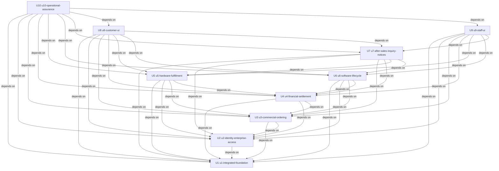

# OMS 작업 단위 의존 DAG

## 의미와 불변 경계

이 그래프는 개발/검증에 필요한 선행 계약·구현이다. A→B는 **A depends on B**이며 사실 발생 순서나 권장 단일 실행 순서가 아니다. Domain Design의14개 컴포넌트/실제 왕복 관계를 이 DAG와 같은 그래프로 취급하지 않는다. 원본 소유·직렬 Construction을 유지하고 경제적 우선순위/Bolt 순서·critical path는 Delivery Planning에 둔다. [S1–S4]

## Unit Dependency DAG

다음10개 선언은 Unit 이름·kind·직접 의존의 기계 판독 원본이다. name은 unit-of-work의 Directory와 같고 아래 표에서 Unit ID를 연결한다.

```yaml
units:
- name: u1-integrated-foundation
  kind: service
  depends_on: []
- name: u2-identity-enterprise-access
  kind: library
  depends_on: [u1-integrated-foundation]
- name: u3-commercial-ordering
  kind: library
  depends_on: [u1-integrated-foundation, u2-identity-enterprise-access]
- name: u4-financial-settlement
  kind: library
  depends_on: [u1-integrated-foundation, u2-identity-enterprise-access, u3-commercial-ordering]
- name: u5-hardware-fulfillment
  kind: library
  depends_on: [u1-integrated-foundation, u2-identity-enterprise-access, u3-commercial-ordering, u4-financial-settlement]
- name: u6-software-lifecycle
  kind: library
  depends_on: [u1-integrated-foundation, u2-identity-enterprise-access, u3-commercial-ordering, u4-financial-settlement]
- name: u7-after-sales-inquiry-notices
  kind: library
  depends_on: [u1-integrated-foundation, u2-identity-enterprise-access, u3-commercial-ordering, u4-financial-settlement, u5-hardware-fulfillment, u6-software-lifecycle]
- name: u8-customer-ui
  kind: ui
  depends_on: [u1-integrated-foundation, u2-identity-enterprise-access, u3-commercial-ordering, u4-financial-settlement, u5-hardware-fulfillment, u6-software-lifecycle, u7-after-sales-inquiry-notices]
- name: u9-staff-ui
  kind: ui
  depends_on: [u1-integrated-foundation, u2-identity-enterprise-access, u3-commercial-ordering, u4-financial-settlement, u5-hardware-fulfillment, u6-software-lifecycle, u7-after-sales-inquiry-notices]
- name: u10-operational-assurance
  kind: service
  depends_on: [u1-integrated-foundation, u2-identity-enterprise-access, u3-commercial-ordering, u4-financial-settlement, u5-hardware-fulfillment, u6-software-lifecycle, u7-after-sales-inquiry-notices, u8-customer-ui, u9-staff-ui]
```

| Unit ID | Name / Directory | Kind | Depends On |
| --- | --- | --- | --- |
| U1 | u1-integrated-foundation | service | None |
| U2 | u2-identity-enterprise-access | library | U1 |
| U3 | u3-commercial-ordering | library | U1, U2 |
| U4 | u4-financial-settlement | library | U1, U2, U3 |
| U5 | u5-hardware-fulfillment | library | U1, U2, U3, U4 |
| U6 | u6-software-lifecycle | library | U1, U2, U3, U4 |
| U7 | u7-after-sales-inquiry-notices | library | U1, U2, U3, U4, U5, U6 |
| U8 | u8-customer-ui | ui | U1, U2, U3, U4, U5, U6, U7 |
| U9 | u9-staff-ui | ui | U1, U2, U3, U4, U5, U6, U7 |
| U10 | u10-operational-assurance | service | U1, U2, U3, U4, U5, U6, U7, U8, U9 |

### Component Diagram

Mermaid12.1.0의 mermaid.parse로 작성 전에 문법을 확인했다. 동일10개 노드·직접 의존 간선이며 방향은 depends on이다.



### 텍스트 대체

| 의존하는 Unit | 필요한 Unit | 선행 결과 |
| --- | --- | --- |
| U2 u2-identity-enterprise-access | U1 u1-integrated-foundation | 필요한 신원/MFA·기업 승인/권한과 최소 상품 등록/조회·주문 접수/지속 기록·확인 대기/진행 조회를 실제 연결한다. API·worker 실행 기반과 고객/직원 UI의 최소 독립 빌드/배포 경로, 실행에 필요한 최소 기술 준비와 공통 계약/통합 접점을 포함한다. 후속 모듈이 없으면 공급/지급/제공을 미확인으로 유지한다. |
| U3 u3-commercial-ordering | U1 u1-integrated-foundation | 필요한 신원/MFA·기업 승인/권한과 최소 상품 등록/조회·주문 접수/지속 기록·확인 대기/진행 조회를 실제 연결한다. API·worker 실행 기반과 고객/직원 UI의 최소 독립 빌드/배포 경로, 실행에 필요한 최소 기술 준비와 공통 계약/통합 접점을 포함한다. 후속 모듈이 없으면 공급/지급/제공을 미확인으로 유지한다. |
| U3 u3-commercial-ordering | U2 u2-identity-enterprise-access | MFA/복구·확인된 동일인, 기업/조직/소속·역할/행위별 범위·관리자 부재/재지정을 완성한다. U1 기본 경로를 확장하고 실제 UI 접점은 U8/U9와 연결한다. |
| U4 u4-financial-settlement | U1 u1-integrated-foundation | 필요한 신원/MFA·기업 승인/권한과 최소 상품 등록/조회·주문 접수/지속 기록·확인 대기/진행 조회를 실제 연결한다. API·worker 실행 기반과 고객/직원 UI의 최소 독립 빌드/배포 경로, 실행에 필요한 최소 기술 준비와 공통 계약/통합 접점을 포함한다. 후속 모듈이 없으면 공급/지급/제공을 미확인으로 유지한다. |
| U4 u4-financial-settlement | U2 u2-identity-enterprise-access | MFA/복구·확인된 동일인, 기업/조직/소속·역할/행위별 범위·관리자 부재/재지정을 완성한다. U1 기본 경로를 확장하고 실제 UI 접점은 U8/U9와 연결한다. |
| U4 u4-financial-settlement | U3 u3-commercial-ordering | 공통 상품 조건·기업 예외·다른 사람 계약 승인·버전별 제안/동의, 구매 당시 조건 보존·타입별 다품목/선후불·전체 수락/확인 대기·제공 선택을 완성한다. 공급/대금 판단은 공통 계약을 통해 소유자 결과를 이용한다. |
| U5 u5-hardware-fulfillment | U1 u1-integrated-foundation | 필요한 신원/MFA·기업 승인/권한과 최소 상품 등록/조회·주문 접수/지속 기록·확인 대기/진행 조회를 실제 연결한다. API·worker 실행 기반과 고객/직원 UI의 최소 독립 빌드/배포 경로, 실행에 필요한 최소 기술 준비와 공통 계약/통합 접점을 포함한다. 후속 모듈이 없으면 공급/지급/제공을 미확인으로 유지한다. |
| U5 u5-hardware-fulfillment | U2 u2-identity-enterprise-access | MFA/복구·확인된 동일인, 기업/조직/소속·역할/행위별 범위·관리자 부재/재지정을 완성한다. U1 기본 경로를 확장하고 실제 UI 접점은 U8/U9와 연결한다. |
| U5 u5-hardware-fulfillment | U3 u3-commercial-ordering | 공통 상품 조건·기업 예외·다른 사람 계약 승인·버전별 제안/동의, 구매 당시 조건 보존·타입별 다품목/선후불·전체 수락/확인 대기·제공 선택을 완성한다. 공급/대금 판단은 공통 계약을 통해 소유자 결과를 이용한다. |
| U5 u5-hardware-fulfillment | U4 u4-financial-settlement | 직원/외부 청구·지급·배분/정정·환불 실제 결과/한도·품목별 지급 조건·후불/연체·보상 중첩 요금 조정을 소유한다. 제공/보상/후속 허용 사실은 각 소유자의 계약으로 연결한다. |
| U6 u6-software-lifecycle | U1 u1-integrated-foundation | 필요한 신원/MFA·기업 승인/권한과 최소 상품 등록/조회·주문 접수/지속 기록·확인 대기/진행 조회를 실제 연결한다. API·worker 실행 기반과 고객/직원 UI의 최소 독립 빌드/배포 경로, 실행에 필요한 최소 기술 준비와 공통 계약/통합 접점을 포함한다. 후속 모듈이 없으면 공급/지급/제공을 미확인으로 유지한다. |
| U6 u6-software-lifecycle | U2 u2-identity-enterprise-access | MFA/복구·확인된 동일인, 기업/조직/소속·역할/행위별 범위·관리자 부재/재지정을 완성한다. U1 기본 경로를 확장하고 실제 UI 접점은 U8/U9와 연결한다. |
| U6 u6-software-lifecycle | U3 u3-commercial-ordering | 공통 상품 조건·기업 예외·다른 사람 계약 승인·버전별 제안/동의, 구매 당시 조건 보존·타입별 다품목/선후불·전체 수락/확인 대기·제공 선택을 완성한다. 공급/대금 판단은 공통 계약을 통해 소유자 결과를 이용한다. |
| U6 u6-software-lifecycle | U4 u4-financial-settlement | 직원/외부 청구·지급·배분/정정·환불 실제 결과/한도·품목별 지급 조건·후불/연체·보상 중첩 요금 조정을 소유한다. 제공/보상/후속 허용 사실은 각 소유자의 계약으로 연결한다. |
| U7 u7-after-sales-inquiry-notices | U1 u1-integrated-foundation | 필요한 신원/MFA·기업 승인/권한과 최소 상품 등록/조회·주문 접수/지속 기록·확인 대기/진행 조회를 실제 연결한다. API·worker 실행 기반과 고객/직원 UI의 최소 독립 빌드/배포 경로, 실행에 필요한 최소 기술 준비와 공통 계약/통합 접점을 포함한다. 후속 모듈이 없으면 공급/지급/제공을 미확인으로 유지한다. |
| U7 u7-after-sales-inquiry-notices | U2 u2-identity-enterprise-access | MFA/복구·확인된 동일인, 기업/조직/소속·역할/행위별 범위·관리자 부재/재지정을 완성한다. U1 기본 경로를 확장하고 실제 UI 접점은 U8/U9와 연결한다. |
| U7 u7-after-sales-inquiry-notices | U3 u3-commercial-ordering | 공통 상품 조건·기업 예외·다른 사람 계약 승인·버전별 제안/동의, 구매 당시 조건 보존·타입별 다품목/선후불·전체 수락/확인 대기·제공 선택을 완성한다. 공급/대금 판단은 공통 계약을 통해 소유자 결과를 이용한다. |
| U7 u7-after-sales-inquiry-notices | U4 u4-financial-settlement | 직원/외부 청구·지급·배분/정정·환불 실제 결과/한도·품목별 지급 조건·후불/연체·보상 중첩 요금 조정을 소유한다. 제공/보상/후속 허용 사실은 각 소유자의 계약으로 연결한다. |
| U7 u7-after-sales-inquiry-notices | U5 u5-hardware-fulfillment | HW 공급/납기 근거, 재고 예약·확보 정책·지급/전체·부분 조건·출고·합의 배송/인수·회수/잔량·미확인/충돌/실패 재처리를 소유한다. U3/U4와 실제 판단/결과 통합을 검증한다. |
| U7 u7-after-sales-inquiry-notices | U6 u6-software-lifecycle | 기업 수량의 영구/기간제 발급·실제 기간·기간 조정/별도 승인·수동/자동 갱신·계약 우선·새 동의·유예/보상·실제 회수를 소유한다. U3/U4와 지급/기간/요금 조정을 통합 검증한다. |
| U8 u8-customer-ui | U1 u1-integrated-foundation | 필요한 신원/MFA·기업 승인/권한과 최소 상품 등록/조회·주문 접수/지속 기록·확인 대기/진행 조회를 실제 연결한다. API·worker 실행 기반과 고객/직원 UI의 최소 독립 빌드/배포 경로, 실행에 필요한 최소 기술 준비와 공통 계약/통합 접점을 포함한다. 후속 모듈이 없으면 공급/지급/제공을 미확인으로 유지한다. |
| U8 u8-customer-ui | U2 u2-identity-enterprise-access | MFA/복구·확인된 동일인, 기업/조직/소속·역할/행위별 범위·관리자 부재/재지정을 완성한다. U1 기본 경로를 확장하고 실제 UI 접점은 U8/U9와 연결한다. |
| U8 u8-customer-ui | U3 u3-commercial-ordering | 공통 상품 조건·기업 예외·다른 사람 계약 승인·버전별 제안/동의, 구매 당시 조건 보존·타입별 다품목/선후불·전체 수락/확인 대기·제공 선택을 완성한다. 공급/대금 판단은 공통 계약을 통해 소유자 결과를 이용한다. |
| U8 u8-customer-ui | U4 u4-financial-settlement | 직원/외부 청구·지급·배분/정정·환불 실제 결과/한도·품목별 지급 조건·후불/연체·보상 중첩 요금 조정을 소유한다. 제공/보상/후속 허용 사실은 각 소유자의 계약으로 연결한다. |
| U8 u8-customer-ui | U5 u5-hardware-fulfillment | HW 공급/납기 근거, 재고 예약·확보 정책·지급/전체·부분 조건·출고·합의 배송/인수·회수/잔량·미확인/충돌/실패 재처리를 소유한다. U3/U4와 실제 판단/결과 통합을 검증한다. |
| U8 u8-customer-ui | U6 u6-software-lifecycle | 기업 수량의 영구/기간제 발급·실제 기간·기간 조정/별도 승인·수동/자동 갱신·계약 우선·새 동의·유예/보상·실제 회수를 소유한다. U3/U4와 지급/기간/요금 조정을 통합 검증한다. |
| U8 u8-customer-ui | U7 u7-after-sales-inquiry-notices | 전체 주문 변경/취소/반품·보류/계속 판단, 소유자별 실제 결과/원본 이력·남은 조치의 권한별 조합 조회, 최소 안내/통지 전달 결과를 완성한다. 각 업무의 원본 대조/정정·실제 환불/회수는 해당 소유자에게 둔다. |
| U9 u9-staff-ui | U1 u1-integrated-foundation | 필요한 신원/MFA·기업 승인/권한과 최소 상품 등록/조회·주문 접수/지속 기록·확인 대기/진행 조회를 실제 연결한다. API·worker 실행 기반과 고객/직원 UI의 최소 독립 빌드/배포 경로, 실행에 필요한 최소 기술 준비와 공통 계약/통합 접점을 포함한다. 후속 모듈이 없으면 공급/지급/제공을 미확인으로 유지한다. |
| U9 u9-staff-ui | U2 u2-identity-enterprise-access | MFA/복구·확인된 동일인, 기업/조직/소속·역할/행위별 범위·관리자 부재/재지정을 완성한다. U1 기본 경로를 확장하고 실제 UI 접점은 U8/U9와 연결한다. |
| U9 u9-staff-ui | U3 u3-commercial-ordering | 공통 상품 조건·기업 예외·다른 사람 계약 승인·버전별 제안/동의, 구매 당시 조건 보존·타입별 다품목/선후불·전체 수락/확인 대기·제공 선택을 완성한다. 공급/대금 판단은 공통 계약을 통해 소유자 결과를 이용한다. |
| U9 u9-staff-ui | U4 u4-financial-settlement | 직원/외부 청구·지급·배분/정정·환불 실제 결과/한도·품목별 지급 조건·후불/연체·보상 중첩 요금 조정을 소유한다. 제공/보상/후속 허용 사실은 각 소유자의 계약으로 연결한다. |
| U9 u9-staff-ui | U5 u5-hardware-fulfillment | HW 공급/납기 근거, 재고 예약·확보 정책·지급/전체·부분 조건·출고·합의 배송/인수·회수/잔량·미확인/충돌/실패 재처리를 소유한다. U3/U4와 실제 판단/결과 통합을 검증한다. |
| U9 u9-staff-ui | U6 u6-software-lifecycle | 기업 수량의 영구/기간제 발급·실제 기간·기간 조정/별도 승인·수동/자동 갱신·계약 우선·새 동의·유예/보상·실제 회수를 소유한다. U3/U4와 지급/기간/요금 조정을 통합 검증한다. |
| U9 u9-staff-ui | U7 u7-after-sales-inquiry-notices | 전체 주문 변경/취소/반품·보류/계속 판단, 소유자별 실제 결과/원본 이력·남은 조치의 권한별 조합 조회, 최소 안내/통지 전달 결과를 완성한다. 각 업무의 원본 대조/정정·실제 환불/회수는 해당 소유자에게 둔다. |
| U10 u10-operational-assurance | U1 u1-integrated-foundation | 필요한 신원/MFA·기업 승인/권한과 최소 상품 등록/조회·주문 접수/지속 기록·확인 대기/진행 조회를 실제 연결한다. API·worker 실행 기반과 고객/직원 UI의 최소 독립 빌드/배포 경로, 실행에 필요한 최소 기술 준비와 공통 계약/통합 접점을 포함한다. 후속 모듈이 없으면 공급/지급/제공을 미확인으로 유지한다. |
| U10 u10-operational-assurance | U2 u2-identity-enterprise-access | MFA/복구·확인된 동일인, 기업/조직/소속·역할/행위별 범위·관리자 부재/재지정을 완성한다. U1 기본 경로를 확장하고 실제 UI 접점은 U8/U9와 연결한다. |
| U10 u10-operational-assurance | U3 u3-commercial-ordering | 공통 상품 조건·기업 예외·다른 사람 계약 승인·버전별 제안/동의, 구매 당시 조건 보존·타입별 다품목/선후불·전체 수락/확인 대기·제공 선택을 완성한다. 공급/대금 판단은 공통 계약을 통해 소유자 결과를 이용한다. |
| U10 u10-operational-assurance | U4 u4-financial-settlement | 직원/외부 청구·지급·배분/정정·환불 실제 결과/한도·품목별 지급 조건·후불/연체·보상 중첩 요금 조정을 소유한다. 제공/보상/후속 허용 사실은 각 소유자의 계약으로 연결한다. |
| U10 u10-operational-assurance | U5 u5-hardware-fulfillment | HW 공급/납기 근거, 재고 예약·확보 정책·지급/전체·부분 조건·출고·합의 배송/인수·회수/잔량·미확인/충돌/실패 재처리를 소유한다. U3/U4와 실제 판단/결과 통합을 검증한다. |
| U10 u10-operational-assurance | U6 u6-software-lifecycle | 기업 수량의 영구/기간제 발급·실제 기간·기간 조정/별도 승인·수동/자동 갱신·계약 우선·새 동의·유예/보상·실제 회수를 소유한다. U3/U4와 지급/기간/요금 조정을 통합 검증한다. |
| U10 u10-operational-assurance | U7 u7-after-sales-inquiry-notices | 전체 주문 변경/취소/반품·보류/계속 판단, 소유자별 실제 결과/원본 이력·남은 조치의 권한별 조합 조회, 최소 안내/통지 전달 결과를 완성한다. 각 업무의 원본 대조/정정·실제 환불/회수는 해당 소유자에게 둔다. |
| U10 u10-operational-assurance | U8 u8-customer-ui | 고객 C01–C09와 고객 인증/가입/복구의 전체 화면을 실제 API에 연결한다. 주문/계약 제안 동의·조직/역할/범위·대금/권한/후속 요청을 허용 정보로 표현하고 상태/오류/미확인·키보드/접근성을 검증한다. |
| U10 u10-operational-assurance | U9 u9-staff-ui | 직원 S01–S11과 인증/복구, 등록/판단/승인·대금/HW/SW·후속 처리를 실제 API에 연결한다. 사내망/승인 원격 PC·행위 권한·계약 다른 사람 승인/기간 동일인 별도 승인을 각각 표현한다. |

## Integration Points and Contracts

| 공급/소유 책임 | 소비/연결 책임 | 내용과 경계 |
|---|---|---|
| U1 통합 실행 기반 | U2–U10 | 공통 원본/요청 참조·최소 실행/통합 계약. 후속 구현 없음을 미확인/미준비로 표시. U1은 초기 실제 경로의 최소 구현 포함. |
| U2 신원/접근 | U3–U10 | 신원/MFA·기업/행위별 범위·동일인/복구 확인. 인증/계정 관리를 전체 권한으로 확대하지 않음. |
| U3 상품/계약/주문 | U4–U10 | 공통/기업 조건·승인/동의·구매 당시 조건·전체 수락/제공 선택·보호 대상 문맥. 변경을 기존 구매에 소급하지 않음. |
| U4 대금 | U3·U5/U6·U7·UI/운영 | 확인 지급/제한/정정·배분/환불 한도·품목별 제공 조건. 미확인/전송 성공을 실제 자금 결과로 바꾸지 않음. |
| U5 HW · U6 SW | U3·U4·U7·UI/운영 | 공급/납기·실제 제공 수량/완료·SW 기간/보상/회수. 원본/버전·충돌/소비 대조, 실제 완료 전 후불/갱신 완료 금지. |
| U7 후속 판단·조회·통지 | U3/U4/U5/U6·U8/U9/U10 | 전체 요청 허용/보류·대상/한도와 실제 결과 연결. 조회/알림이 원본 또는 중앙 실행 조정자가 아님. |
| U8 고객 · U9 직원 UI | 업무 API · U10 검증 | 서버 허용 정보/행동·대상/제안 버전·미확인/부분 결과/남은 조치. 별도 빌드/배포·직원 망/PC 조건. |
| U10 기술 검증 | 원본 진단/실제 운영 주체 | 성공 접수/복구/정확성·국내 위치·배포/가용성/사람 작업 증거. 최소 권한·장애 중 독립 통지/실행 경계. |

### 실제 결과 왕복과 개발 DAG의 구별

U3는 공급/대금 소유자의 계약으로 판단하고 U4는 제공/보상/후속 허용 사실의 계약으로 대금을 판단한다. 공통 계약/참조가 있어도 후속 소유자의 실제 코드/제공자/근거가 없으면 완료로 가정하지 않는다. U5/U6/U7이 구현될 때 U3/U4와 실제 연결을 같은 단위의 범위에서 추가/검증한다. 합성 계약 시험은 실제 외부 주체 실증이 아니다.

공통 소유자 계약/통합 접점으로 구현을 연결하며 후속 Unit의 코드/패키지를 앞선 Unit에 미리 import하는 숨은 의존을 만들지 않는다. 실제 패키지/호스트 등록·소비/버전·동시 실행은 Contract/Functional/NFR Design에서 정의한다. 각 확장 Unit의 호스트/구성 연결도 해당 변경/검증 범위다. DAG 무순환만으로 전달/저장/원본 조합의 안전성을 주장하지 않는다. [S1·S3]

## Independent Development Sets

| 독립 집합 | 공통 선행 | 의미 |
|---|---|---|
| U5 HW · U6 SW | U1–U4의 실행/접근/거래·대금 계약/구현 | 서로의 구현을 필요로 하지 않음. 현재 직렬 실행 유지. |
| U8 고객 UI · U9 직원 UI | U1–U7의 실제 업무/조회·통지 연결 | 서로의 UI 구현에 의존하지 않고 각각 빌드/검증. 공통 코드 변경 책임 명시. |

여러 유효한 위상 순서가 존재한다. 직렬 설정을 이유로 독립 집합에 가짜 간선을 넣지 않는다. 단일 권장 구현 순서/critical path를 선택하지 않는다.

## First Resolved Unit

U1만 의존 없는 루트이며 YAML의 첫 선언이다. 실제 UI/API·신원/기업/권한·상품·접수/기록·확인 대기/진행 조회와 최소 준비를 후속 Unit 없이 실행해야 한다. 공급/지급/발급의 미확인은 확인 대기로 표시해 성공 조건을 지킨다. 실제 데모·명령·경로/시험 준비는 후속 확인에서 정한다. 나머지 Unit의 가치/위험 순서는 Delivery Planning에 둔다.

## 이전 보완 의견의 담당과 구현 전 확인

| 근거 | 소유·담당 | 구현 전 확인 |
|---|---|---|
| Domain Design R-01:주문 보호 대상 부서/사업장 문맥 누락 | OrderAcceptance 소유. U1 최소 주문 Functional Design, U2 접근·U3 주문 완성 및 U4/U6/U7·U8/U9의 연결 조회 | U1 주문 코드 전에 보호 대상 문맥·Department/BusinessSite 원본 연결과 동일 문맥 사용 경로를 명시한다. 요청자 현재 소속으로 과거 주문 문맥을 추측하지 않는다. 조직 변경 효력은 OQ4로 별도 확인한다. |
| Domain Design R-02:교차 참조5건 누락 | U3 CommercialProposal→U6 RenewalCycle, U3 PurchaseTermsSnapshot→U3 CommonOfferRevision, U3 OrderChangeApplication→U3 CustomerConsent, U4 FinancialEligibility→U6 RenewalCycle, U5 HardwareFulfillmentCase→U4 FinancialEligibility | 관련 Contract/Functional Design에서 식별자·원본 소유자·관계/버전·복제 값/외부 근거를 선언/대조하고 인터페이스/스키마 코드 전에 확인한다. 같은 Unit 안에서도 서로 다른 컴포넌트의 원본 참조를 유지한다. |

이는 후속 책임/확인 조건이며 과거 검토의 해결 판정이 아니다. 검증되지 않은 대상 문맥·계약/동의/금액/수량/기간·공급/대금 결과를 자동 허용·성공으로 구현하지 않는다.

## Structural Verification and Limits

10개 Unit·선언된 의존·자기 의존0·순환0·유효 kind, YAML/표/도식·ID/Directory·스토리/JSON target의 일치를 검사한다. 구조/문서 검증은 실제 구현/연동·AC·복구/운영 달성의 증거가 아니다. 원본/권한/버전과 공급 계약 대조도 필요하다.

## Assumptions & Open Questions

- A-UG1 [assumption]:10개 단위·상대 규모·공통 실행 기반 위 확장이 실제 개발/기술 운영에 적합하다. 인원 수로 기능을 축소하지 않고 변경/부하/복구·운영 부담을 검증한다.
- A-UG2 [assumption]:첫 실제 통합에 필요한 신원/기업 확인·지속 기록·실행/기본 통지·대조 경로를 확보할 수 있다. 후속 구현·제공자·실제 계정을 완료된 선행 조건으로 가정하지 않는다.
- A-UG3 [assumption]:공통 소유자 계약·모듈/호스트 연결·버전 대조로 무순환 개발 DAG와 실제 사실 왕복을 함께 구현할 수 있다. 실제 포트/패키지/저장/전달·동시 제어/실증은 후속 설계에서 확인한다.
- Domain Design의 두 수용된 미해결 의견은 아래 담당/구현 전 조건으로 이어받는다. 이 할당을 해결 판정이나 과거 원본 변경으로 보지 않는다.
- OQ1–OQ2:계약 필수 값/버전·금액/기간/달력/반올림 산식·보류/정지/정정/한도·전이/동시 처리. U3–U7의 관련 Contract/Functional Design과 코드 전에 확인한다.
- OQ3:실제 재고/예약 권위·최신성·확보/출고/배송/인수·청구/지급/환불 주체/접근권, SW 수량/발급/전달/적용/회수 근거. U3–U7이 관련 계약/구현 약속·실거래 전에 실증한다.
- OQ4:실제 기업/첫 관리자·계정/동일인·MFA/복구·직원 망/PC·세션/권한 효력. U1/U2와 관련 실행/승인/조회 소유자가 접근 설계·코드/실제 계정 처리 전에 확인한다.
- OQ5–OQ7:분류/보관·고객 데이터/포함 로그·백업/외부 제공자 한국 저장, 장애/물리 대재난 제외·논리 손상/오삭제·RTO/RPO·야간/측정, 실제 알림/수신/재알림·장애 중 경로. U1/U7/U10과 원본 소유자가 관련 NFR/Infra/운영·실데이터/상용 약속 전에 검증한다.
- OQ8–OQ9:입력 상한/필터·화면/비동기/부하 측정, 검사 도구/대상/차단선·실행/배포/복구 방법. 관련 단위/단계에서 확인하며 이미 결정한 PC/브라우저/접근성 방향을 재질문하지 않는다.
- OQ10·HB-01–HB-08:실제 고객/가치·연동/실데이터/운영 증거·비용/업무량/지원 및 등록자 외 계약 승인자 확보. 개발자1명을 모든 사업/승인 역할의 인원으로 가정하지 않는다.

## Sources

- S1: [components](../domain-design/components.md), [decisions](../domain-design/decisions.md) —14개 논리 코드 책임·단일 원본 소유·ADR와 의도적 사실 왕복.
- S2: [requirements](../requirements-analysis/requirements.md), [stories](../user-stories/stories.md) —69 US·227 AC, 전체 기능·접근·실제 결과·정확성/운영 목표와 OQ1–OQ10.
- S3: [이번 질문과 요약 확인](units-generation-questions.md) —Q1 A·Q2 A·Q3 B·Q4 A·Q5 A·Q6 A·Looks correct. 초기6–9개는 후보 추정이고10개 단위·kind·배포 모델·DAG는 별도 Approve Plan으로 확인했다.
- S4: [team-practices](../practices-discovery/team-practices.md), [최신 UI 결정](../refined-mockups/refined-mockups-questions.md), [mockups](../refined-mockups/mockups.md), [interaction-spec](../refined-mockups/interaction-spec.md) —최소 통합 동작·1인 구조/전체 기능·테스트/배포 원칙, PC1280 이상·고객 모바일 미정·직원 모바일 제외·권한 정보 투영.
- S5: [이전 Domain Design 검토](../domain-design/reviews/review-01.md) —조직 문맥 및 교차 참조5건의 근거. 사용자의 미해결 수용은 감사 기록에 있고 당시 원문을 소급 수정하지 않는다.

일반 OMS/외부 제품 기능을 새 요구로 도입하지 않는다. 단위/종류/배포 역할은 확인한 답변과 구성 계획의 설계 선택이며 실제 구현·계정/연동·운영 목표 달성의 증거가 아니다.
